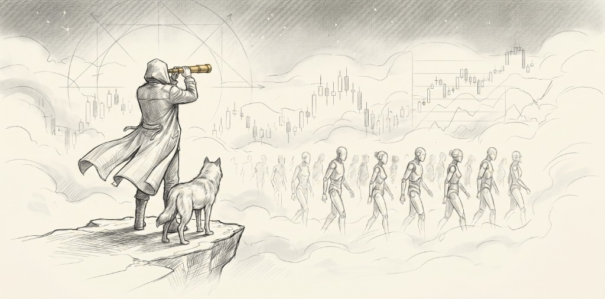

<div align="center">



# Trade Nothing

### *Trade nothing but your mind.*

An adversarial multi-agent skill that turns your AI into a ruthless investment research machine. <br/>
It doesn't tell you what to buy. It tells you where everyone else is **spectacularly wrong**.

[](https://opensource.org/licenses/MIT)
[](https://www.python.org/downloads/)
[](#agent-runtime-compatibility)

[English](README.md) · [中文](README_zh.md) · [Architecture](docs/architecture.md) · [Contributing](CONTRIBUTING.md)

</div>

---

## The Problem

Every AI can summarize a stock. None of them can **think adversarially** about it.

Ask any LLM to analyze a company and you'll get the same thing: a polished, well-structured, utterly useless report that agrees with itself from start to finish. It reads analyst reports, regurgitates the consensus, and confidently presents the median view as insight. It suffers from every cognitive bias it was trained on — confirmation bias, anchoring, narrative fallacy — and it does so with perfect grammar.

**This is not research. This is a mirror.**

The best investors in history — Soros, Druckenmiller, Burry — didn't beat the market by being smarter. They beat it by seeing what everyone else refused to see. They asked: *"Where is the crowd most confidently wrong, and what is the asymmetric bet against that confidence?"*

Trade Nothing is a skill that forces your AI agent to ask that same question — and then tries to **destroy its own answer**.

---

## The Philosophy

<div align="center">
  
</div>

> *"You are not a commentator explaining past facts. You are a hunter seeking misalignments in the mist. Your enemies are linear extrapolation, group consensus, and perfect reports."*

The name "Trade Nothing" is a deliberate paradox. It means three things:

1. **Trade nothing but your mind.** The most valuable asset isn't capital — it's the quality of your thinking. This tool sharpens thinking, not picks stocks.

2. **Sometimes the best trade is no trade.** If the system can't find asymmetric odds (>1:3) with an imminent catalyst, the correct output is "No Edge." A system that always finds a buy signal is broken.

3. **Trade the nothing — the gap.** Alpha lives in the space between what the market prices and what is actually true. The system is designed to find and measure that gap.

### Four Enemies

| Enemy | How We Fight It |
|-------|----------------|
| **Confirmation Bias** | Deploy an Inquisitor whose *only job* is to destroy the bull thesis |
| **Linear Extrapolation** | Force 4-scenario thinking: Bear, Base, Bull, Black Swan |
| **Narrative Fallacy** | Require every claim to be a falsifiable statement with a kill switch |
| **Consensus Drift** | Quantify consensus distance — *how boring is this idea?* |

---

## How It Works

<div align="center">
  
</div>

Trade Nothing deploys **two physically isolated AI sub-agents** in structured adversarial debate:

```
You: "-deepthink NVIDIA AI Infrastructure"

                    ┌─────────────────┐
                    │   Orchestrator   │
                    │     (Judge)      │
                    └────────┬────────┘
                             │
              ┌──────────────┼──────────────┐
              ▼                              ▼
    ┌─────────────────┐            ┌─────────────────┐
    │   🔍 Detective   │            │  ⚔️ Inquisitor  │
    │   (Bull Case)    │            │   (Bear Case)   │
    │                  │            │                  │
    │ "Here's why this │            │ "Here's why this │
    │  is mispriced"   │            │  will blow up"   │
    └────────┬────────┘            └────────┬────────┘
             │                              │
             │    Isolated — no shared      │
             │    reasoning or context      │
             └──────────┬───────────────────┘
                        ▼
              ┌─────────────────┐
              │  Bayesian Update │
              │  LFI Convergence │
              │  (3-12 rounds)   │
              └────────┬────────┘
                       ▼
              ┌─────────────────┐
              │  📄 Research     │
              │  Report + DCF   │
              │  Model (.xlsx)  │
              └─────────────────┘
```

### Why Physical Isolation Matters

When a single model "role-plays" both bull and bear, it converges to a comfortable middle ground within 2 turns. The arguments become performative. The debate is theater.

Trade Nothing forces **real cognitive friction**: each sub-agent runs in a separate context with no access to the other's intermediate reasoning. They communicate only through structured output. The Orchestrator acts as judge, tracking Bayesian probability shifts and a **Logical Friction Index (LFI)** that measures how much new information each round actually contributes.

The debate ends only when:
- LFI drops below 0.15 (diminishing returns) **and** at least 3 rounds completed
- Or the hard fuse triggers at 12 rounds (prevent infinite loops)

---

## Quick Start

### 1. Install & Setup

```bash
git clone https://github.com/Thhoho/trade-nothing.git
cd trade-nothing
pip install -r requirements.txt
```

### 2. 🤖 Load as Agent Skill (For AI Agents / Claude / Antigravity)

If you are an AI agent or using an agent runtime (like Claude Code, Antigravity, OpenHands, etc.):
*   **Direct Instruction**: Act by reading [SKILL.md](SKILL.md) in full first. It contains complete run instructions and prompt definitions.
*   **Activate Skill**: Symlink this repository to your global skills directory (e.g., `~/.gemini/skills/trade-nothing/`).
*   **Prompt to AI**: Simply type: *“Activate trade-nothing skill and deepthink ByteDance Pre-IPO Valuation”* or use the shorthand `-deepthink "ByteDance Pre-IPO Valuation"`.

---

### 3. Usage Examples & Commands

#### 🤺 Run Multi-Agent Adversarial DeepThink (Main Event)
Orchestrates an isolated, structured debate between the **Detective** (Bull case) and the **Inquisitor** (Bear case attacks), moderated by the **Orchestrator** (Judge) using Bayesian updates until logic convergence, automatically outputting a 3-part institutional-grade investment decision dashboard:
```bash
# Start adversarial debate on any stock or core investment thesis
python3 scripts/deepthink_orchestrator.py --run --topic "ByteDance Pre-IPO Valuation"
```

#### 📊 Standalone Quantitative & Sizing Tools (No Agent Required)
If you want to run calculations or query specific data feeds standalone:
```bash
# Calculate 4-scenario payoff matrix & entropy-discounted Kelly position sizing
python3 scripts/scenario_matrix.py --demo

# Get global macro water temperature dashboard (US10Y yield, Brent crude, VIX, FX, Gold)
python3 scripts/verified_fetcher.py --all

# Fetch quotes, valuation metrics, and core financials for A-share companies
python3 scripts/fetch_akshare.py --code 300118 --financial

# Build and compile an institutional-grade, formula-driven DCF valuation model in Excel
python3 scripts/excel_model_builder.py --help
```

---

## The Five Phases of DeepThink

<div align="center">
  
</div>

When you trigger `-deepthink`, the system executes a rigorous 5-phase pipeline:

### Phase 1: Negative Prior Injection 🧠
> *"What has the system learned from past failures?"*

Scans `Evolution.md` for topic-relevant historical mistakes, calibration results, and cognitive bias logs. Injects these as **hard constraints** that both sub-agents must obey.

### Phase 2: Parallel Mobilization 🚀
> *"Deploy the hunter and the assassin."*

Spawns Detective and Inquisitor in isolated contexts. Detective builds the bull case with real data (financials, supply chain, insider activity). Inquisitor prepares the attack vectors (cycle analysis, reflexivity traps, black swan scenarios).

### Phase 3: Adversarial Debate Loop 🤺
> *"Forge the thesis in fire."*

3 to 12 rounds of structured debate. Each round:
1. Detective presents evidence and updated thesis
2. Inquisitor attacks with lethal vectors
3. Orchestrator judges, updates Bayesian posterior, calculates LFI
4. If LFI < 0.15 and round ≥ 3 → converge. Else → next round.

### Phase 4: Quantitative Synthesis 📊
> *"Numbers don't lie. But they can be arranged to."*

Generates: 4-scenario probability matrix, expected value calculation, Kelly-optimal position sizing, consensus distance measurement, DCF model with institutional formatting.

### Phase 5: Harvesting & Feedback 🔄
> *"Every unresolved question is a future research task."*

Unrefuted attack vectors become tracked issues. Testable predictions become calibrated assertions. The system literally schedules reminders to check if its predictions were right.

---

## Toolbox

| Script | What It Does | Standalone? |
|--------|-------------|:-----------:|
| `deepthink_engine.py` | State machine: convergence logic, Bayesian updates, LFI calculation | ✅ |
| `deepthink_pipeline.py` | Memory extraction from Evolution.md, unresolved attack harvesting | ✅ |
| `scenario_matrix.py` | 4-scenario probability matrix + Kelly sizing + expected value | ✅ |
| `consensus_distance.py` | Quantifies gap between your thesis and market consensus | ✅ |
| `catalyst_calendar.py` | Macro/sector event calendar ("Why now?") | ✅ |
| `excel_model_builder.py` | Institutional-grade DCF → `.xlsx` with formula-driven sheets | ✅ |
| `fetch_akshare.py` | A-share quotes + financials (Tencent → AkShare multi-fallback) | ✅ |
| `verified_fetcher.py` | Macro indicators (US10Y, Brent, VIX, USDCNY, Gold) with confidence scoring | ✅ |
| `fetch_polymarket.py` | Prediction market data from Polymarket | ✅ |
| `logic_radar_v2.py` | Assertion tracker: auto-calibrates past predictions against reality | ✅ |
| `logic_radar_daemon.py` | Background daemon: monitors macro thresholds, sends system alerts | ✅ |
| `deepthink_timer.py` | Interactive countdown for forced thinking pauses | ✅ |

All scripts output structured JSON. All paths are configurable via environment variables. No hardcoded personal paths. Cross-platform (macOS / Linux / Windows).

---

## Agent Runtime Compatibility

Trade Nothing is **agent-agnostic**. It defines a *protocol*, not an API binding:

| Runtime | Sub-Agent Method | Isolation Level | Status |
|---------|-----------------|:--------------:|:------:|
| **Antigravity** | `define_subagent` + `invoke_subagent` | 🟢 Full | ✅ Native |
| **Claude Code** | `Task` tool (parallel spawn) | 🟢 Full | ✅ Tested |
| **Gemini CLI** | Context fork / shell sub-process | 🟢 Full | ✅ Compatible |
| **Hermes / OpenHands** | `AgentDelegateAction` | 🟢 Full | ✅ Compatible |
| **Single Model** | Role-switch prompt injection | 🟡 Pseudo | ⚠️ Degraded |

> **Why does isolation level matter?** In "Single Model" mode, the same weights generate both bull and bear arguments. The model knows what it argued last turn and naturally drifts toward reconciliation. Full isolation means each agent is genuinely surprised by the other's attacks.

---

## Configuration

All paths resolve automatically. Override with environment variables only if needed:

| Variable | Default | Purpose |
|----------|---------|---------|
| `TRADE_NOTHING_SKILL_DIR` | Auto-detected | Skill root directory |
| `TRADE_NOTHING_SCRATCH_DIR` | `~/.trade-nothing/scratch` | Runtime state files |
| `TRADE_NOTHING_OUTPUT_DIR` | `~/trade-nothing-outputs` | Reports & Excel models |
| `TRADE_NOTHING_VAULT_DIR` | `~/trade-nothing-vault` | Research data vault |
| `TRADE_NOTHING_EVOLUTION_PATH` | `<skill>/Methodology_Evolution.md` | Historical memory |
| `TRADE_NOTHING_AUTO_CONTINUE` | unset | Skip interactive timers (headless/CI) |

---

## Who Is This For?

- **Independent investors** who want AI to challenge their thesis, not confirm it
- **Research analysts** who need structured adversarial review before publishing
- **Agent developers** who want a non-trivial, multi-agent skill to study and extend
- **Anyone tired of AI producing confident, well-formatted, wrong analysis**

## Who Is This NOT For?

- People looking for stock picks or trading signals
- People who want AI to validate decisions they've already made
- People uncomfortable with a system that frequently concludes "No Edge"

---

## Contributing

See [CONTRIBUTING.md](CONTRIBUTING.md). We especially welcome:
- New data source integrations (US equities, crypto, commodities)
- Agent runtime adapters (Langchain, CrewAI, AutoGen)
- Alternative convergence algorithms
- Translations

## License

[MIT](LICENSE) — Use it, fork it, make it better.

---

<div align="center">

*The best trade is often no trade at all.*

*But when you do trade — trade with the conviction that comes from surviving your own worst critic.*

</div>
