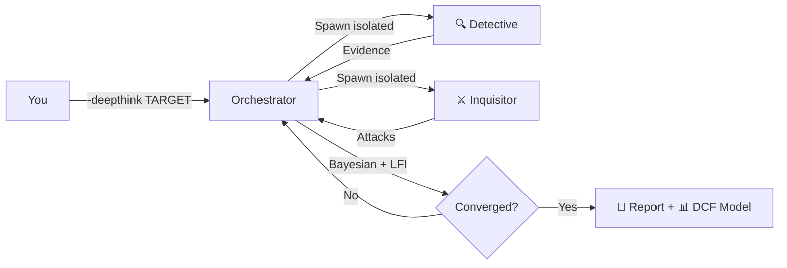

<div align="center">

# 🎯 Trade Nothing

**An adversarial multi-agent skill for deep investment research.**

*Hunt alpha, not consensus.*

[](https://opensource.org/licenses/MIT)
[](https://www.python.org/downloads/)

[English](README.md) · [中文](README_zh.md) · [Architecture](docs/architecture.md)

</div>

---

## What is Trade Nothing?

Trade Nothing is an **agent skill** that deploys physically isolated, adversarial AI sub-agents (Detective 🔍 + Inquisitor ⚔️) in structured debate rounds to produce investment research reports. It's not about AI writing stock tips — it's about **weaponizing adversarial thinking** to find where the market is spectacularly wrong.

> *"You are not a commentator explaining past facts; you are a hunter seeking misalignments in the mist. Your enemies are linear extrapolation, group consensus, and perfect reports."*

### Key Features

- 🤺 **Adversarial Debate**: Detective (bull) vs Inquisitor (bear) in physically isolated contexts — not fake role-playing
- 📊 **Bayesian Convergence**: Probability updates with LFI (Logical Friction Index) driving debate rounds
- 🔧 **12-Round Hard Fuse**: Prevents infinite loops while ensuring minimum 3 rounds of adversarial pressure
- 📈 **Quantitative Synthesis**: 4-scenario matrix, Kelly sizing, DCF model builder, consensus distance calculator
- 🌐 **Agent-Agnostic**: Works with Claude Code, Gemini CLI, Antigravity, Hermes, or any framework with sub-agent support
- 🔄 **Full Lifecycle Feedback**: Historical calibration, pre-mortem analysis, assertion tracking with automated verification

---

## Quick Start

### 1. Install

```bash
git clone https://github.com/YOUR_USERNAME/trade-nothing.git
cd trade-nothing
pip install -r requirements.txt
```

### 2. Configure Your Agent

Copy or symlink the `trade-nothing/` directory to your agent's skill directory:

| Agent Runtime | Skill Location |
|---------------|---------------|
| **Antigravity** | `~/.gemini/skills/trade-nothing/` |
| **Claude Code** | Reference `SKILL.md` in your project context |
| **Gemini CLI** | Pass `SKILL.md` as system context |
| **Hermes** | Configure as agent skill directory |

### 3. Run

Tell your agent:

```
-deepthink "NVIDIA AI Infrastructure"
```

Or try the individual tools:

```bash
# Demo scenario matrix
python3 scripts/scenario_matrix.py --demo

# Fetch macro water temperature
python3 scripts/verified_fetcher.py --all

# A-share real-time data
python3 scripts/fetch_akshare.py --code 300118 --financial

# Polymarket prediction data
python3 scripts/fetch_polymarket.py --query "China"
```

---

## Architecture



See [docs/architecture.md](docs/architecture.md) for the full system diagram.

---

## Modes

| Mode | Trigger | Description |
|------|---------|-------------|
| **DeepThink** | `-deepthink "topic"` | Full adversarial deep research pipeline (5 phases) |
| **Scan** | `-scan` | Quick opportunity radar with flash-scan |
| **Calibrate** | `-calibrate` | Historical assertion audit and self-correction |
| **Pre-mortem** | `-premortem` | Distributed failure path simulation |
| **Q&A** | Direct question | Standard investment Q&A |

---

## Agent Runtime Compatibility

| Runtime | Sub-Agent Dispatch | Status |
|---------|-------------------|--------|
| **Antigravity (agy)** | `define_subagent` + `invoke_subagent` | ✅ Native |
| **Claude Code** | `Task` tool (parallel spawn) | ✅ Tested |
| **Gemini CLI** | Context fork / shell sub-process | ✅ Compatible |
| **Hermes / OpenHands** | `AgentDelegateAction` | ✅ Compatible |
| **Single Model** | Role-switch prompt injection | ⚠️ Pseudo-isolation |

---

## Toolbox

| Script | Purpose |
|--------|---------|
| `deepthink_engine.py` | State machine, convergence, Bayesian updates |
| `deepthink_pipeline.py` | Memory extraction, task harvesting |
| `scenario_matrix.py` | 4-scenario probability matrix + Kelly sizing |
| `consensus_distance.py` | Market consensus gap calculator |
| `catalyst_calendar.py` | Macro/sector event calendar |
| `excel_model_builder.py` | Institutional-grade DCF Excel model |
| `fetch_akshare.py` | A-share quotes + financials (multi-source) |
| `verified_fetcher.py` | Macro indicators with confidence scoring |
| `fetch_polymarket.py` | Prediction market data |
| `logic_radar_v2.py` | Assertion calibrator + hook monitor |
| `logic_radar_daemon.py` | Background threshold monitoring daemon |
| `deepthink_timer.py` | Interactive countdown for pause-and-think |

---

## Environment Variables

| Variable | Default | Description |
|----------|---------|-------------|
| `TRADE_NOTHING_SKILL_DIR` | Auto-detected | Skill root directory |
| `TRADE_NOTHING_SCRATCH_DIR` | `~/.trade-nothing/scratch` | Runtime state files |
| `TRADE_NOTHING_OUTPUT_DIR` | `~/trade-nothing-outputs` | Reports & Excel models |
| `TRADE_NOTHING_VAULT_DIR` | `~/trade-nothing-vault` | Research data vault |
| `TRADE_NOTHING_EVOLUTION_PATH` | `<skill_dir>/Methodology_Evolution.md` | Active memory file |
| `TRADE_NOTHING_AUTO_CONTINUE` | unset | Skip interactive timers (headless) |

---

## Philosophy

**Trade Nothing** = Trade nothing but your mind.

The name reflects the core belief: the most valuable trades come from **not trading** when the setup isn't there. The system is designed to make you uncomfortable — if every analysis produces a "buy" signal, the adversarial engine isn't working.

- **Anti-confirmation bias**: The Inquisitor exists to destroy your thesis
- **Anti-linear extrapolation**: Scenario matrices force non-linear thinking
- **Anti-perfection**: Pre-mortem analysis assumes failure and works backwards
- **Anti-consensus**: Consensus distance calculator quantifies "how boring is this idea?"

---

## Contributing

See [CONTRIBUTING.md](CONTRIBUTING.md).

## License

[MIT](LICENSE)
