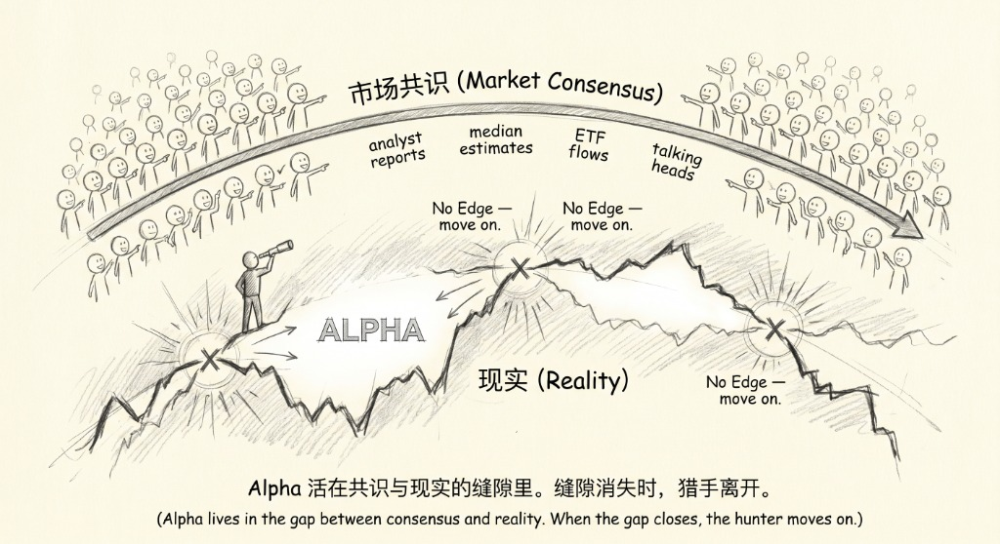
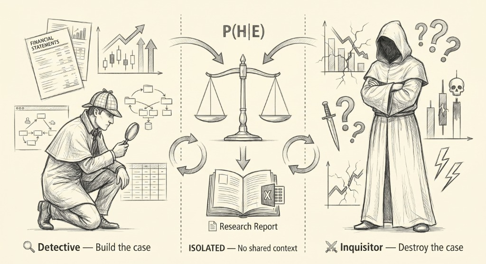
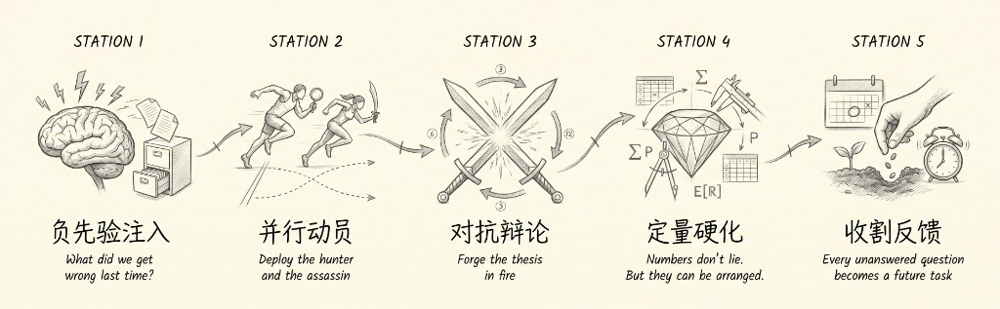

# Trade Nothing

Trade Nothing is an adversarial investment-research skill for agent runtimes such as
Codex, Gemini CLI, Antigravity, Claude Code, OpenHands, and similar systems.

It does not try to produce a polished buy report. It tries to answer a narrower
question:

> Where is the market confidently wrong, and is there enough evidence to act?

The recommended workflow is `-deepthink2`, a crux-based debate pipeline. It frames
an investment question into several load-bearing claims, sends isolated bull and bear
agents to attack those claims, lets a Judge score only sourced evidence, and lets a
deterministic engine decide whether the debate has converged.

<p align="center">
  
</p>

## What Changed In v0.10.2

`-deepthink2` is now the main path.

- Uses a per-crux ledger instead of one fragile global posterior.
- Requires concrete source URLs for evidence, not homepage links.
- Blocks formal report generation when max rounds are hit without convergence.
- Adds `scripts/validate_report_v2.py` to catch invalid references and uncited numbers.
- Keeps legacy `-deepthink` for compatibility and regression comparison.

## Should I Use `-deepthink` Or `-deepthink2`?

Use `-deepthink2` by default.

`-deepthink` is the old pipeline. It is useful for comparing behavior against older
runs, but it tends to push one global probability toward extremes and can burn all
12 rounds even when the real dispute is only one or two claims.

`-deepthink2` is the newer design:

- Each important claim gets its own probability.
- Finished claims retire, so later rounds focus on unresolved claims.
- A final report is allowed only when the engine says the cruxes are resolved or monitorable.
- `fuse_break` is treated as blocked, not as convergence.

<p align="center">
  
</p>

## Install

First clone the repository and install the Python dependencies:

```bash
git clone https://github.com/Thhoho/trade-nothing.git
cd trade-nothing
python3 -m pip install -r requirements.txt
```

Then expose the repository to your agent runtime.

### Codex

```bash
mkdir -p ~/.codex/skills
ln -s "$(pwd)" ~/.codex/skills/trade-nothing
```

Use it from Codex:

```text
use trade-nothing -deepthink2 "NVDA AI infrastructure over the next 3-6 months"
```

### Claude Code

Claude Code does not require a global skill registry. The simplest setup is to keep
this repository inside the project you open with Claude Code, or reference it from
your project instructions.

Option A: put the repo in your project:

```bash
mkdir -p tools
git clone https://github.com/Thhoho/trade-nothing.git tools/trade-nothing
```

Add this to your project `CLAUDE.md`:

```md
When I ask for trade-nothing or -deepthink2, first read tools/trade-nothing/SKILL.md.
Follow its orchestrator-driven workflow and use the agent prompts under tools/trade-nothing/agents/.
```

Option B: keep one shared clone and point Claude at it:

```md
When I ask for trade-nothing or -deepthink2, read /absolute/path/to/trade-nothing/SKILL.md first.
```

Use it from Claude Code:

```text
Use /absolute/path/to/trade-nothing/SKILL.md and run -deepthink2 on "NVDA AI infrastructure over the next 3-6 months".
```

### Antigravity / Gemini CLI

```bash
mkdir -p ~/.gemini/skills
ln -s "$(pwd)" ~/.gemini/skills/trade-nothing
```

Use it from Antigravity or Gemini CLI:

```text
use trade-nothing -deepthink2 "NVDA AI infrastructure over the next 3-6 months"
```

If a target skill folder already exists, replace it with a symlink to your local clone.

## Minimal Usage

In your agent, ask:

```text
use trade-nothing -deepthink2 "NVDA AI infrastructure over the next 3-6 months"
```

The agent should read `SKILL.md` and run the v2 state machine:

```bash
python3 scripts/deepthink_orchestrator_v2.py --frame --topic "TARGET"
python3 scripts/deepthink_orchestrator_v2.py --init --topic "TARGET" --frame-json '<framer_json>'
python3 scripts/deepthink_orchestrator_v2.py --submit --topic "TARGET" \
  --det '<detective_json>' --inq '<inquisitor_json>' --judge '<judge_json>'
python3 scripts/deepthink_orchestrator_v2.py --report --topic "TARGET"
```

You usually do not type those commands manually. The agent orchestrates them.

## Report Validation

Before publishing a completed v2 report, validate it:

```bash
python3 scripts/validate_report_v2.py \
  --report stock-report.md \
  --state scripts/.state/<topic>_v2_state.json
```

The validator fails when:

- a reference is only a homepage URL;
- the BATTLE_LOG section is still empty;
- the report cites a missing reference number;
- data-like numbers appear without `[n]` citations.

This is intentional. The report should stop rather than silently present unsupported
numbers.

## How The v2 Pipeline Works

<p align="center">
  
</p>

1. **Framer** defines the decision question and 2-5 cruxes.
2. **Detective** searches for the strongest sourced bull case.
3. **Inquisitor** attacks the thesis and can introduce new cruxes.
4. **Judge** scores only the evidence in the agent outputs.
5. **Crux engine** updates probabilities and decides whether to continue.
6. **Report renderer** produces Layer A from engine state and gives instructions for Layer B.
7. **Validator** checks the final report before it is treated as publishable.

The LLM does not compute probabilities. `crux_engine.py` does.

## Important Safety Rule

`fuse_break` means the run hit the maximum round limit. It is not convergence.

If any crux is still `OPEN` or `PENDING`, `deepthink_orchestrator_v2.py --report`
returns `blocked_unconverged` and refuses to generate a formal report.

## Useful Commands

Run the v2 orchestrator self-test:

```bash
python3 scripts/deepthink_orchestrator_v2.py --selftest
```

Run the crux engine replay test:

```bash
python3 scripts/crux_engine.py
```

Check version consistency:

```bash
python3 scripts/version.py
```

## Repository Layout

```text
agents/       Agent prompts: framer, detective, inquisitor, judge
scripts/      Orchestrators, engines, validators, data helpers
docs/         Architecture and design notes
examples/     Demo state and scenario files
references/   Data source and vault rules
SKILL.md      Main runtime instructions for agents
```

## License

MIT.
