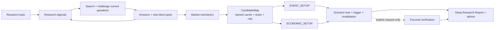

# Trade Nothing

<p align="center">
  
</p>

<p align="center"><strong>Frame the topic. Answer the questions. Find the blind spots. Explain the market.</strong></p>

<p align="center">
  <a href="README_zh.md">中文</a> ·
  <a href="SKILL.md">Runtime contract</a> ·
  <a href="docs/release-v0.15.0.md">v0.15.0 release</a> ·
  <a href="docs/hypothesis-led-research-v0.10.md">v0.10 foundation design</a>
</p>

Trade Nothing is a topic-led, adversarial investment-research skill for agent runtimes. It turns a
research topic into an answerable Agenda, searches and challenges those questions over bounded
rounds, surfaces new blind spots, explains market transmission, and maps concrete securities.

The objective is not minimum risk. It is to search actively for asymmetric opportunity while
making downside friction, invalidation, evidence gaps, and the price already paid impossible to
hide.

It is a research workflow, not an automated trading system. It does not produce an automatic
buy/sell instruction, target price, expected return, Kelly allocation, or position size.

> **v0.15 product shape implemented.** The Research Agenda is the primary object, opportunity
> discovery remains central, heavy verification is explicit and selective, and the skill ends at a
> Deep Research Report with conditional advice. Thesis,
> Decision, order, position, portfolio, publication workflow, and cross-product handoff are outside
> the product boundary. CandidateMap, discovery-first dispatch and the new default renderer are now
> wired; real-theme effectiveness remains unbenchmarked. See
> [the topic-led product baseline](docs/topic-led-research-product.md).

## v0.15.0: discovery first, verification on demand

> **The topic defines the work. Each round answers, challenges, and discovers what was missed.**


```mermaid
flowchart LR
    A["Research topic"] --> B["Research Agenda"]
    B --> C["Search + challenge current questions"]
    C --> X["Answers + new blind spots"]
    X --> B
    X --> M["Market mechanics"]
    M --> D["CandidateMap<br/>named carrier + ticker + role"]
    D --> E["EVENT_SETUP"]
    D --> F["ECONOMIC_SETUP"]
    E --> G["Scenario tree + trigger + invalidation"]
    F --> G
    G -. "explicit request only" .-> H["Focused verification"]
    G --> I["Deep Research Report + advice"]
    H --> I
```

Discovery and verification are deliberately asymmetric. A mechanism hypothesis may be recorded before
it has a citation; a concrete named carrier may enter CandidateMap with a `HYPOTHESIS` or
`INFERENCE` label. Only shortlisted claims need the stricter evidence path. Neither route creates
an automatic downstream action.

v0.15.0 retains the v0.10 hypothesis-led foundation and makes asymmetric opportunity discovery,
decision-discriminating evidence, research allocation, and bounded stopping explicit contracts.

### What changed from v0.14

- **The research kernel is question-native.** Research Agenda, canonical evidence, answer merging,
  and named-instrument identity now share deterministic contracts without turning the workflow into
  another state machine.
- **Industry logic now reaches market choice.** `ValueTransferPath` connects state and constraint
  changes to profit-pool transfer; economic-exposure and observed trading-carrier universes remain
  separate; recommendations are projected independently for event days, tactical weeks, earnings
  quarters, and structural years.
- **Recommendation authority is fail-closed.** A concrete priority requires path-aligned evidence,
  a closest-alternative comparison, current reasons and switch conditions, a payload-bound
  multi-role phase receipt, and a host-ingested market artifact with benchmark-relative strength
  plus activity. Model-authored quotes and valuation-only snapshots cannot self-authorize.
- **A-share data is reproducible and secret-safe.** Tushare Pro, BaoStock, AKShare Tencent, and CSV
  feed one frozen adapter contract. Acquisition and adapter receipts bind the candidate, benchmark,
  session, observations, and derived snapshot; Tushare credentials never enter role prompts, state,
  receipts, reports, or installed skill copies.

The current method includes:

- **Time semantics are fail-closed.** `as_of_date` is the evidence cutoff, `horizon` is the
  relative decision window, and `forecast_target_date` is an optional exact future target. A
  future target can never masquerade as evidence coverage.
- **Deep Research Report is the default artifact.** It leads with conclusions and conditional
  advice, then shows Agenda answers, challenges, blind spots, market mechanics, concrete carriers,
  event versus economic capture, price/crowding, triggers and evidence labels. Opportunity Brief,
  Facts Box, Decision Brief and Candidate Cards remain explicit compatibility views.
- **Report grade is independent of candidate promotion.** `FORMAL` requires convergence, required
  Landscape completion, and independent sourcing for every crux. CandidateScreen gates ranking of
  named securities; snapshot claim verification gates candidate promotion. Zero candidates is a
  valid formal research outcome.
- **Research Agenda is the first-class object.** Every new frame asks 4–8 answerable factual,
  causal, market, candidate, pricing, risk, or forward-looking questions. Each round preserves
  answers, disputes, missing information, new blind spots and new questions. Hypothesis gardens are
  optional tools; a full 5–7-path Landscape is required only when explicitly declared.
- **Faint clues become auditable trails.** A `ProxyTrail` binds an observable clue to its
  direction, causal link, alternative explanation, source lineage, bounded query, and stop
  condition. The system does not jump from an interesting clue to an investable claim.
- **Asymmetry directs attention, not capital.** Qualitative upside shape, convexity, downside
  friction, time-to-signal, and the cheapest discriminating test prioritize the next research
  task. They are not probability, expected return, target price, direction, or sizing inputs.
- **A new source is not automatically new decision evidence.** A citation resets evidence
  exhaustion only when the Judge accepts it with a non-zero directional signal that separates the
  non-consensus mechanism from its strongest alternative. New background, balanced, or duplicated
  information remains auditable but counts as a decision-dry probe.
- **Round feasibility models settlement work.** Framing budgets the actual number of crux touches
  needed for directional settlement or sourced bilateral exhaustion under the two-crux dispatch
  capacity. Source collection and dry probing may overlap; only a frame that cannot fit a complete
  route is rejected before a run starts.
- **CandidateMap is lightweight.** It requires a ticker for listed equities and preserves concrete
  leads even when price, crowding or evidence is still unknown. It does not create a parallel
  lifecycle, confidence score or expected-return rank.
- **Recommendation authority has a separate trusted data plane.** Model-authored market metrics,
  valuation-only snapshots, hypothesis-only value paths, and single-role phase views cannot unlock
  a conditional priority. A host-ingested receipt must carry relative strength and market activity.
- **A strict evidence stop no longer erases exploratory value.** `NO_USABLE_SETUP` is allowed only
  after bounded search-field coverage plus explicit economic-chain, market-carrier,
  competitor/substitute, failure/adverse and ownership/capital routes. `INSUFFICIENT` remains open;
  otherwise the result stays `EXPLORE` with the cheapest next test.
- **Reruns cannot silently forget decisive findings.** Up to eight prior findings may enter the
  Agenda as URL/date-bearing search leads. They inherit no truth status and must be reverified,
  superseded, marked out of scope, or left unresolved with current-round evidence boundaries.
- **Evidence exhaustion can converge honestly.** Repeated zero-signal rounds do not move debate
  support. A sufficiently sourced, bilaterally probed crux may become `MONITORABLE` only after
  bounded research adds no new evidence. Never-probed, one-sided, source-thin, or newly introduced
  cruxes remain fail-closed.

Read the [v0.15.0 release note](docs/release-v0.15.0.md), the historical
[v0.10 foundation design](docs/hypothesis-led-research-v0.10.md),
[hypothesis protocol](references/hypothesis-protocol.md), and
[report contract](references/report-contract.md).

> [!IMPORTANT]
> **Calibration status:** v0.15.0 is implemented and passes the deterministic engineering safety
> gates, but `scripts/benchmark_current.py --check` currently returns
> `UNBENCHMARKED_METHOD_CHANGE`. The operational method differs from the last calibrated v0.9.9
> identity. Existing closed-packet and discovery suites remain historical controls; they are not
> evidence that v0.15.0 improves opportunity recall, lead quality, alpha, return, or risk-adjusted
> return. Engineering correctness, research effectiveness, and investment performance are three
> separate claims.

## What is trustworthy

- A Judge signal cannot move a crux without a concrete citation containing claim, source, date,
  and a specific article, filing, or API URL.
- Judge citations must match evidence already present in the isolated agent payloads.
- Repeated evidence with the same normalized URL, claim, and number cannot be scored twice.
- A zero Judge signal never changes debate support, even when a new citation is retained for audit.
- `wild_hypotheses`, `hypothesis_sparks`, `proxy_trails`, and every `HYPOTHESIS_ONLY` object are
  invisible to Judge scoring, source counts, convergence, and promotion.
- `EVIDENCE_BACKED` is still an exploration-maturity label, not an `OpportunitySeed` and not a
  CandidateScreen entry.
- `continue`, `fuse_break`, insufficient source diversity, and unresolved required cruxes block the
  `FORMAL` grade, never the complete graded report bundle.
- `NO_EDGE` means no usable expectation gap was established under the current frame and evidence.
  It does not mean `AVOID` or `SHORT`, and it does not require deleting a bounded exploratory path.
- Reported values are debate-support and workflow heuristics, not calibrated market probabilities.
- An exploration execution is `typed design → plan → explicit authorization → receipt`: one exact
  query, at most three documents, no automatic retry, and no ingestion after state or as-of drift.
- Runtime state is stored under `TRADE_NOTHING_SCRATCH_DIR`, not inside the skill source. The
  published skill contains no notification, webhook, portfolio, or order-execution entry point.

## Isolation is a host responsibility

Framer runs inline in the parent context and does not browse. Detective and Inquisitor must run in
separate contexts with no shared intermediate reasoning; CandidateScreen and claim verification
have their own isolation contracts. If a host can only role-switch within one model, the run must
be labelled `degraded` and cannot claim physical multi-agent isolation.

## Installation

### Natural-language installation for an agent

Paste the following into Codex, Claude Code, Gemini CLI, Antigravity, or another coding agent:

```text
Install Trade Nothing v0.15.0 from https://github.com/Thhoho/trade-nothing.git for this agent runtime.

Safety and verification requirements:
1. Do not start a research run. This request authorizes installation only.
2. Detect the current runtime's configured skill root and target its `trade-nothing` directory. Use
   `${CODEX_HOME:-$HOME/.codex}/skills/trade-nothing` for Codex,
   `$HOME/.claude/skills/trade-nothing` for Claude Code, or
   `$HOME/.gemini/skills/trade-nothing` for Gemini CLI. For any other runtime, use its documented
   configured skill root; if that cannot be verified, stop and ask me instead of guessing.
3. Before writing, inspect any existing checkout and target. Never reset, delete, or overwrite a
   dirty checkout, runtime state, scratch data, personal research memory, or target metadata.
4. Clone or fetch `origin/main` in a new temporary or user-approved source directory, detach at the
   exact fetched commit, and report `git rev-parse HEAD`. Do not install from a moving branch while
   leaving the installed commit unidentified. If an annotated release tag is explicitly requested,
   verify that tag separately; this instruction does not authorize creating one.
5. From that checkout, run `python3 scripts/version.py` and `make test`. Do not install third-party
   packages unless a required check fails and I explicitly approve the dependency change.
6. Install with `python3 scripts/install_skill.py --source <checkout> --targets <target>`; do not
   hand-copy files. Then run `python3 scripts/check_source_sync.py --source <checkout> --targets
   <target>`.
7. Preserve `Methodology_Evolution.md`, `scripts/.state`, `.git`, and everything under
   `~/.trade-nothing/`. Let the installer move stale managed code to its recoverable quarantine.
8. Request permission before network access or writes outside the current workspace when the host
   requires it. Finish by reporting the commit, install target, test result, sync result, and
   any quarantined files.
```

That prompt intentionally installs only into the current runtime. To install the same verified
checkout into the default Gemini, Codex, and Claude directories, explicitly ask the agent to run
`make install DEV_DIR="<checkout>"` followed by `make status DEV_DIR="<checkout>"`.

### Shell installation

```bash
git clone --branch main --depth 1 https://github.com/Thhoho/trade-nothing.git
cd trade-nothing
git switch --detach
git rev-parse HEAD
python3 scripts/version.py
make test
```

Install the controlled bundle into the default Gemini, Codex, and Claude skill directories:

```bash
make install DEV_DIR="$(pwd)"
```

This does not delete runtime JSON, state, scratch data, `.git`, or personal research artifacts.
Stale files on the managed code surface are moved to a recoverable quarantine. Antigravity and
Claude Code have bounded process adapters; Codex has manual collaboration receipt builders;
Gemini, Hermes, and OpenHands remain manual/protocol-only integrations in this release. See
[`references/runtime-compatibility.md`](references/runtime-compatibility.md) for the exact matrix.
Nested runtime role contracts are part of the controlled bundle, and installation fails closed if
the installed operational method identity differs from the verified source checkout.

Then ask the agent, for example:

```text
Use trade-nothing -deepthink2 in OPPORTUNITY_DISCOVERY mode:
"Where could AI data-center power constraints create mispriced value transfer over 3–6 months?"
```

The recommended `-deepthink2` path is:

1. Frame a bounded, falsifiable question and choose `THESIS_CHALLENGE`,
   `OPPORTUNITY_DISCOVERY`, or `HYBRID`.
2. Run Framer inline, initialize the deterministic state, then dispatch isolated Detective and
   Inquisitor roles on the selected open cruxes.
3. Let Judge score only the cited formal evidence. The engine—not the LLM—updates support and
   decides whether the run continues, converges, or fuse-breaks.
4. For opportunity work, advance the Research Agenda and CandidateMap first. CandidateScreen and
   snapshot-bound claim verification run only when explicitly requested for a short list.
5. If useful, design one bounded exploration action. Planning does not authorize execution; only
   explicit authorization for the exact action ID permits one query and one receipt.

Read [SKILL.md](SKILL.md) completely before driving the low-level commands. The exact runtime,
resume, CandidateScreen, claim-verification, and exploration schemas are normative there.

When bounded A-share observations are needed, acquire and adapt them first, then explicitly attach
the complete artifact to the registered run with `--ingest-market-snapshot --market-snapshot PATH`.
This is a data injection step, not a candidate lifecycle transition.

### Tushare Pro configuration

Trade Nothing reads one credential, `TUSHARE_TOKEN`, from the **parent acquisition process**. Do
not put the token in this repository, request JSON, `.env` files committed to Git, role prompts, or
the three installed skill directories. Codex, Claude Code, and Gemini CLI do not need three copies
of the token; they only need to inherit the same host environment.

For terminal-launched runtimes on macOS or Linux, export it in the shell that launches the agent
(optionally persist the same export in your private shell profile):

```bash
export TUSHARE_TOKEN="replace-with-your-own-token"
python3 -c 'import os; print("TUSHARE_TOKEN configured" if os.environ.get("TUSHARE_TOKEN") else "TUSHARE_TOKEN missing")'
```

For a macOS GUI app that does not inherit the terminal environment, inject the already-exported
value into the user launch environment, then fully restart the app:

```bash
launchctl setenv TUSHARE_TOKEN "$TUSHARE_TOKEN"
```

Run one explicitly bounded request; the adapter never scans the whole market and never silently
falls back to another provider:

```bash
python3 scripts/free_market_observations.py --input tushare-request.json \
  --output market-observations.json
python3 scripts/market_snapshot_adapter.py --input market-observations.json \
  --output market-snapshot.json
```

Set `"provider": "TUSHARE"` in `tushare-request.json`; the complete request schema and ingestion
command are in [`references/data-sources.md`](references/data-sources.md). A successful data call
proves acquisition and deterministic transformation, not issuer fundamentals, recommendation
quality, or expected return.

## Minimal manual workflow

```bash
# Frame, then execute agents/framer.md inline in the host.
python3 scripts/deepthink_orchestrator_v2.py --frame --topic "TARGET"

# Initialize from the exact Framer JSON.
python3 scripts/deepthink_orchestrator_v2.py --init \
  --topic "TARGET" --frame-json '<framer_json>'

# Submit isolated Detective, Inquisitor, and Judge payloads.
python3 scripts/deepthink_orchestrator_v2.py --submit \
  --topic "TARGET" --det '<detective_json>' \
  --inq '<inquisitor_json>' --judge '<judge_json>'

# Render at every terminal stop; the deterministic gate controls the grade and allowed claims.
python3 scripts/deepthink_orchestrator_v2.py --report --topic "TARGET"
```

The report command returns `deep_research_report_markdown`, a separate
`evidence_ledger_markdown`, compatibility views, and the structured view model. New hosts deliver
the Deep Research Report by default. `opportunity`, `brief`, `cards`, and `audit` remain explicit
compatibility views.

Common terminal or continuation states include:

- `dispatch_subagents`: continue only on the bounded open-crux packet.
- `ready_for_report`: deterministic convergence and evidence gates passed.
- `blocked_max_rounds`: the fuse fired; a downgraded report ships alongside the Resolution Memo.
- `report_data_ready`: report data is available. It is always produced; limitations ride on
  `report_grade` rather than suppressing output.
- `no_edge`: no formally usable expectation gap was established; a labelled, bounded exploration
  action may still remain, but it requires separate authorization.

Report grade and the two hard gates:

- `report_grade` is `FORMAL`, `PROVISIONAL`, or `EXPLORATORY`. Unmet gates lower the grade instead
  of deleting the research.
- Its only inputs are convergence, required Landscape completion, and independent crux sourcing.
  CandidateScreen and claim verification appear under `candidate_lifecycle` and do not lower it.
- Report grades do not create publication permission or own any downstream workflow.
- Conditional research and market recommendations may compare named securities when trigger,
  invalidation, price/crowding, alternative explanation, and evidence boundary are visible.
- Claims carry a tier: `FACT` may be asserted plainly, `SINGLE_SOURCE` must be marked as
  uncorroborated, and `INFERENCE` / `HYPOTHESIS` must be labelled but are allowed in the body.
  Stripping the label is the violation.

The older `-deepthink` single-posterior/LFI pipeline was retired in v0.13.0. Its uncalibrated
LFI/AFI/EGI/posterior numbers, its separate `scripts/.state/` format, and its harvest path (which
silently missed `-deepthink2` state) are gone. A `-deepthink` request is answered by `-deepthink2`.

## Evidence schema

Formal citation objects use:

```json
{
  "claim": "what the source establishes",
  "number": "value or null",
  "source": "organization",
  "url": "https://example.com/specific-page",
  "date": "YYYY-MM-DD",
  "source_tier": "primary"
}
```

Bare domains, missing dates, missing sources, future-dated evidence beyond the frozen as-of, and
invented Judge citations are rejected.

## Configuration

| Variable | Default | Purpose |
|---|---|---|
| `TRADE_NOTHING_SKILL_DIR` | auto-detected | Skill installation root |
| `TRADE_NOTHING_SCRATCH_DIR` | `~/.trade-nothing/scratch` | State and issue files |
| `TRADE_NOTHING_OUTPUT_DIR` | `~/trade-nothing-outputs` | Generated artifacts |
| `TRADE_NOTHING_VAULT_DIR` | `~/trade-nothing-vault` | Research vault |
| `TRADE_NOTHING_EVOLUTION_PATH` | `<vault>/Methodology/Evolution.md` | Negative-prior memory |
| `TRADE_NOTHING_MODEL_DEEP` | host default | Quality-critical roles and Judge |
| `TUSHARE_TOKEN` | unset | Parent-only Tushare Pro credential for bounded A-share acquisition |

## Verification and maintenance

`~/Documents/trade-nothing` is the single source of truth in the default local setup.

```bash
# Current deterministic safety and regression gates
make test

# Complete offline unit-test discovery
python3 -B -m unittest discover -s scripts -p 'test_*.py'

# Version and benchmark-identity checks
python3 scripts/version.py
python3 scripts/benchmark_current.py --check --source-repo .

# Sync controlled source files, quarantine retired managed code, then verify exact hashes
make install DEV_DIR="$(pwd)"
make status DEV_DIR="$(pwd)"
```

Installed packages run benchmark checks in explicit package mode and report that pinned Git-object
verification is unavailable there. Run `--source-repo .` only from the canonical Git checkout.

## Repository layout

```text
agents/       Isolated role contracts
scripts/      Orchestrators, deterministic engines, validators, and tests
references/   Normative research and report protocols; legacy handoff files are compatibility only
docs/         Architecture and design notes
benchmarks/   Frozen evaluation packets and method bindings
assets/       Report templates and README illustrations
legacy/       Source-only archived v0.9 execution and historical design surfaces; never installed
SKILL.md      Main runtime contract
```

## License

MIT. See [LICENSE](LICENSE).
