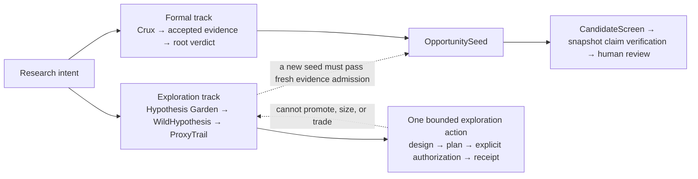

# Trade Nothing

<p align="center">
  
</p>

<p align="center"><strong>Propose boldly. Trace faint signals. Promote only what survives evidence.</strong></p>

<p align="center">
  <a href="README_zh.md">中文</a> ·
  <a href="SKILL.md">Runtime contract</a> ·
  <a href="docs/release-v0.13.1.md">v0.13.1 release</a> ·
  <a href="docs/hypothesis-led-research-v0.10.md">v0.10 foundation design</a>
</p>

Trade Nothing is an adversarial investment-research skill for agent runtimes. It is neither a
falsification machine nor a story generator. It lets bold, non-consensus ideas enter a
non-promotable exploration ledger, follows observable proxy trails and alternative explanations,
and keeps formal conclusions behind deterministic evidence and human-review gates.

The objective is not minimum risk. It is to search actively for asymmetric opportunity while
making downside friction, invalidation, evidence gaps, and the price already paid impossible to
hide.

It is a research workflow, not an automated trading system. It does not produce an automatic
buy/sell instruction, target price, expected return, Kelly allocation, or position size.

## v0.13.1: hypothesis-led, time-bounded research

> **Imagination proposes. Evidence promotes. Risk control governs execution.**


```mermaid
flowchart LR
    A["Research intent"] --> B["Exploration track<br/>Hypothesis Garden → WildHypothesis → ProxyTrail"]
    A --> C["Formal track<br/>Crux → accepted evidence → root verdict"]
    B -. "a new seed must pass fresh evidence admission" .-> D["OpportunitySeed"]
    C --> D
    D --> E["CandidateScreen → snapshot claim verification → human review"]
    B --> F["One bounded exploration action<br/>design → plan → explicit authorization → receipt"]
    F -. "cannot promote, size, or trade" .-> B
```

The two tracks are deliberately asymmetric. A bold hypothesis may be recorded before it has a
citation. It cannot change a crux score, root verdict, CandidateScreen result, Thesis, Decision,
order, or position. To cross into the formal track, a newly drafted `OpportunitySeed` must
independently pass the existing same-agent, same-round, same-crux evidence gate.

v0.13.1 retains the v0.10 hypothesis-led foundation and makes time, research allocation, and
human-facing report outputs explicit contracts. The current method includes:

- **Time semantics are fail-closed.** `as_of_date` is the evidence cutoff, `horizon` is the
  relative decision window, and `forecast_target_date` is an optional exact future target. A
  future target can never masquerade as evidence coverage.
- **Reports have a locked facts layer.** Every new Decision Brief begins with the exact
  deterministic Facts Box; the Evidence Ledger and Candidate Cards are separate, content-addressed
  artifacts. Free narrative may improve readability but cannot rewrite state, citations, or action
  gates.
- **Report grade is independent of candidate promotion.** `FORMAL` requires convergence, required
  Landscape completion, and independent sourcing for every crux. CandidateScreen gates ranking of
  named securities; snapshot claim verification gates candidate promotion. Zero candidates is a
  valid formal research outcome.
- **Bold conjecture is a first-class research object.** `OPPORTUNITY_DISCOVERY` and `HYBRID`
  frames begin with 5–7 entity-agnostic paths. Each `WildHypothesis` records a causal chain,
  consensus blind spot, upside and downside mechanisms, catalyst, expiry, alternative
  explanation, and falsifier.
- **Faint clues become auditable trails.** A `ProxyTrail` binds an observable clue to its
  direction, causal link, alternative explanation, source lineage, bounded query, and stop
  condition. The system does not jump from an interesting clue to an investable claim.
- **Asymmetry directs attention, not capital.** Qualitative upside shape, convexity, downside
  friction, and time-to-signal may prioritize the next research task. They are not probability,
  expected return, target price, direction, or sizing inputs.
- **A formal stop no longer erases exploratory value.** Every report has exactly one deterministic
  `formal_action` and at most one separately authorized `exploration_action`. The latter can
  gather information; it cannot override a stop or promote a candidate.
- **Evidence exhaustion can converge honestly.** Repeated zero-signal rounds do not move debate
  support. A sufficiently sourced, bilaterally probed crux may become `MONITORABLE` only after
  bounded research adds no new evidence. Never-probed, one-sided, source-thin, or newly introduced
  cruxes remain fail-closed.

Read the [v0.13.1 release note](docs/release-v0.13.1.md), the historical
[v0.10 foundation design](docs/hypothesis-led-research-v0.10.md),
[hypothesis protocol](references/hypothesis-protocol.md), and
[report contract](references/report-contract.md).

> [!IMPORTANT]
> **Calibration status:** v0.13.1 is implemented and passes the deterministic engineering safety
> gates, but `scripts/benchmark_current.py --check` currently returns
> `UNBENCHMARKED_METHOD_CHANGE`. The operational method differs from the last calibrated v0.9.9
> identity. Existing closed-packet and discovery suites remain historical controls; they are not
> evidence that v0.13.1 improves opportunity recall, lead quality, alpha, return, or risk-adjusted
> return. Engineering correctness, research effectiveness, and investment performance are three
> separate claims.

## What is trustworthy

- A Judge signal cannot move a crux without a concrete citation containing claim, source, date,
  and a specific article, filing, or API URL.
- Judge citations must match evidence already present in the isolated agent payloads.
- Repeated evidence with the same normalized URL, claim, and number cannot be scored twice.
- A zero Judge signal never changes debate support, even when a new citation is retained for audit.
- `wild_hypotheses`, `hypothesis_sparks`, `proxy_trails`, and every `HYPOTHESIS_ONLY` object are
  invisible to Judge scoring, source counts, convergence, and promotion.
- `EVIDENCE_BACKED` is still an exploration-maturity label, not an `OpportunitySeed` and not a
  CandidateScreen entry.
- `continue`, `fuse_break`, insufficient source diversity, and unresolved required cruxes block the
  `FORMAL` grade, never the complete graded report bundle.
- `NO_EDGE` means no usable expectation gap was established under the current frame and evidence.
  It does not mean `AVOID` or `SHORT`, and it does not require deleting a bounded exploratory path.
- Reported values are debate-support and workflow heuristics, not calibrated market probabilities.
- An exploration execution is `typed design → plan → explicit authorization → receipt`: one exact
  query, at most three documents, no automatic retry, and no ingestion after state or as-of drift.
- Runtime state is stored under `TRADE_NOTHING_SCRATCH_DIR`, not inside the skill source. The
  published skill contains no notification, webhook, portfolio, or order-execution entry point.

## Isolation is a host responsibility

Framer runs inline in the parent context and does not browse. Detective and Inquisitor must run in
separate contexts with no shared intermediate reasoning; CandidateScreen and claim verification
have their own isolation contracts. If a host can only role-switch within one model, the run must
be labelled `degraded` and cannot claim physical multi-agent isolation.

## Installation

### Natural-language installation for an agent

Paste the following into Codex, Claude Code, Gemini CLI, Antigravity, or another coding agent:

```text
Install Trade Nothing v0.13.1 from https://github.com/Thhoho/trade-nothing.git for this agent runtime.

Safety and verification requirements:
1. Do not start a research run. This request authorizes installation only.
2. Detect the current runtime's configured skill root and target its `trade-nothing` directory. Use
   `${CODEX_HOME:-$HOME/.codex}/skills/trade-nothing` for Codex,
   `$HOME/.claude/skills/trade-nothing` for Claude Code, or
   `$HOME/.gemini/skills/trade-nothing` for Gemini CLI. For any other runtime, use its documented
   configured skill root; if that cannot be verified, stop and ask me instead of guessing.
3. Before writing, inspect any existing checkout and target. Never reset, delete, or overwrite a
   dirty checkout, runtime state, scratch data, personal research memory, or target metadata.
4. Clone or fetch the repository in a new temporary or user-approved source directory, check out
   the exact annotated tag `v0.13.1`, verify that `git cat-file -t v0.13.1` prints `tag`, and report
   the commit from `git rev-parse 'v0.13.1^{commit}'`. Do not install from an untagged branch tip.
5. From that checkout, run `python3 scripts/version.py` and `make test`. Do not install third-party
   packages unless a required check fails and I explicitly approve the dependency change.
6. Install with `python3 scripts/install_skill.py --source <checkout> --targets <target>`; do not
   hand-copy files. Then run `python3 scripts/check_source_sync.py --source <checkout> --targets
   <target>`.
7. Preserve `Methodology_Evolution.md`, `scripts/.state`, `.git`, and everything under
   `~/.trade-nothing/`. Let the installer move stale managed code to its recoverable quarantine.
8. Request permission before network access or writes outside the current workspace when the host
   requires it. Finish by reporting the tag, commit, install target, test result, sync result, and
   any quarantined files.
```

That prompt intentionally installs only into the current runtime. To install the same verified
checkout into the default Gemini, Codex, and Claude directories, explicitly ask the agent to run
`make install DEV_DIR="<checkout>"` followed by `make status DEV_DIR="<checkout>"`.

### Shell installation

```bash
git clone --branch v0.13.1 --depth 1 https://github.com/Thhoho/trade-nothing.git
cd trade-nothing
test "$(git cat-file -t v0.13.1)" = tag
git rev-parse 'v0.13.1^{commit}'
python3 scripts/version.py
make test
```

Install the controlled bundle into the default Gemini, Codex, and Claude skill directories:

```bash
make install DEV_DIR="$(pwd)"
```

This does not delete runtime JSON, state, scratch data, `.git`, or personal research artifacts.
Stale files on the managed code surface are moved to a recoverable quarantine. Antigravity and
Claude Code have bounded process adapters; Codex has manual collaboration receipt builders;
Gemini, Hermes, and OpenHands remain manual/protocol-only integrations in this release. See
[`references/runtime-compatibility.md`](references/runtime-compatibility.md) for the exact matrix.

Then ask the agent, for example:

```text
Use trade-nothing -deepthink2 in OPPORTUNITY_DISCOVERY mode:
"Where could AI data-center power constraints create mispriced value transfer over 3–6 months?"
```

The recommended `-deepthink2` path is:

1. Frame a bounded, falsifiable question and choose `THESIS_CHALLENGE`,
   `OPPORTUNITY_DISCOVERY`, or `HYBRID`.
2. Run Framer inline, initialize the deterministic state, then dispatch isolated Detective and
   Inquisitor roles on the selected open cruxes.
3. Let Judge score only the cited formal evidence. The engine—not the LLM—updates support and
   decides whether the run continues, converges, or fuse-breaks.
4. For opportunity work, mature and screen evidence-backed seeds before snapshot-bound claim
   verification and human review.
5. If useful, design one bounded exploration action. Planning does not authorize execution; only
   explicit authorization for the exact action ID permits one query and one receipt.

Read [SKILL.md](SKILL.md) completely before driving the low-level commands. The exact runtime,
resume, CandidateScreen, claim-verification, and exploration schemas are normative there.

## Minimal manual workflow

```bash
# Frame, then execute agents/framer.md inline in the host.
python3 scripts/deepthink_orchestrator_v2.py --frame --topic "TARGET"

# Initialize from the exact Framer JSON.
python3 scripts/deepthink_orchestrator_v2.py --init \
  --topic "TARGET" --frame-json '<framer_json>'

# Submit isolated Detective, Inquisitor, and Judge payloads.
python3 scripts/deepthink_orchestrator_v2.py --submit \
  --topic "TARGET" --det '<detective_json>' \
  --inq '<inquisitor_json>' --judge '<judge_json>'

# Render at every terminal stop; the deterministic gate controls the grade and allowed claims.
python3 scripts/deepthink_orchestrator_v2.py --report --topic "TARGET"
```

The report command returns a locked `facts_box_markdown`, a separate
`evidence_ledger_markdown`, optional Candidate Cards, and the structured view model. New hosts
place the Facts Box verbatim at the top of a content-driven Decision Brief and persist the Evidence
Ledger separately. The deterministic `brief` and `full` views remain compatibility fallbacks.

Common terminal or continuation states include:

- `dispatch_subagents`: continue only on the bounded open-crux packet.
- `ready_for_report`: deterministic convergence and evidence gates passed.
- `blocked_max_rounds`: the fuse fired; a downgraded report ships alongside the Resolution Memo.
- `report_data_ready`: report data is available. It is always produced; limitations ride on
  `report_grade` rather than suppressing output.
- `no_edge`: no formally usable expectation gap was established; a labelled, bounded exploration
  action may still remain, but it requires separate authorization.

Report grade and the two hard gates:

- `report_grade` is `FORMAL`, `PROVISIONAL`, or `EXPLORATORY`. Unmet gates lower the grade instead
  of deleting the research.
- Its only inputs are convergence, required Landscape completion, and independent crux sourcing.
  CandidateScreen and claim verification appear under `candidate_lifecycle` and do not lower it.
- `publication_allowed` (`FORMAL` only) is the single gate on externally distributed writing.
- `ranking_allowed` (requires a completed CandidateScreen) gates ordering or recommendation
  language over named securities and is limited to `candidate_lifecycle.rankable_seed_ids`.
- Claims carry a tier: `VERIFIED` may be asserted plainly, `SINGLE_SOURCE` must be marked as
  uncorroborated, and `HYPOTHESIS` must be labelled but is explicitly allowed in the body.
  Stripping the label is the violation.

The older `-deepthink` single-posterior/LFI pipeline was retired in v0.13.0. Its uncalibrated
LFI/AFI/EGI/posterior numbers, its separate `scripts/.state/` format, and its harvest path (which
silently missed `-deepthink2` state) are gone. A `-deepthink` request is answered by `-deepthink2`.

## Evidence schema

Formal citation objects use:

```json
{
  "claim": "what the source establishes",
  "number": "value or null",
  "source": "organization",
  "url": "https://example.com/specific-page",
  "date": "YYYY-MM-DD",
  "source_tier": "primary"
}
```

Bare domains, missing dates, missing sources, future-dated evidence beyond the frozen as-of, and
invented Judge citations are rejected.

## Configuration

| Variable | Default | Purpose |
|---|---|---|
| `TRADE_NOTHING_SKILL_DIR` | auto-detected | Skill installation root |
| `TRADE_NOTHING_SCRATCH_DIR` | `~/.trade-nothing/scratch` | State and issue files |
| `TRADE_NOTHING_OUTPUT_DIR` | `~/trade-nothing-outputs` | Generated artifacts |
| `TRADE_NOTHING_VAULT_DIR` | `~/trade-nothing-vault` | Research vault |
| `TRADE_NOTHING_EVOLUTION_PATH` | `<vault>/Methodology/Evolution.md` | Negative-prior memory |
| `TRADE_NOTHING_MODEL_DEEP` | host default | Quality-critical roles and Judge |

## Verification and maintenance

`~/Documents/trade-nothing` is the single source of truth in the default local setup.

```bash
# Current deterministic safety and regression gates
make test

# Complete offline unit-test discovery
python3 -B -m unittest discover -s scripts -p 'test_*.py'

# Version and benchmark-identity checks
python3 scripts/version.py
python3 scripts/benchmark_current.py --check --source-repo .

# Sync controlled source files, quarantine retired managed code, then verify exact hashes
make install DEV_DIR="$(pwd)"
make status DEV_DIR="$(pwd)"
```

Installed packages run benchmark checks in explicit package mode and report that pinned Git-object
verification is unavailable there. Run `--source-repo .` only from the canonical Git checkout.

## Repository layout

```text
agents/       Isolated role contracts
scripts/      Orchestrators, deterministic engines, validators, and tests
references/   Normative research and handoff protocols
docs/         Architecture and design notes
benchmarks/   Frozen evaluation packets and method bindings
assets/       Report templates and README illustrations
legacy/       Source-only archived v0.9 execution and historical design surfaces; never installed
SKILL.md      Main runtime contract
```

## License

MIT. See [LICENSE](LICENSE).
