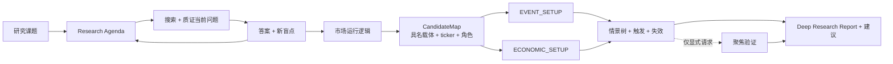

# Trade Nothing

<p align="center">
  
</p>

<p align="center"><strong>定清课题，逐题回答，发现盲点，解释市场。</strong></p>

<p align="center">
  <a href="README.md">English</a> ·
  <a href="SKILL.md">运行契约</a> ·
  <a href="docs/release-v0.15.0.md">v0.15.0 发布说明</a> ·
  <a href="docs/hypothesis-led-research-v0.10.md">v0.10 基础设计</a>
</p>

Trade Nothing 是一套面向 Agent Runtime 的课题驱动、对抗式投资研究 Skill。它把一个
课题拆成可回答的 Research Agenda，在有界轮次中搜索、质证和更新答案，主动发现新盲点，
解释市场传导并映射具体证券。

目标不是追求最低风险，而是更积极地寻找收益风险不对称的机会，同时让下行摩擦、
失效条件、证据缺口以及市场已经支付的价格无处隐藏。

它是研究工作流，不是自动交易系统。它不会自动给出买卖指令、目标价、预期收益、
Kelly 仓位或持仓比例。

> **v0.15 产品形态已落地。** Research Agenda 是主对象，机会发现是核心任务，重型验证
> 改为显式、选择性调用，Skill 止于 Deep Research Report 与条件性建议。Thesis、Decision、订单、仓位、组合、发布流程和跨产品 handoff
> 均在边界之外。CandidateMap、discovery-first 调度和新默认 renderer 已接通；真实主题
> 有效性仍未完成 benchmark。
> 详见[课题驱动产品基准](docs/topic-led-research-product.md)。

## v0.15.0：发现优先，验证按需

> **课题定义工作；每轮回答、质证，并发现此前没意识到的问题。**



发现与验证有意保持不对称：未验证机制可以在尚无引用时被记录，具名载体也可以带着
`HYPOTHESIS` 或 `INFERENCE` 标签进入 CandidateMap；只有前列候选的关键断言才需要
更严格的证据路径。两条路径都不会创建自动下游动作。

v0.15.0 保留 v0.10 的假说驱动基础，并把非对称机会挖掘、判别性证据、研究预算分配和
有界停止升级为显式契约。

### 相比 v0.14 改了什么

- **研究内核改为问题原生。** Research Agenda、统一证据、答案合并与具名证券身份共用
  确定性契约，但没有把研究流程重建成另一套状态机。
- **产业逻辑真正连接市场选择。** `ValueTransferPath` 把事实/约束变化连接到利润池转移，
  经济暴露池与市场实际交易池保持分离，并分别在事件日、战术周、财报季度和长期结构视野
  下投影建议。
- **推荐权限改为 fail-closed。** 条件性优先项必须同时具备路径语义对齐证据、最近替代项、
  当前优先理由、切换条件、与原始 payload 绑定的多角色阶段回执，以及同时包含基准超额和
  市场活跃度的宿主行情 artifact。模型自报行情和纯估值快照不能自行获得权限。
- **A 股数据可回放且不泄露密钥。** Tushare Pro、BaoStock、AKShare 腾讯和 CSV 进入统一
  冻结适配器；采集与 adapter 回执绑定候选、基准、交易日、原始序列和派生快照。Tushare
  凭证不会进入角色 prompt、state、回执、报告或三个 Skill 安装目录。

当前方法包括：

- **时间语义失败关闭。** `as_of_date` 是证据截止日，`horizon` 是相对决策窗口，
  `forecast_target_date` 是可选的精确未来目标；未来目标绝不能伪装成证据覆盖日期。
- **Deep Research Report 是默认产物。** 首屏给出结论与条件性建议，随后展示逐题答案、
  质证、新盲点、市场机制、具名载体、事件与经济兑现、价格筹码和证据标签。旧
  Opportunity Brief、Facts Box、Decision Brief 与 Candidate Cards 只保留为显式兼容视图。
- **报告等级与候选晋级解耦。** `FORMAL` 只要求收敛、必要 Landscape 覆盖完成和每条
  crux 具备独立来源。CandidateScreen 只控制具名标的排序，快照 claim 核验只控制候选
  晋级；零候选也是合法的正式研究结果。
- **Research Agenda 成为一等研究对象。** 新课题先形成 4—8 个事实、因果、市场、候选、
  定价、风险或前瞻问题；每轮保留答案、争议、缺失信息、新盲点和新问题。假说花园是
  可选工具，只有显式声明完整 Landscape 时才要求 5—7 条路径。
- **微弱线索变成可审计轨迹。** `ProxyTrail` 把一个可观察线索与方向、因果联系、
  替代解释、来源谱系、有界查询和停止条件绑定起来，不允许从“有意思”直接跳到
  “可投资”。
- **收益风险不对称只调度注意力，不调度资金。** 上行形态、凸性、下行摩擦、
  见到信号的时间和最低成本判别实验，可以决定下一步优先研究什么；它们不是概率、
  预期收益、目标价、方向或仓位输入。
- **新来源不自动等于新决策证据。** 只有 Judge 以非零方向信号接纳、且能区分非共识
  机制与最强替代解释的引用，才会重置证据耗尽。新的背景材料、平衡材料或重复材料
  仍进入审计账本，但在决策层算作一次 dry probe。
- **轮次可行性按真实结算工作计算。** Framer 必须在每轮最多两个 crux 的容量下，为
  每条 crux 预留完整结算路径所需触达；来源获取与 dry probe 可以同轮重叠，不再被错误
  串行相加。只有确实装不下完整路径时才拒绝开跑。
- **CandidateMap 保持轻量。** 上市证券必须有 ticker；价格、筹码或证据未知时，具名线索
  仍可保留，但必须标明缺口。它不新增生命周期、信心分或预期收益排序。
- **推荐权限使用独立可信数据平面。** 模型自报行情、只有估值的快照、纯假说价值路径和
  单角色阶段读数都不能形成条件性优先级；必须有宿主摄入、同时覆盖相对强弱与市场活跃度的回执。
- **严格停止不再抹去探索价值。** 只有在具名载体、替代路径、价格/筹码和事件窗口均
  完成有界覆盖后，才能输出 `NO_USABLE_SETUP`；否则保持 `EXPLORE` 并给出最低成本检验。
- **证据耗尽也能诚实收敛。** Judge 连续给出零信号不会改变支持度；只有在来源充分、
  多空双方都已探查且有界研究不再产生新证据时，crux 才可能进入 `MONITORABLE`。
  从未探查、只有单边、来源单薄或新引入的 crux 继续失败关闭。

完整说明见 [v0.15.0 发布说明](docs/release-v0.15.0.md)、历史
[v0.10 基础设计](docs/hypothesis-led-research-v0.10.md)、
[假说协议](references/hypothesis-protocol.md)和
[报告契约](references/report-contract.md)。

> [!IMPORTANT]
> **校准状态：** v0.15.0 已实现，并通过确定性工程安全门；但
> `scripts/benchmark_current.py --check` 当前返回 `UNBENCHMARKED_METHOD_CHANGE`。
> 这表示运行方法已不同于最后校准的 v0.9.9 身份。现有 closed-packet 与 discovery
> 套件只是历史控制，不是 v0.15.0 提高机会召回率、线索质量、Alpha、收益率或风险调整
> 收益的证据。工程正确性、研究有效性和投资收益是三层不同结论。

## 现在真正可靠的部分

- Judge 信号必须携带 claim、source、date 和具体文章、公告或 API URL，否则不能
  推动 crux。
- Judge 引用必须能反查到隔离 Agent 的原始 JSON，不能临时编造。
- 同一规范化 URL、claim 和 number 不能重复计分。
- 即使保留了新的审计引用，Judge 零信号也绝不会改变辩论支持度。
- `wild_hypotheses`、`hypothesis_sparks`、`proxy_trails` 和所有
  `HYPOTHESIS_ONLY` 对象，对 Judge 评分、来源计数、收敛和晋级完全不可见。
- `EVIDENCE_BACKED` 仍然只是探索成熟度，不是 `OpportunitySeed`，也不能进入
  CandidateScreen。
- `continue`、`fuse_break`、独立来源不足以及必要 crux 未解决，只会阻断 `FORMAL` 等级，
  不会阻断完整的分级报告包。
- `NO_EDGE` 只表示当前框架和证据下没有建立可用的预期差，不等于 `AVOID` 或
  `SHORT`，也不要求删除一个有界的探索路径。
- 报告数值只是辩论支持度和工作流启发式，不是经过校准的市场概率。
- 探索执行严格遵循“类型化设计 → 计划 → 明确授权 → 回执”：一次精确查询、最多
  三份文档、不得自动重试；状态或 as-of 漂移后不得摄入结果。
- 运行状态写入 `TRADE_NOTHING_SCRATCH_DIR`，不污染 Skill 源码；发布包不包含提醒、
  webhook、投资组合或下单执行入口。

## 隔离是宿主能力，不是 Skill 自带能力

Framer 在父上下文内联运行且不浏览。Detective 和 Inquisitor 必须进入互不共享中间
推理的独立上下文；CandidateScreen 与 claim 核验也有各自的隔离契约。如果宿主只能
让同一个模型切换角色，运行必须标注为 `degraded`，不得声称完成了物理多智能体隔离。

## 安装

### 在 Agent 中用自然语言安装

把下面整段直接发给 Codex、Claude Code、Gemini CLI、Antigravity 或其他编程 Agent：

```text
请为当前 Agent Runtime 安装 Trade Nothing v0.15.0，源码为：
https://github.com/Thhoho/trade-nothing.git

安全与验收要求：
1. 不要启动任何研究 run；本次只授权安装。
2. 先识别当前 Runtime 已配置的 Skill 根目录，并以其中的 `trade-nothing` 为目标。Codex
   使用 `${CODEX_HOME:-$HOME/.codex}/skills/trade-nothing`，Claude Code 使用
   `$HOME/.claude/skills/trade-nothing`，Gemini CLI 使用
   `$HOME/.gemini/skills/trade-nothing`。其他 Runtime 只能使用其文档或配置明确给出的目录；
   无法确认时停止并询问我，不要猜路径。
3. 写入前检查已有源码目录和安装目标。不得 reset、删除或覆盖 dirty checkout、运行状态、
   scratch、个人研究记忆或目标目录元数据。
4. 在新的临时目录或我批准的源码目录 clone/fetch `origin/main`，detach 到刚拉取的精确
   commit，并报告 `git rev-parse HEAD`；不得在不说明安装 commit 的情况下直接依赖持续移动
   的分支。若用户另行明确要求 annotated release tag，再单独核验；这条安装指令不授权建 tag。
5. 在该 checkout 中运行 `python3 scripts/version.py` 和 `make test`。除非必要检查因缺少
   依赖失败且我明确批准，否则不要安装第三方依赖。
6. 使用 `python3 scripts/install_skill.py --source <checkout> --targets <target>` 安装，
   不要手工复制；然后运行 `python3 scripts/check_source_sync.py --source <checkout>
   --targets <target>`。
7. 保留 `Methodology_Evolution.md`、`scripts/.state`、`.git` 和
   `~/.trade-nothing/` 下的全部内容；旧受控代码交给安装器移入可恢复隔离区。
8. 宿主要求时，网络访问和工作区外写入必须先申请权限。最后报告 commit、安装目标、
   测试结果、同步结果和被隔离文件。
```

这段提示默认只安装到当前 Runtime。若要把同一份已验证 checkout 同步到默认的 Gemini、
Codex 和 Claude 目录，需要明确要求 Agent 运行 `make install DEV_DIR="<checkout>"`，随后
运行 `make status DEV_DIR="<checkout>"`。

### Shell 安装

```bash
git clone --branch main --depth 1 https://github.com/Thhoho/trade-nothing.git
cd trade-nothing
git switch --detach
git rev-parse HEAD
python3 scripts/version.py
make test
```

把受控包安装到默认的 Gemini、Codex 和 Claude Skill 目录：

```bash
make install DEV_DIR="$(pwd)"
```

这个命令不会删除运行期 JSON、state、scratch、`.git` 或个人研究文档；已退出源码的
受控代码会被移入可恢复隔离区。Antigravity 与 Claude Code 具备有界进程适配器，Codex
具备手工 collaboration receipt 构造器；Gemini、Hermes 与 OpenHands 在本版本仍是
手工/协议级集成。准确矩阵见 `references/runtime-compatibility.md`。

然后可以直接对 Agent 说：

```text
使用 trade-nothing -deepthink2，以 OPPORTUNITY_DISCOVERY 模式研究：
“未来 3–6 个月，AI 数据中心电力约束可能把价值转移到哪些尚未充分定价的环节？”
```

推荐的 `-deepthink2` 主路径是：

1. 定义有边界、可证伪的问题，并选择 `THESIS_CHALLENGE`、
   `OPPORTUNITY_DISCOVERY` 或 `HYBRID`。
2. 在父上下文内联运行 Framer，初始化确定性状态，再把选中的 OPEN crux 分派给
   隔离的 Detective 与 Inquisitor。
3. Judge 只对带引用的正式证据评分；由引擎而不是 LLM 更新支持度，并决定继续、
   收敛或熔断。
4. 机会研究先推进 Research Agenda、产业到市场映射与 CandidateMap；CandidateScreen 和
   快照绑定的 claim 核验只在用户要求核验短名单时显式运行。
5. 如有价值，可以设计一个有界探索动作；计划不等于授权，只有用户对精确 action ID
   的明确授权，才允许执行一次查询并提交一次回执。

驱动底层命令前，必须完整阅读 [SKILL.md](SKILL.md)。运行恢复、CandidateScreen、
claim 核验和探索执行的精确 schema 都以其中契约为准。

需要 A 股有界行情时，先采集并生成 adapter artifact，再用
`--ingest-market-snapshot --market-snapshot PATH` 显式写入注册 run。它只是数据注入，
不是候选状态迁移。

### 配置 Tushare Pro

Trade Nothing 只从**父级数据采集进程**读取 `TUSHARE_TOKEN`。不要把 token 写进仓库、
提交到 Git 的 `.env`、请求 JSON、角色 prompt，或 Codex、Claude、Gemini 的三个 Skill
目录。三个 Agent 不需要分别保存三份 token；只要它们继承同一个宿主环境即可。

在 macOS/Linux 终端启动 Agent 时，先在启动它的 shell 中配置；如需持久化，只写入你自己的
私有 shell profile：

```bash
export TUSHARE_TOKEN="替换为你自己的-token"
python3 -c 'import os; print("TUSHARE_TOKEN 已配置" if os.environ.get("TUSHARE_TOKEN") else "TUSHARE_TOKEN 未配置")'
```

如果 macOS GUI 应用没有继承终端环境，把已经 export 的值注入当前用户的 launch 环境，
然后彻底退出并重启应用：

```bash
launchctl setenv TUSHARE_TOKEN "$TUSHARE_TOKEN"
```

每次只执行一个显式有界请求；适配器不会扫描全市场，也不会静默切换数据源：

```bash
python3 scripts/free_market_observations.py --input tushare-request.json \
  --output market-observations.json
python3 scripts/market_snapshot_adapter.py --input market-observations.json \
  --output market-snapshot.json
```

在 `tushare-request.json` 中设置 `"provider": "TUSHARE"`；完整请求 schema 和写入注册 run
的命令见 [`references/data-sources.md`](references/data-sources.md)。数据调用成功只证明采集与
确定性转换完成，不证明公司基本面、推荐质量或预期收益。

## 最小手动流程

```bash
# 生成 framing 请求，再由宿主内联执行 agents/framer.md。
python3 scripts/deepthink_orchestrator_v2.py --frame --topic "TARGET"

# 用原样 Framer JSON 初始化。
python3 scripts/deepthink_orchestrator_v2.py --init \
  --topic "TARGET" --frame-json '<framer_json>'

# 提交隔离的 Detective、Inquisitor 与 Judge 载荷。
python3 scripts/deepthink_orchestrator_v2.py --submit \
  --topic "TARGET" --det '<detective_json>' \
  --inq '<inquisitor_json>' --judge '<judge_json>'

# 每个终态都渲染；确定性闸门控制报告等级与允许表达的结论。
python3 scripts/deepthink_orchestrator_v2.py --report --topic "TARGET"
```

报告命令会返回默认的 `deep_research_report_markdown`、独立的
`evidence_ledger_markdown`、兼容视图和结构化 view model。新的宿主默认交付 Deep
Research Report；`opportunity`、`brief`、`cards` 和 `audit` 仅作为显式兼容视图。

常见终态或续研状态：

- `dispatch_subagents`：只对有界的 OPEN-crux packet 继续质证。
- `ready_for_report`：确定性收敛与证据闸门通过。
- `blocked_max_rounds`：达到熔断轮次，同时交付降级报告与 Resolution Memo。
- `report_data_ready`：报告数据已就绪。它总是产出——限制由 `report_grade` 承载。
- `no_edge`：尚未建立可正式使用的预期差；仍可保留一个明确标注的有界探索动作，
  但必须单独授权。

报告等级与两道硬闸门：

- `report_grade` 为 `FORMAL` / `PROVISIONAL` / `EXPLORATORY`。未满足的闸门降低等级，
  但不再删除研究成果。
- 它只由收敛、必要 Landscape 覆盖和 crux 独立来源决定。CandidateScreen 与 claim 核验
  进入独立的 `candidate_lifecycle`，不会降低报告等级。
- 报告等级不产生发布权限，也不拥有任何下游流程。
- 当触发、失效、价格筹码、替代解释和证据边界可见时，可以对具名标的给出条件性研究
  或市场建议。
- 断言分四档：`FACT` 可直接陈述；`SINGLE_SOURCE` 标注单一来源；`INFERENCE` 与
  `HYPOTHESIS` 必须带标签并允许写进正文。撕掉标签才是违规。

旧的 `-deepthink` 单后验/LFI 流程已于 v0.13.0 退役。它的 LFI/AFI/EGI/后验数值未经校准、
维护独立的 `scripts/.state/` 状态格式，且其 harvest 路径对 `-deepthink2` 的状态会静默失效。
收到 `-deepthink` 请求时改用 `-deepthink2`。

## 正式证据格式

正式引用对象格式如下：

```json
{
  "claim": "来源具体证明了什么",
  "number": "数值或 null",
  "source": "机构名称",
  "url": "https://example.com/specific-page",
  "date": "YYYY-MM-DD",
  "source_tier": "primary"
}
```

裸域名、缺日期、缺来源、超出冻结 as-of 的未来证据，以及 Judge 自行补出的引用都会
被拒绝。

## 环境变量

| 变量 | 默认值 | 用途 |
|---|---|---|
| `TRADE_NOTHING_SKILL_DIR` | 自动识别 | Skill 安装根目录 |
| `TRADE_NOTHING_SCRATCH_DIR` | `~/.trade-nothing/scratch` | 状态与 Issue 文件 |
| `TRADE_NOTHING_OUTPUT_DIR` | `~/trade-nothing-outputs` | 生成物 |
| `TRADE_NOTHING_VAULT_DIR` | `~/trade-nothing-vault` | 研究资料库 |
| `TRADE_NOTHING_EVOLUTION_PATH` | `<vault>/Methodology/Evolution.md` | 负面先验记忆 |
| `TRADE_NOTHING_MODEL_DEEP` | 宿主默认 | 质量关键角色与 Judge |
| `TUSHARE_TOKEN` | 未配置 | 仅供父进程有界采集 A 股行情的 Tushare Pro 凭证 |

## 验证、维护与同步

默认本地配置以 `~/Documents/trade-nothing` 为唯一开发源。

```bash
# 当前方法的确定性安全与回归门
make test

# 完整离线单元测试发现
python3 -B -m unittest discover -s scripts -p 'test_*.py'

# 版本与 benchmark 身份检查
python3 scripts/version.py
python3 scripts/benchmark_current.py --check --source-repo .

# 同步受控源码、隔离退役代码，再核对精确哈希
make install DEV_DIR="$(pwd)"
make status DEV_DIR="$(pwd)"
```

已安装包会明确以 package 模式检查 benchmark，并说明无法在包内核验固定 Git 对象；
`--source-repo .` 只应在规范 Git 源仓库中运行。

## 目录结构

```text
agents/       隔离角色契约
scripts/      Orchestrator、确定性引擎、校验器与测试
references/   规范性研究与报告协议；旧交接文件仅作兼容
docs/         架构与设计说明
benchmarks/   冻结评估包与方法绑定
assets/       报告模板与 README 插图
legacy/       仅源码保留的 v0.9 执行面和历史设计；不会进入安装包
SKILL.md      Agent 运行时主契约
```

## 许可证

MIT，见 [LICENSE](LICENSE)。
