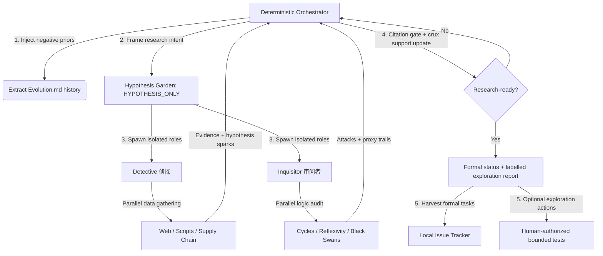

# Trade Nothing v0.13.1 — The Sovereign Alpha Hunter

> **"Propose boldly where consensus may be wrong; follow faint proxy trails before the answer is
> obvious; promote nothing until evidence survives adversarial checks. Seek upside actively without
> hiding failure paths, invalidation, or the price already paid. Excess caution is not edge, and
> imaginative prose is not evidence."**

**Skill Root:** `./` (relative to this file)  
**Scripts:** `./scripts/`  
**Agent Personas:** `./agents/`

---

## 1. Agentic Architecture (智能体协同架构)

Trade Nothing requires **host-enforced isolated contexts** for the Detective and Inquisitor.
Framer is deliberately different: it must execute **inline in the parent context**, without search
or sub-agent dispatch. It declares `research_intent` and creates hypotheses and research structure,
not evidence. `OPPORTUNITY_DISCOVERY` and `HYBRID` start with a 5–7 path entity-agnostic hypothesis
garden even when the named task is one company or asset; `THESIS_CHALLENGE` may omit it.
The frame also separates `as_of_date` (the evidence cutoff), `horizon` (relative decision window),
and optional `forecast_target_date` (an exact future target). A question that names a later date
without the explicit target field is invalid rather than silently treated as future evidence.
The skill itself cannot guarantee physical isolation; the host must record how agents were
dispatched. Single-model role switching is allowed only as an explicitly labelled `degraded` run.


```mermaid
graph TD
    A[Deterministic Orchestrator] -->|1. Inject negative priors| B(Extract Evolution.md history)
    A -->|2. Frame research intent| K[Hypothesis Garden: HYPOTHESIS_ONLY]
    K -->|3. Spawn isolated roles| C[Detective 侦探]
    K -->|3. Spawn isolated roles| D[Inquisitor 审问者]
    C -->|Parallel data gathering| E[Web / Scripts / Supply Chain]
    D -->|Parallel logic audit| F[Cycles / Reflexivity / Black Swans]
    E -->|Evidence + hypothesis sparks| A
    F -->|Attacks + proxy trails| A
    A -->|4. Citation gate + crux support update| G{Research-ready?}
    G -->|No| A
    G -->|Yes| H[Formal status + labelled exploration report]
    H -->|5. Harvest formal tasks| I[Local Issue Tracker]
    H -->|5. Optional exploration actions| J[Human-authorized bounded tests]
```

### Agent Runtime Compatibility (多平台适配)

Support is stage-specific. Do not infer verified isolation from successful installation:

| Runtime | Detective Dispatch | Inquisitor Dispatch | Notes |
|---------|-------------------|---------------------|-------|
| **Antigravity (agy)** | `deepthink_host_runner.py --runtime antigravity` | Same | Implemented bounded OS-process adapter |
| **Claude Code** | `deepthink_host_runner.py --runtime claude-code` | Same | Implemented structured-output OS-process adapter |
| **Codex** | Manual collaboration-agent dispatch | Same | Receipt helpers exist; no Codex CLI host runner |
| **Gemini CLI** | Manual context/process mapping | Same | Installation only; no verified receipt adapter |
| **Hermes / OpenHands** | Protocol mapping only | Same | Documentation-only, not release-validated |
| **Single Model (Fallback)** | Role-switch prompt injection | Same | Must be marked `degraded`; no isolation claim |

Read `references/runtime-compatibility.md` for CandidateScreen/Claim Verifier coverage and the
audited assurance level. Framer is never dispatched through the mechanisms in this table. On every runtime—including
Antigravity/`agy`—the parent reads `agents/framer.md`, produces its strict JSON inline, and submits
that JSON to `--init`. See `references/runtime-protocol.md` for bounded waits and failure handling.

> **Critical Constraint**: Detective and Inquisitor must run in isolated contexts with no shared
> intermediate reasoning and communicate only through structured JSON. If the host cannot enforce
> this, state that limitation in the report; do not claim a physically isolated multi-agent run.

### Role Definitions

- **Orchestrator**: Deterministic dispatch and report gate. Loads negative priors, stores evidence,
  de-duplicates citations, applies bounded support-score updates, evidence-back-checks and merges
  OpportunitySeeds across rounds, combines isolated Candidate Analyst/Skeptic screens without
  averaging away disagreement, binds decisive claims to content-hashed source snapshots, and
  blocks unconverged or source-unverified promotion.
- **Judge**: Evidence scorer, not a researcher or final decision-maker. It may score only claims
  present in the isolated agent JSON and must attach concrete citations.
- **Detective** (`agents/detective.md`): Generates non-consensus mechanisms, follows faint proxy
  trails, and verifies physical constraints, value transfer, and pricing. Optimistic exploration
  bias; explicit evidence boundary.
- **Inquisitor** (`agents/inquisitor.md`): Applies full-strength red-team attacks while constructing
  symmetric bull-surprise, base, and bear-failure paths. It can preserve counter-mechanism sparks
  without forcing an arbitrary crash or bottom price.
- **Claim Verifier** (`agents/claim_verifier.md`): Independently checks claim-to-snapshot alignment
  using short exact source spans. It does not assess publisher truth or investment merit.

---

## 2. Execution Pipelines (核心模式)

### Mode B: `-deepthink` — RETIRED

The legacy single-posterior/LFI pipeline was removed in v0.13.0 along with
`deepthink_orchestrator.py`, `deepthink_engine.py`, and `dungs_argumentation.py`.
Its LFI/AFI/EGI/posterior numbers were uncalibrated, it maintained a separate state
format under `scripts/.state/`, and its harvest path silently missed `-deepthink2`
state. A `-deepthink` request must be answered by running `-deepthink2` instead.
Archived v1 state files are readable only through Git history.

---

### Mode C: `-scan` — Experimental Macro Radar

Invoke `scripts/logic_radar_v2.py` to inspect its configured macro triggers in read-only mode. This is **not** a
full-universe stock scanner: the current script does not maintain a security universe, rank
candidates, or validate investability. If a host adds a Detective flash screen, label it
experimental and route any candidate back through `-deepthink2`. Do not emit R/R, target price,
or position sizing from radar output.

### Mode D: `-calibrate` — Historical Audit
1. Run `scripts/logic_radar_v2.py` to preview verification of all `[ASSERTION: ...]` entries in
   `Evolution.md` without modifying the file.
2. Mark `✅correct` or `❌wrong` in the response. Pass `--write-evolution` only when the user
   explicitly asks to persist the calibration.
3. On `❌wrong`: Force halt and demand root cause analysis + methodology correction, which feeds back as negative constraints in the next `-deepthink2` run.

### Mode E: `-premortem` — Distributed Pre-mortem
Spawn 3 independent Inquisitor instances. Each constructs a different symmetric
`BULL_SURPRISE / BASE / BEAR_FAILURE` map over the declared horizon, with observable triggers,
transmission chains, falsifiers, and kill-switch monitors. Do not preset a crash percentage,
bottom price, target price, or path probability.

---

### Mode F: `-deepthink2` — Crux-Based Adversarial Pipeline (v0.13.1, recommended)

> Replaces the single-posterior + LFI layer (which railroaded every run to 0%/100% and always
> burned 12 rounds) with two separate ledgers: a non-promotable **exploration ledger** for wild
> hypotheses, sparks, proxy trails, alternative explanations, and cheap tests; and a
> **per-crux evidence ledger** for bounded debate-support, decision-readiness convergence,
> de-duplicated citations, OpportunitySeed admission, and formal reporting. The score is a workflow heuristic, not
> a probability, return forecast, target price, trade signal, or sizing input.

**Model tiering** (`scripts/model_tiers.py`): Detective / Inquisitor / Candidate Analyst /
Candidate Skeptic / Claim Verifier / Framer / Judge / battle-log synthesis use the **DEEP** model by default.
Judge and CandidateScreen evidence quality directly control their respective gates.
Override via `TRADE_NOTHING_MODEL_DEEP` / `TRADE_NOTHING_MODEL_FAST`.

When receiving `-deepthink2 "target/topic"`, run this orchestrator-driven loop:

For Antigravity or Claude Code, prefer the resumable host runner after producing the Framer JSON
inline. It creates an immutable `run_id`, runs Detective/Inquisitor in separate OS processes,
checkpoints successful roles, dispatches Judge separately, and never retries a failed role
automatically. Select the actual host explicitly when both CLIs are installed:

```bash
python3 scripts/deepthink_host_runner.py start --topic "TARGET" \
  --frame-json '<framer_output>' --run-purpose PRODUCTION_RESEARCH --round-budget 1
# Continue only after the caller authorizes more runtime/research budget:
python3 scripts/deepthink_host_runner.py resume --run-id "RUN-..." --round-budget 1
# Preferred once budget is authorized: stop on evidence exhaustion, not a round count.
# --round-budget then acts as a safety fuse rather than the operative limit.
python3 scripts/deepthink_host_runner.py resume --run-id "RUN-..." \
  --round-budget 9 --stop-after-dry-rounds 3
# From Claude Code, use its structured-output CLI adapter rather than agy:
python3 scripts/deepthink_host_runner.py resume --run-id "RUN-..." \
  --runtime claude-code --round-budget 9 --stop-after-dry-rounds 3
# Adopt a pre-v0.12 state once, then address it only by run_id:
python3 scripts/deepthink_host_runner.py adopt --state-path "/.../v2_state.json"
```

Use `--allow-agent-tools` only after explicit authorization. The default one-round budget is
intentional. A 429, timeout, invalid JSON, or one-sided failure returns a stage envelope and retains
the successful role payload; resume reruns only the missing role. Read
`references/run-resume-protocol.md` before adopting or recovering a run. Registered stage results
are content-addressed artifacts: the public envelope contains control fields and verified paths,
not the full result/report body. Read `references/artifact-envelope-protocol.md` before explicitly
loading one. The manual commands below
remain a runtime-agnostic fallback; once a run has an id, do not mix topic-based and run-id-based
addressing.

```bash
# 1. Framing gate (DEEP, runs once) — question type + research intent + logic graph + 2-5 cruxes
python3 scripts/deepthink_orchestrator_v2.py --frame --topic "TARGET"
# When tradenothing-next exported a human-gated ACTIVE Lesson packet, read
# references/research-start-packet-protocol.md and add:
#   --start-packet /path/to/RSP-....json
#    → execute agents/framer.md INLINE IN THE PARENT. Never define/invoke a Framer sub-agent and
#      never browse during framing. If no_edge_precheck.is_researchable=false → emit
#      No-Edge statement and STOP (spawn nothing). Lack of an obvious variant perception is not
#      sufficient; false means the question is not bounded or falsifiable.
#    → Framer must return inline JSON only. It must not create Markdown, Google Drive/cloud files,
#      or choose an output path. Persistence requires explicit user opt-in and an approved output root.
#    → OPPORTUNITY_DISCOVERY/HYBRID must include 5-7 entity-agnostic wild hypotheses in
#      hypothesis_garden, all HYPOTHESIS_ONLY. THESIS_CHALLENGE may omit the garden.

# 2. Init from frame → Round-1 dispatch prompts (Detective+Inquisitor scoped to all cruxes)
python3 scripts/deepthink_orchestrator_v2.py --init --topic "TARGET" --frame-json '<framer_output>'
# If --frame used --start-packet, --init MUST receive that exact same packet.
#    → status=frame_rejected when premise_audit, unit_of_analysis, falsifiers, concrete catalyst
#      windows, or No-Edge basis are missing. Never repair or bypass this gate by hand.
#    A host with physically isolated contexts may additionally pass --runtime-isolation verified.
#    Framer JSON cannot self-attest this field; default is unverified.

# Runtime failure receipt (non-formal; use after a bounded stage timeout, never as a report)
python3 scripts/deepthink_orchestrator_v2.py --runtime-failure --topic "TARGET" \
    --stage framing --reason "host timeout before init"

# 3. Each round: spawn isolated Detective (detective.md) + Inquisitor (inquisitor.md) on the
#    OPEN cruxes only (+ Inquisitor's free-roam slot to re-open a resolved crux). Both may emit
#    max 3 HYPOTHESIS_ONLY sparks and 3 proxy trails for the separate exploration ledger, plus
#    max 3 OpportunitySeeds backed by their own same-round/same-crux evidence. Judge must ignore
#    every exploration object. Then score only formal evidence with
#    the DEEP Judge (agents/judge.md) and submit:
python3 scripts/deepthink_orchestrator_v2.py --submit --topic "TARGET" \
    --det '<detective_json>' --inq '<inquisitor_json>' --judge '<judge_json>'
#    → status=dispatch_subagents (loop), blocked_max_rounds, ready_for_report, OR for
#      UNIVERSE_SEARCH/COMPARATIVE with screenable leads: dispatch_candidate_screeners;
#      with only blocked evidence-backed leads: candidate_gap_tasks_planned.
#    Whenever the loop ends for ANY reason — convergence, fuse, exhausted budget, or the user
#    stopping early — run step 4 before finishing. A run that never calls --report delivers
#    nothing, which is strictly worse than delivering a graded EXPLORATORY report.

# 3a. Candidate maturation: after convergence, execute the bounded task rather than rewriting
#     an OpportunitySeed or lowering the independent-source gate. Every attempt is appended.
python3 scripts/deepthink_orchestrator_v2.py --plan-candidate-gaps --topic "TARGET"
python3 scripts/deepthink_orchestrator_v2.py --submit-gap-evidence --topic "TARGET" \
    --task-id "CGT-..." --supplement '<candidate-evidence-supplement JSON>'
# If the bounded task ends without aligned evidence, preserve a terminal research result.
python3 scripts/deepthink_orchestrator_v2.py --close-gap-task --topic "TARGET" \
    --task-id "CGT-..." --close-status SOURCE_EXHAUSTED --close-reason "reason"
# Read references/candidate-maturation-protocol.md before using these commands.

# 4. Report: ALWAYS available, at any round, converged or not. `--report` never blocks; an
#    unconverged run returns report_grade=EXPLORATORY plus the Resolution Memo, and only the
#    FORMAL grade may claim to be a formal report. Do NOT skip this step because --submit
#    returned `continue` — that is the single most common operator error, and it is how a run
#    ends with no artifact at all. Opportunity questions additionally surface a CandidateScreen
#    dispatch, which gates ranking, not the report. Use --challenge-only when the user wants
#    thesis critique without opportunity screening. The orchestrator exposes a deterministic
#    facts box, Evidence Ledger, candidate cards, and the synthesis packet (default on). The
#    parent compiles the content-driven Decision Brief without altering locked facts.
python3 scripts/deepthink_orchestrator_v2.py --report --topic "TARGET"
#    `--allow-non-formal` is a deprecated compatibility no-op. Never use it to request a
#    ledger-only result; if an older caller still passes it, the same complete graded bundle
#    must be returned with a warning.
# Low-context locked-facts view (synthesis input remains explicit opt-in):
python3 scripts/deepthink_orchestrator_v2.py --report --topic "TARGET" --report-view facts_box
# Read references/report-contract.md before changing report status words, views, or next actions.
# Explicit thesis-critique-only escape hatch:
python3 scripts/deepthink_orchestrator_v2.py --report --topic "TARGET" --challenge-only

# 4a. Fuse-break: FORMAL grade remains blocked, but always render the complete EXPLORATORY report
#     bundle plus a Resolution Memo and compact continuation packet. Persist all report artifacts
#     when the user requested an artifact.
python3 scripts/deepthink_orchestrator_v2.py --resolution-memo --topic "TARGET"

# 4b. Resume only after explicit user authorization because this consumes more research budget.
python3 scripts/deepthink_orchestrator_v2.py --resume-blocked --topic "TARGET" --extra-rounds 3

# 4c. Optional exploration loop. Design and planning are safe and non-executing.
# If exploration_action.authorization_state=NEEDS_ACTION_DESIGN, record exactly
# the typed design requested by its action_code. The design must bind both the
# emitted design_target_id and design_state_revision.
python3 scripts/deepthink_orchestrator_v2.py --record-exploration-design \
    --topic "TARGET" --exploration-design \
    '{"design_reviewed":true,"design_scope":"ONE_EXPLORATION_LEDGER_DESIGN","design_note":"reviewed the cheapest two-sided test","design_target_id":"DT-...","expected_state_revision":12,"hypothesis_id":"WH-...","action_code":"DESIGN_PROXY_TRAIL","proxy_plan":[{"direction":"SUPPORTS","proxy":"dated customer acceptance milestone","causal_link":"acceptance distinguishes qualified scarcity from announced capacity","publisher_class":"CUSTOMER_OR_COUNTERPARTY","bounded_query":"site:customer.example dated acceptance supplier","stop_condition":"stop after one query or three documents","origin_crux":"C1"},{"direction":"CONTRADICTS","proxy":"dated qualification lead-time compression","causal_link":"compression contradicts persistent qualified scarcity","publisher_class":"REGULATOR_OR_OFFICIAL_DATASET","bounded_query":"official qualification lead time series","stop_condition":"stop after one query or three documents","origin_crux":"C1"}]}'

# Planning freezes one attempt. Repeating this command is idempotent while that
# exact attempt remains open. An unapproved plan may be explicitly cancelled;
# cancellation performs no search and allows a new attempt ID.
python3 scripts/deepthink_orchestrator_v2.py --plan-exploration --topic "TARGET"
python3 scripts/deepthink_orchestrator_v2.py --cancel-exploration-action \
    --topic "TARGET" --action-id "EA-..." --reason "superseded by a better diagnostic route"

# Never call --authorize-exploration unless the user explicitly authorizes the
# exact action_id. This receipt is caller-attested procedural evidence; it is
# not cryptographic proof of a host UI approval event.
python3 scripts/deepthink_orchestrator_v2.py --authorize-exploration --topic "TARGET" \
    --action-id "EA-..." --authorization-receipt \
    '{"action_id":"EA-...","explicit_user_authorization":true,"authorization_scope":"ONE_BOUNDED_EXPLORATION_ACTION","authorization_note":"user explicitly approved this one bounded test"}'
# Run only the emitted dispatch contract, then close it with the exact bounded receipt.
python3 scripts/deepthink_orchestrator_v2.py --submit-exploration-result --topic "TARGET" \
    --action-id "EA-..." --exploration-result '<authorized exploration result JSON>'
# This endpoint may write one ProxyTrail only. It cannot mutate cruxes, OpportunitySeeds,
# CandidateScreens, claims, decisions, trades, or schedule a follow-on.
# Every document needs a concrete URL and YYYY-MM-DD date on or before the frozen
# as_of_date. Proxy evidence must bind an exact document_id (or the full canonical
# citation tuple), planned route_id, planned proxy, origin crux, query, source class,
# causal link, and stop condition. If formal or exploration state changed after
# authorization, the result is not ingested: the host stores only a SHA-256 stale
# receipt, closes the old attempt, and forbids automatic retry.

# 5. CandidateScreen: for opportunity questions this is the default post-convergence continuation.
#    The deterministic engine selects at most 3 de-duplicated READY_FOR_SCREENING seeds using
#    evidence breadth, causal directness, structured pricing-anchor completeness, and observable
#    catalyst. This is research priority, not expected return, conviction, or a ranking signal.
#    Omit --seed-id to screen the next unscreened batch (max 3).
python3 scripts/deepthink_orchestrator_v2.py --screen --topic "TARGET" --as-of "YYYY-MM-DD"

# 6. Submit both isolated JSON payloads. The deterministic engine emits WATCHLIST,
#    REJECTED, or THESIS_CANDIDATE, then --report renders the eight-dimension matrix.
python3 scripts/deepthink_orchestrator_v2.py --submit-screen --topic "TARGET" --as-of "YYYY-MM-DD" \
    --screen-isolation verified --analyst '<candidate_analyst_json>' --skeptic '<candidate_skeptic_json>' \
    --isolation-receipt candidate-screen-receipt.json

# 7. List decisive claims and URLs that require immutable page snapshots.
python3 scripts/deepthink_orchestrator_v2.py --verification-plan --topic "TARGET"

# 8. Capture public pages (repeat --url) and dispatch the independent Claim Verifier.
python3 scripts/evidence_snapshot.py --url "SPECIFIC_URL" --output snapshots.json
python3 scripts/deepthink_orchestrator_v2.py --verify-claims --topic "TARGET" \
    --snapshots snapshots.json

# 9. Submit exact-span verdicts. Only snapshot-aligned VERIFIED candidates return to
#    DRAFT_REQUIRES_HUMAN; contradictions physically block promotion.
python3 scripts/deepthink_orchestrator_v2.py --submit-verification --topic "TARGET" \
    --snapshots snapshots.json --verifier '<claim_verifier_json>' --verifier-isolation verified \
    --verifier-isolation-receipt claim-verifier-receipt.json
```

### Mandatory protocol routing

Before operating a specialized ledger or gate, read the matching protocol completely:

- Tracking and candidate maturation: `docs/path-led-research-v0.12.md` and
  `references/candidate-maturation-protocol.md`.
- Facts-locked reporting, synthesis, publication/ranking gates, and anti-template rules:
  `references/report-contract.md`.
- Hypothesis sparks, proxy trails, authorized exploration, and non-promotion:
  `references/hypothesis-protocol.md`.
- Landscape scheduling, repairable payload fields, coverage, and path binding:
  `references/landscape-map-protocol.md`.
- Opportunity admission and pricing anchors: `references/opportunity-protocol.md` and
  `references/pricing-gap-protocol.md`.
- CandidateScreen and claim verification: `references/candidate-screen-protocol.md` and
  `references/claim-verification-protocol.md`.
- Benchmark and product handoff: `references/benchmark-protocol.md` and
  `references/project-handoff-protocol.md`.

`--report` always returns a graded artifact. FORMAL requires deterministic convergence, required
Landscape completion, and independent sourcing for every crux. CandidateScreen gates named-security
ranking, while claim verification gates candidate promotion only; neither lowers `report_grade`.
An unconverged terminal stop is EXPLORATORY; a converged run with an unmet research gate is
PROVISIONAL. Unconverged reports retain their Resolution Memo and next action.
The parent composes a content-driven Decision Brief only from the locked Facts Box, view model, and
explicit synthesis packet. It must never modify deterministic facts or expose raw role transcripts.

Every new run pins `method_identity` and `run_purpose`. Resume fails closed after method drift;
`status` remains read-only and reports pinned/current identities. Installed legacy state is never
auto-loaded; use an exact explicit `adopt --state-path` command.

## 3. Core Commands

Produce Framer JSON inline in the parent, then prefer the registered host runner where supported:

```bash
python3 scripts/deepthink_host_runner.py start --topic "TARGET" \
  --frame-json '<json>' --run-purpose PRODUCTION_RESEARCH --round-budget 1
python3 scripts/deepthink_host_runner.py resume --run-id "RUN-..." \
  --runtime claude-code --round-budget 9 --stop-after-dry-rounds 3
python3 scripts/deepthink_host_runner.py status --run-id "RUN-..."
```

The runtime-agnostic manual control surface remains:

```bash
python3 scripts/deepthink_orchestrator_v2.py --init --topic "TARGET" --frame-json '<json>'
python3 scripts/deepthink_orchestrator_v2.py --submit --topic "TARGET" \
  --det '<json>' --inq '<json>' --judge '<json>'
python3 scripts/deepthink_orchestrator_v2.py --report --topic "TARGET"
```

Use the receipt-producing adapters for promotion-sensitive stages:

```bash
python3 scripts/agy_candidate_screen_runner.py --topic "TARGET" \
  --as-of "YYYY-MM-DD" --runtime claude-code
python3 scripts/claim_verifier_runner.py --topic "TARGET" \
  --snapshots snapshots.json --runtime claude-code
```

For source validation and installation:

```bash
python3 scripts/benchmark_current.py --check --source-repo .
make test
make install DEV_DIR="$(pwd)"
make status DEV_DIR="$(pwd)"
```

Read the routed protocol before using lower-level exploration, gap-task, snapshot, report-validation,
handoff, radar, model-building, or provider commands. None authorizes a
trade, Thesis, Decision, retry, external publication, or side effect by implication.

## 4. Environment Configuration (环境变量)

All paths are portable. Override defaults via environment variables:

| Variable | Default | Description |
|----------|---------|-------------|
| `TRADE_NOTHING_SKILL_DIR` | `./` (auto-detected) | Skill installation root |
| `TRADE_NOTHING_SCRATCH_DIR` | `~/.trade-nothing/scratch` | Runtime state & issue files |
| `TRADE_NOTHING_OUTPUT_DIR` | `~/trade-nothing-outputs` | Generated research artifacts |
| `TRADE_NOTHING_VAULT_DIR` | `~/trade-nothing-vault` | Research data vault |
| `TRADE_NOTHING_EVOLUTION_PATH` | `<vault>/Methodology/Evolution.md` | Active memory file |
| `TRADE_NOTHING_AUTO_CONTINUE` | unset | If set, skip interactive timers (headless mode) |
| `TRADE_NOTHING_DISABLE_PROXY` | unset | Explicit opt-in to bypass configured proxies for provider requests |

When `TRADE_NOTHING_EVOLUTION_PATH` is unset, resolve the first non-empty file from
`<TRADE_NOTHING_VAULT_DIR>/Methodology/Evolution.md`, then
`~/Documents/Trade_Nothing_Vault/Methodology/Evolution.md`. Runtime memory is never installed,
copied into, or auto-loaded from the skill directory.

---

*Trade Nothing v0.13.1 — Hunt Alpha, Not Consensus.*
*Adversarial multi-agent architecture with full lifecycle negative feedback loops.*


## 5. Core Safety Guardrails (核心安全护栏与逻辑红线)

> [!IMPORTANT]
> **【逻辑诚实与数学一致性公理】**：
> 1. **v2 支持度只能读取 `crux_engine.py` 生成的状态；它不是统计概率，不得用于 Kelly、目标价、收益率或仓位。**
> 2. **没有具体 URL、来源与日期的数字不得进入评分；重复的 URL+claim+number 不得重复计分。**
> 3. **报告永远产出。`continue` / `fuse_break` 不再抹掉研究成果，而是把 `report_grade` 降为
>    `EXPLORATORY`，并如实呈报未收敛 crux。只有 `FORMAL` 等级才允许自称正式报告。**
> 4. **当前发布包不包含提醒、webhook、投资组合或下单执行入口；任何外部副作用都必须由宿主另行集成并取得用户明确授权。**
> 5. **v1 的 LFI/AFI/EGI/后验管线已于 v0.13.0 退役。历史报告里的这些数值是未校准启发式，
>     不得包装成真实胜率，也不得作为新研究的输入。**
> 6. **CandidateScreen 分歧不得取平均；THESIS_CANDIDATE 必须先完成来源内容对齐，且永远不得自动建仓或继承原命题分数。**
> 7. **THESIS_CANDIDATE 在页面快照与 claim 对齐完成前不得进入人工升级；CandidateScreen
>    与 Claim Verifier 的 `verified` 字符串不能自证隔离，缺少有效绑定收据、哈希或精确片段必须保持阻塞。**
> 8. **Framer 只能内联返回 JSON；未经用户明确授权不得写入 Google Drive、云文档或自选路径。缺少前提审计、反证条件或催化窗口时，`--init` 必须返回 `frame_rejected`。**
> 9. **默认用户报告不得包含 Detective/Inquisitor/Judge 原始输出、搜索日志或写作占位符；这些只留在 state 审计层。**
> 10. **`fuse_break` 禁止 `FORMAL` 等级和自动续跑，但必须同时交付降级报告与 Resolution Memo；扩展轮次必须由用户显式授权。**
> 11. **Framer 必须由父上下文内联执行，禁止派生子代理和搜索；任何阶段超时必须输出非正式 runtime failure memo，禁止无界等待、伪造输出或自动重试。**
> 12. **题型、逻辑图和 crux 角色决定总命题聚合方式；`NO_EDGE`、证据方向与可行动性必须分开，禁止恢复 `NO_EDGE / AVOID`。**
> 13. **报告合法、根问题 `READY_FOR_SCREENING` 与候选可升级是三件事；只有候选级 `VERIFIED_FOR_HUMAN` 可以进入人工 DRAFT Thesis。**
> 14. **`wild_hypotheses`、`hypothesis_sparks`、`proxy_trails` 与 `HYPOTHESIS_ONLY` 永远不得进入 Judge 评分、来源计数、收敛或晋级；但不得因证据尚弱而从探索账本静默删除。**
> 15. **`research_intent` 必须独立于题型声明；`OPPORTUNITY_DISCOVERY` / `HYBRID` 必须先生成 5–7 个实体无关假说，`THESIS_CHALLENGE` 才可省略。**
> 16. **报告必须物理区分唯一正式动作与可选探索动作；探索动作只用于经人明确授权的有界求证，不能绕过 fuse、CandidateScreen、快照核验或人工闸门。**
> 17. **Inquisitor 必须同时构造 bull surprise、base、bear failure 路径；不得预设固定暴跌幅度、底价、目标价或伪概率来制造红队强度。**
> 18. **标注优先于许可。研究等级只由收敛、必要 Landscape 覆盖和 crux 独立来源决定；CandidateScreen 与 claim 核验必须进入独立的 `candidate_lifecycle`，不得降低 `report_grade`，也不得阻止报告产出。对外使用另有两道硬闸门：**
>     - **`publication_allowed`**：对外传播稿（公开文章、推送、任何离开本人之手的产物）只有 `FORMAL` 等级才允许；
>     - **`ranking_allowed`**：对具名标的排序、打分或使用推荐语气，必须以最新一轮 CandidateScreen 的存续结果为准，且权限只覆盖 `candidate_lifecycle.rankable_seed_ids`，不得扩展到未筛选或已拒绝候选。
>     两者为 false 时，报告照常交付，但禁止产出对外稿件与个股排序。
> 19. **断言分三档，缺标签才是违规，证据弱不是：`VERIFIED`（≥2 家独立出版方）可直接陈述；
>     `SINGLE_SOURCE` 必须标注『单一来源·未交叉验证』；`HYPOTHESIS` 必须标注『假说』。
>     假说允许写进正文——它是洞见的来源；把假说去标签写成断言（hypothesis laundering）才是红线。**
> 20. **报告的自我描述（引用条数、轮次、独立出版方数、收敛状态、覆盖率）一律读取
>     `evidence_counts` 与 `research_grade`，严禁叙事层自行撰写。**
> 21. **覆盖率不再阻断收敛。Landscape 路径只在仍有质证预算时阻断；预算耗尽的路径记为
>     `UNKNOWN` 并标注 `ASSIGNMENT_EXHAUSTED_NO_ACCEPTED_EVIDENCE`。要求无法达成的覆盖会让整轮研究死锁。**
> 22. **【载荷契约公理】新增任何一条拒绝理由前，必须先回答：*引擎自己能不能算出这件事？*
>     能算出的一律修复并记 `repair_notes`，不得丢弃载荷；只有内容本身缺失才允许拒绝。**
>     - **可派生（必须修复）**：路径归属哪个 crux、本轮分配了哪些路径、状态词拼写、
>       seed 属于哪条路径、claim 措辞与父数组不一致。引擎对这些持有权威答案，
>       要求子代理猜对、猜错即整条丢弃，是 bug 而不是闸门。
>     - **需证据（必须拒绝）**：因果链缺失、无来源支撑、URL 无效或为占位、
>       日期越过 `as_of_date`、载荷非对象。这些只有内容能确立，放宽等于允许凑数。
>     实践依据：一次真实运行中 24 份载荷只有 1 份被采纳，其余全部因可派生字段被丢弃，
>     而这个事实要翻进嵌套 audit 才看得见。因此 `payload_yield`（提交/采纳/丢弃/应交未交）
>     必须出现在 Facts Box，让契约回归第一眼可见。
> 23. **预算按产出计，不按轮数计。** 一轮可能新增五条引用，也可能空转。
>     `--stop-after-dry-rounds N` 是操作性停止条件（连续 N 轮无新增证据、探测或 seed 进展），
>     `--round-budget` 退化为安全熔断。Landscape 的最低轮次必须包含 crux 定型余量，
>     只算"覆盖 + harvest-dry"会给出数学上不可能收敛的下限。
