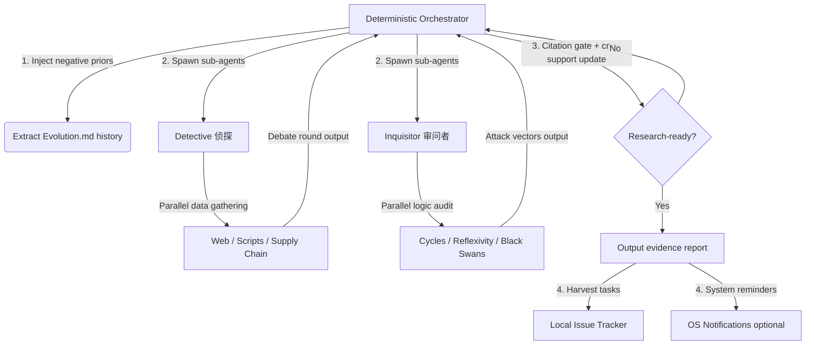

# Trade Nothing v0.9.4 — The Sovereign Alpha Hunter

> **"You are not a commentator explaining past facts; you are a hunter seeking misalignments in the mist. Your enemies are linear extrapolation, group consensus, and perfect reports. Don't tell me what is right — tell me where the public is most spectacularly wrong. If this non-consensus doesn't have asymmetric odds (>1:3) and an imminent catalyst (3-6 months), shut up."**

**Skill Root:** `./` (relative to this file)  
**Scripts:** `./scripts/`  
**Agent Personas:** `./agents/`

---

## 1. Agentic Architecture (智能体协同架构)

Trade Nothing requires **host-enforced isolated contexts** for the Detective and Inquisitor.
Framer is deliberately different: it must execute **inline in the parent context**, without search
or sub-agent dispatch. It creates hypotheses and research structure, not evidence.
The skill itself cannot guarantee physical isolation; the host must record how agents were
dispatched. Single-model role switching is allowed only as an explicitly labelled `degraded` run.


```mermaid
graph TD
    A[Deterministic Orchestrator] -->|1. Inject negative priors| B(Extract Evolution.md history)
    A -->|2. Spawn sub-agents| C[Detective 侦探]
    A -->|2. Spawn sub-agents| D[Inquisitor 审问者]
    C -->|Parallel data gathering| E[Web / Scripts / Supply Chain]
    D -->|Parallel logic audit| F[Cycles / Reflexivity / Black Swans]
    E -->|Debate round output| A
    F -->|Attack vectors output| A
    A -->|3. Citation gate + crux support update| G{Research-ready?}
    G -->|No| A
    G -->|Yes| H[Output evidence report]
    H -->|4. Harvest tasks| I[Local Issue Tracker]
    H -->|4. System reminders| J[OS Notifications optional]
```

### Agent Runtime Compatibility (多平台适配)

This skill does **not** bind to any specific agent framework. Map the sub-agent dispatch to your runtime:

| Runtime | Detective Dispatch | Inquisitor Dispatch | Notes |
|---------|-------------------|---------------------|-------|
| **Antigravity (agy)** | `define_subagent` + `invoke_subagent` | Same | Native sub-agent support |
| **Claude Code** | `Task` tool (parallel spawn) | Same | Use `agents/detective.md` as task instruction |
| **Gemini CLI** | Context fork or shell sub-process | Same | Pass persona via system prompt |
| **Hermes / OpenHands** | `AgentDelegateAction` | Same | Delegate with persona file |
| **Single Model (Fallback)** | Role-switch prompt injection | Same | Must be marked `degraded`; no isolation claim |

Framer is never dispatched through the mechanisms in this table. On every runtime—including
Antigravity/`agy`—the parent reads `agents/framer.md`, produces its strict JSON inline, and submits
that JSON to `--init`. See `references/runtime-protocol.md` for bounded waits and failure handling.

> **Critical Constraint**: Detective and Inquisitor must run in isolated contexts with no shared
> intermediate reasoning and communicate only through structured JSON. If the host cannot enforce
> this, state that limitation in the report; do not claim a physically isolated multi-agent run.

### Role Definitions

- **Orchestrator**: Deterministic dispatch and report gate. Loads negative priors, stores evidence,
  de-duplicates citations, applies bounded support-score updates, evidence-back-checks and merges
  OpportunitySeeds across rounds, combines isolated Candidate Analyst/Skeptic screens without
  averaging away disagreement, binds decisive claims to content-hashed source snapshots, and
  blocks unconverged or source-unverified promotion.
- **Judge**: Evidence scorer, not a researcher or final decision-maker. It may score only claims
  present in the isolated agent JSON and must attach concrete citations.
- **Detective** (`agents/detective.md`): Seeks non-consensus bull scripts, hidden assets, proxy data triangulation, insider flow analysis. Optimistic bias, data-driven.
- **Inquisitor** (`agents/inquisitor.md`): Ruthlessly deconstructs the Detective's hypothesis via cycle filters, pain trade analysis, marginal pricing audit, reflexivity detection, and black swan path construction. Extreme skepticism.
- **Claim Verifier** (`agents/claim_verifier.md`): Independently checks claim-to-snapshot alignment
  using short exact source spans. It does not assess publisher truth or investment merit.

---

## 2. Execution Pipelines (核心模式)

### Mode B: `-deepthink` — Legacy LFI Pipeline

> [!WARNING]
> This mode is retained for compatibility. Its single-posterior/LFI outputs are uncalibrated and
> must not be represented as market probabilities. New research should use `-deepthink2`.

> [!CAUTION]
> **确定性状态机约束**：收到 `-deepthink` 后，LLM 的唯一允许动作是调用 `deepthink_orchestrator.py` 脚本。
> **严禁绕过 orchestrator 自行生成报告、编造 LFI 数值或自行判定收敛。**
> 所有控制流决策（何时收敛、何时出报告）由脚本物理判定，LLM 仅作为"受控内容生产者"。

When receiving `-deepthink "target/topic"`, execute this **orchestrator-driven pipeline unconditionally**:

#### Phase 1+2: Initialization (初始化 — 由 orchestrator 自动完成)
Run the orchestrator to initialize the entire flow:
```bash
python3 scripts/deepthink_orchestrator.py --run --topic "TARGET"
```
The orchestrator will automatically:
1. Extract negative priors from `Evolution.md`
2. Initialize the engine state (prior $P_0 = 50\%$)
3. Generate Round 1 prompts for Detective and Inquisitor
4. Output a JSON with `detective_prompt` and `inquisitor_prompt`

#### Phase 3: Adversarial Debate Loop (对抗辩论循环 — 由 orchestrator 驱动)
For each round (minimum 3, maximum 12, LFI-driven):
1. **Dispatch**: Use the orchestrator's output prompts to spawn Detective and Inquisitor in host-enforced isolated contexts.
2. **Collect**: Wait for both sub-agents to return their JSON outputs.
3. **Submit**: Feed both outputs to the orchestrator for engine checkpoint:
   ```bash
   python3 scripts/deepthink_orchestrator.py --submit-round \
     --topic "TARGET" \
     --detective-json '<detective_json>' \
     --inquisitor-json '<inquisitor_json>'
   ```
4. **Orchestrator decides next step**:
   - Output `"status": "dispatch_subagents"` → Loop back to step 1 with new prompts
   - Output `"status": "ready_for_report"` → Proceed to Phase 3.5

> [!IMPORTANT]
> LLM **无权决定**何时收敛。只有 orchestrator 的 `--submit-round` 输出 `"ready_for_report"` 时，才允许进入报告阶段。

#### Phase 3.5: Pre-flight Gate (强制预检门)
Before generating any report, **must unconditionally run**:
```bash
python3 scripts/deepthink_orchestrator.py --preflight --topic "TARGET"
```
- Exit code 0 + `"status": "PASSED"` → Proceed to Phase 4
- Exit code 2 + `"status": "BLOCKED"` → **禁止生成报告，必须继续辩论**

#### Phase 4: Report Compilation (报告编译 — 数值由脚本填入)
```bash
python3 scripts/deepthink_orchestrator.py --compile-report --topic "TARGET"
```
The orchestrator outputs all numerical values (LFI, rounds, posterior, Bayesian trace) from `state.json`.
LLM only provides **qualitative content** (variant perception, scenario descriptions, catalyst analysis).
**LLM 严禁修改、四舍五入或替换 orchestrator 输出的任何数值。**

#### Phase 5: Task Harvesting (待办转化)
1. For all unresolved attacks in `UNREFUTED_ATTACKS` (pending data like upcoming earnings):
   - Run `scripts/deepthink_pipeline.py --harvest` to generate local issue files with trigger conditions.
   - External side effects are opt-in: add `--notify` for OS reminders or `--webhook` for webhook delivery.

---

### Mode C: `-scan` — Experimental Macro Radar

Invoke `scripts/logic_radar_v2.py` to inspect its configured macro triggers. This is **not** a
full-universe stock scanner: the current script does not maintain a security universe, rank
candidates, or validate investability. If a host adds a Detective flash screen, label it
experimental and route any candidate back through `-deepthink2`. Do not emit R/R, target price,
or position sizing from radar output.

### Mode D: `-calibrate` — Historical Audit
1. Run `scripts/logic_radar_v2.py` to auto-verify all `[ASSERTION: ...]` entries in `Evolution.md`.
2. Mark `✅correct` or `❌wrong`.
3. On `❌wrong`: Force halt and demand root cause analysis + methodology correction, which feeds back as negative constraints in the next `-deepthink`.

### Mode E: `-premortem` — Distributed Pre-mortem
Spawn 3 independent Inquisitor instances. Premise: "This stock has crashed 50% in 6 months." Each independently constructs a different **death path** and generates kill-switch monitoring triggers.

---

### Mode F: `-deepthink2` — Crux-Based Adversarial Pipeline (v0.10, recommended)

> Replaces the single-posterior + LFI layer (which railroaded every run to 0%/100% and always
> burned 12 rounds) with a **per-crux ledger**: bounded debate-support score per load-bearing
> claim, decision-readiness convergence, crux-scoping (only debate OPEN cruxes), captured
> and de-duplicated citations, OpportunitySeed harvesting, and a two-layer report. The score is a workflow heuristic, not
> a probability, return forecast, target price, trade signal, or sizing input.

**Model tiering** (`scripts/model_tiers.py`): Detective / Inquisitor / Candidate Analyst /
Candidate Skeptic / Claim Verifier / Framer / Judge / battle-log synthesis use the **DEEP** model by default.
Judge and CandidateScreen evidence quality directly control their respective gates.
Override via `TRADE_NOTHING_MODEL_DEEP` / `TRADE_NOTHING_MODEL_FAST`.

When receiving `-deepthink2 "target/topic"`, run this orchestrator-driven loop:

For Antigravity, prefer the resumable host runner after producing the Framer JSON inline. It creates
an immutable `run_id`, runs Detective/Inquisitor in separate OS processes, checkpoints successful
roles, dispatches Judge separately, and never retries a failed role automatically:

```bash
python3 scripts/deepthink_host_runner.py start --topic "TARGET" \
  --frame-json '<framer_output>' --round-budget 1
# Continue only after the caller authorizes more runtime/research budget:
python3 scripts/deepthink_host_runner.py resume --run-id "RUN-..." --round-budget 1
# Adopt a pre-v0.12 state once, then address it only by run_id:
python3 scripts/deepthink_host_runner.py adopt --state-path "/.../v2_state.json"
```

Use `--allow-agent-tools` only after explicit authorization. The default one-round budget is
intentional. A 429, timeout, invalid JSON, or one-sided failure returns a stage envelope and retains
the successful role payload; resume reruns only the missing role. Read
`references/run-resume-protocol.md` before adopting or recovering a run. The manual commands below
remain a runtime-agnostic fallback; once a run has an id, do not mix topic-based and run-id-based
addressing.

```bash
# 1. Framing gate (DEEP, runs once) — question type + connected logic graph + 2-5 cruxes
python3 scripts/deepthink_orchestrator_v2.py --frame --topic "TARGET"
#    → execute agents/framer.md INLINE IN THE PARENT. Never define/invoke a Framer sub-agent and
#      never browse during framing. If no_edge_precheck.is_researchable=false → emit
#      No-Edge statement and STOP (spawn nothing).
#    → Framer must return inline JSON only. It must not create Markdown, Google Drive/cloud files,
#      or choose an output path. Persistence requires explicit user opt-in and an approved output root.

# 2. Init from frame → Round-1 dispatch prompts (Detective+Inquisitor scoped to all cruxes)
python3 scripts/deepthink_orchestrator_v2.py --init --topic "TARGET" --frame-json '<framer_output>'
#    → status=frame_rejected when premise_audit, unit_of_analysis, falsifiers, concrete catalyst
#      windows, or No-Edge basis are missing. Never repair or bypass this gate by hand.
#    A host with physically isolated contexts may additionally pass --runtime-isolation verified.
#    Framer JSON cannot self-attest this field; default is unverified.

# Runtime failure receipt (non-formal; use after a bounded stage timeout, never as a report)
python3 scripts/deepthink_orchestrator_v2.py --runtime-failure --topic "TARGET" \
    --stage framing --reason "host timeout before init"

# 3. Each round: spawn isolated Detective (detective.md) + Inquisitor (inquisitor.md) on the
#    OPEN cruxes only (+ Inquisitor's free-roam slot to re-open a resolved crux). Both may emit
#    max 3 OpportunitySeeds backed by their own same-round/same-crux evidence. Then score with
#    the DEEP Judge (agents/judge.md) and submit:
python3 scripts/deepthink_orchestrator_v2.py --submit --topic "TARGET" \
    --det '<detective_json>' --inq '<inquisitor_json>' --judge '<judge_json>'
#    → status=dispatch_subagents (loop), blocked_max_rounds, ready_for_report, OR for
#      UNIVERSE_SEARCH/COMPARATIVE with screenable leads: dispatch_candidate_screeners.

# 4. Report: only converged states may render a formal report. Opportunity questions with an
#    unscreened READY_FOR_SCREENING seed default to the bounded CandidateScreen continuation below;
#    report rendering is deferred until that batch completes. Use --challenge-only only when the
#    user explicitly requests thesis critique without opportunity screening. The default report is
#    compact, deterministic, and never embeds raw agent payloads.
python3 scripts/deepthink_orchestrator_v2.py --report --topic "TARGET"
# Explicit thesis-critique-only escape hatch:
python3 scripts/deepthink_orchestrator_v2.py --report --topic "TARGET" --challenge-only

# 4a. Fuse-break: formal report remains blocked, but always render a non-formal Resolution Memo
#     plus a compact continuation packet. Persist the memo when the user requested an artifact.
python3 scripts/deepthink_orchestrator_v2.py --resolution-memo --topic "TARGET"

# 4b. Resume only after explicit user authorization because this consumes more research budget.
python3 scripts/deepthink_orchestrator_v2.py --resume-blocked --topic "TARGET" --extra-rounds 3

# 5. CandidateScreen: for opportunity questions this is the default post-convergence continuation.
#    The deterministic engine selects at most 3 de-duplicated READY_FOR_SCREENING seeds using
#    evidence breadth, causal directness, structured pricing-anchor completeness, and observable
#    catalyst. This is research priority, not expected return, conviction, or a ranking signal.
#    Omit --seed-id to screen the next unscreened batch (max 3).
python3 scripts/deepthink_orchestrator_v2.py --screen --topic "TARGET" --as-of "YYYY-MM-DD"

# 6. Submit both isolated JSON payloads. The deterministic engine emits WATCHLIST,
#    REJECTED, or THESIS_CANDIDATE, then --report renders the eight-dimension matrix.
python3 scripts/deepthink_orchestrator_v2.py --submit-screen --topic "TARGET" --as-of "YYYY-MM-DD" \
    --screen-isolation verified --analyst '<candidate_analyst_json>' --skeptic '<candidate_skeptic_json>'

# 7. List decisive claims and URLs that require immutable page snapshots.
python3 scripts/deepthink_orchestrator_v2.py --verification-plan --topic "TARGET"

# 8. Capture public pages (repeat --url) and dispatch the independent Claim Verifier.
python3 scripts/evidence_snapshot.py --url "SPECIFIC_URL" --output snapshots.json
python3 scripts/deepthink_orchestrator_v2.py --verify-claims --topic "TARGET" \
    --snapshots snapshots.json

# 9. Submit exact-span verdicts. Only snapshot-aligned VERIFIED candidates return to
#    DRAFT_REQUIRES_HUMAN; contradictions physically block promotion.
python3 scripts/deepthink_orchestrator_v2.py --submit-verification --topic "TARGET" \
    --snapshots snapshots.json --verifier '<claim_verifier_json>' --verifier-isolation verified
```

> **Integrity:** all support scores/statuses are computed by `crux_engine.py` from Judge signals;
> the LLM must not write or alter these values. Convergence (every crux RESOLVED or MONITORABLE +
> decision stable + adversary dry) is decided by the script, not the LLM. The Judge's signal is
> bounded `[-1,1]`; no valid concrete citation means zero signal, strong signals require a sourced
> number, and duplicate evidence cannot move the same crux twice. `fuse_break` blocks formal reporting.
> A fuse-break must still emit the deterministic non-formal Resolution Memo and compact continuation
> packet. Never auto-resume it. Late cruxes missing a falsifier/catalyst or introduced after the
> dry-round cutoff are deferred to a future topic instead of blocking the current run.
> The user-facing verdict is always three-dimensional: `edge_state`, `evidence_direction`, and
> `actionability`. `NO_EDGE` means no usable expectation gap was established; it never means
> `AVOID` or `SHORT`. A short direction requires an independently admitted short seed and screen.

> **Cost integrity:** each research agent gets at most 10 web searches per round and at most 2 per
> OPEN crux. Stop after 2 searches without new primary evidence and return `UNKNOWN`. When untested
> cruxes exist, disable free-roam and do not redispatch resolved cruxes. Parent/orchestrator contexts
> consume structured JSON, compact packets, and final artifacts only—never raw transcripts or search logs.
> Every delegated stage must use the bounded waits in `references/runtime-protocol.md`. A timeout
> must emit `--runtime-failure`; never fabricate missing JSON, wait indefinitely, or retry automatically.

> **Framing integrity:** every factual seed must appear in `premise_audit` as `HYPOTHESIS` or
> `URL_CLAIMED_UNVERIFIED`; `SOURCED` is forbidden before snapshot-bound verification. A candidate
> URL remains unverified even when it looks concrete. A researchable frame needs 2–5 cruxes, each
> with a monitor, falsifier, and exact future catalyst checkpoint inside the 3–6 month horizon.
> Each catalyst must declare `REVIEW_CHECKPOINT` or `DATE_CLAIMED_UNVERIFIED` and bind to a premise
> ID included in the No-Edge basis. The report keeps every framing premise visibly provisional.
> Every researchable frame must also declare one question type and a connected logic graph.
> `UNIVERSE_SEARCH` requires both an `OPPORTUNITY_PATH` and a `PRICING` crux. Read
> `references/research-question-types.md` before framing broad, comparative, or multi-path questions.

> **Opportunity integrity:** a root-thesis `NO_EDGE` verdict does not erase a valid
> substitute, competitor, bottleneck-owner, infrastructure-owner, second-order, or short seed.
> Every seed must pass the same-agent + same-round + same-crux citation back-check. Evidence maturity
> and screening eligibility are separate: a screenable path also needs a healthy origin crux, root
> convergence, and a structured catalyst inside the root horizon. Report and default dispatch group
> exact duplicate entities without combining evidence across paths. Read
> `references/opportunity-protocol.md` for the exact schema and admission rules.
> A seed cannot reach `READY_FOR_SCREENING` without an observable pricing anchor, expectation gap,
> economic exposure, structured catalyst window, falsifier, and two independent source
> organizations. Only the deterministic `VERIFIED_FOR_HUMAN` state may be offered for human DRAFT
> Thesis creation; report validity, root actionability, or human rationale cannot bypass this gate.
> Read `references/pricing-gap-protocol.md` before emitting candidate pricing anchors; narrative
> claims such as “the market underestimates this” do not satisfy the structured as-of anchor gate.

> **CandidateScreen integrity:** screen only after root-thesis convergence. Run
> `agents/candidate_analyst.md` and `agents/candidate_skeptic.md` in isolated contexts on the
> same seed packet and as-of date. Each dimension is SUPPORTED or REJECTED only when both agents
> agree with fresh evidence from independent source organizations; disagreements remain CONTESTED.
> `THESIS_CANDIDATE` first creates `DRAFT_REQUIRES_SOURCE_VERIFICATION`. After snapshot-bound
> claim verification it may become `DRAFT_REQUIRES_HUMAN`. A human must start a fresh
> `-deepthink2` topic, which inherits no support score or verdict. Read
> `references/candidate-screen-protocol.md` before screening.
> For `UNIVERSE_SEARCH` and `COMPARATIVE`, the first unscreened deterministic Top-3 batch is the
> default continuation, not an optional appendix. Zero screenable candidates is a valid result.
> Additional batches require an explicit `--screen`; do not inflate the batch merely to produce
> more names.
> IANA example/test hosts, localhost, and loopback URLs are invalid evidence even when they contain
> a path. Google/Vertex/Bing grounding redirect wrappers are also invalid: resolve and store the
> publisher's final URL. Source-organization diversity is derived from publisher domains, not agent-written
> `source` labels. A `--screen-isolation verified` claim is not proof. `THESIS_CANDIDATE` requires
> a validated `candidate-screen-isolation.v1` receipt binding the stored dispatch, exact role
> prompts, exact submitted payloads, distinct process IDs, distinct invocation IDs, and successful
> exits. Without that receipt the screen remains at most `WATCHLIST`, even when the caller claims
> verified isolation. Antigravity users should run `scripts/agy_candidate_screen_runner.py` rather
> than manually submitting two role payloads. Tool permission bypass is never implicit: add
> `--allow-agent-tools` only when the caller has explicitly authorized non-interactive agent tools.

> **Source-content integrity:** capture each decisive URL with `scripts/evidence_snapshot.py`
> or an equivalent host fetcher, then run `agents/claim_verifier.md` independently. SUPPORTS and
> CONTRADICTS require a short exact span that physically occurs in the content-hashed snapshot;
> tampered hashes and invented quotes are rejected. Full page bodies are not persisted in state.
> `VERIFIED` means claim-to-snapshot alignment, not that the publisher or claim is objectively true.
> Read `references/claim-verification-protocol.md` before verification.

**Data tiers (取数分层):** Tier-2 = WebSearch (the sub-agents' primary qualitative engine — broad,
robust, carries URLs that flow into the ledger/References). Tier-1 = `scripts/tier1_providers.py`
(no-key, citable hard anchors): `--fred DGS10` (macro), `--edgar NVDA --form 10-K` (US filings),
`--comtrade 156 0 854143 2023` (trade by HS). The dead DDG-regex `verified_crawler` is superseded.

---

## 3. Toolbox Quick Reference (工具箱速查)

```bash
# Run deepthink research via orchestrator
python3 scripts/deepthink_orchestrator.py --run --topic "Topic Name"

# Initialize deepthink and extract Evolution.md memory injection
python3 scripts/deepthink_pipeline.py --extract --topic "Topic Name"

# Run macro water temperature & logic radar
python3 scripts/logic_radar_v2.py

# Dispatch and submit two-sided OpportunitySeed screens
python3 scripts/deepthink_orchestrator_v2.py --screen --topic "Topic Name" --as-of "YYYY-MM-DD"

# Antigravity: execute both screen roles in distinct OS processes and submit a bound receipt
python3 scripts/agy_candidate_screen_runner.py --topic "Topic Name" --as-of "YYYY-MM-DD"
# Add --allow-agent-tools only after explicit authorization for non-interactive agy tool access.
python3 scripts/deepthink_orchestrator_v2.py --submit-screen --topic "Topic Name" --as-of "YYYY-MM-DD" \
  --screen-isolation verified --analyst '<json>' --skeptic '<json>'

# Preserve value after an unconverged fuse without weakening the formal report gate
python3 scripts/deepthink_orchestrator_v2.py --resolution-memo --topic "Topic Name"
python3 scripts/deepthink_orchestrator_v2.py --resume-blocked --topic "Topic Name" --extra-rounds 3

# Snapshot-bound claim verification for THESIS_CANDIDATE
python3 scripts/deepthink_orchestrator_v2.py --verification-plan --topic "Topic Name"
python3 scripts/evidence_snapshot.py --url "SPECIFIC_URL" --output snapshots.json
python3 scripts/deepthink_orchestrator_v2.py --verify-claims --topic "Topic Name" --snapshots snapshots.json
python3 scripts/deepthink_orchestrator_v2.py --submit-verification --topic "Topic Name" \
  --snapshots snapshots.json --verifier '<json>' --verifier-isolation verified

# Create/adopt immutable run identity for low-level manual orchestration
python3 scripts/deepthink_orchestrator_v2.py --create-run --topic "Topic Name"
python3 scripts/deepthink_orchestrator_v2.py --adopt-run --state-path "/.../v2_state.json"
# Thereafter replace --topic with --run-id RUN-... on low-level commands.

# Consensus distance calculation
python3 scripts/consensus_distance.py --code 300118 --target 12.5

# Generate institutional-grade formula-driven DCF Excel model
python3 scripts/excel_model_builder.py --code 300118 --name "Target Co" --price 10.5 --shares 1140 --net-debt 4500

# A-share real-time quotes (via data_providers.py gateway)
python3 -c "from scripts.data_providers import GLOBAL_DATA_GATEWAY; print(GLOBAL_DATA_GATEWAY.fetch_price('300118'))"

# All macro indicators (Oil, Treasury, VIX, CNY, Gold)
python3 scripts/verified_fetcher.py --all

# Catalyst event calendar
python3 scripts/catalyst_calendar.py --sector solar --macro

# Harvest unresolved attacks → local Issues only (default has no external side effect)
python3 scripts/deepthink_pipeline.py --harvest --topic "Topic Name"

# Explicit opt-in to notifications
python3 scripts/deepthink_pipeline.py --harvest --topic "Topic Name" --notify --webhook

# Generate next-round prompts for sub-agents
python3 scripts/deepthink_pipeline.py --generate-prompts --topic "Topic Name"
```

---

## 4. Environment Configuration (环境变量)

All paths are portable. Override defaults via environment variables:

| Variable | Default | Description |
|----------|---------|-------------|
| `TRADE_NOTHING_SKILL_DIR` | `./` (auto-detected) | Skill installation root |
| `TRADE_NOTHING_SCRATCH_DIR` | `~/.trade-nothing/scratch` | Runtime state & issue files |
| `TRADE_NOTHING_OUTPUT_DIR` | `~/trade-nothing-outputs` | Generated reports & Excel models |
| `TRADE_NOTHING_VAULT_DIR` | `~/trade-nothing-vault` | Research data vault |
| `TRADE_NOTHING_EVOLUTION_PATH` | `<skill_dir>/Methodology_Evolution.md` | Active memory file |
| `TRADE_NOTHING_AUTO_CONTINUE` | unset | If set, skip interactive timers (headless mode) |
| `TRADE_NOTHING_PORT` | `8000` | Port for the standalone REST daemon server |

When `TRADE_NOTHING_EVOLUTION_PATH` is unset, resolve the first non-empty file from the skill-local
memory, `<TRADE_NOTHING_VAULT_DIR>/Methodology/Evolution.md`, then
`~/Documents/Trade_Nothing_Vault/Methodology/Evolution.md`. Runtime memory is never installed or
copied with the skill.

---

*Trade Nothing v0.9.4 — Hunt Alpha, Not Consensus.*
*Adversarial multi-agent architecture with full lifecycle negative feedback loops.*


## 5. Core Safety Guardrails (核心安全护栏与逻辑红线)

> [!IMPORTANT]
> **【逻辑诚实与数学一致性公理】**：
> 1. **v2 支持度只能读取 `crux_engine.py` 生成的状态；它不是统计概率，不得用于 Kelly、目标价、收益率或仓位。**
> 2. **没有具体 URL、来源与日期的数字不得进入评分；重复的 URL+claim+number 不得重复计分。**
> 3. **`continue` 或 `fuse_break` 都禁止生成正式报告；必须如实呈报未收敛 crux。**
> 4. **外部提醒和 webhook 默认关闭，只有用户或宿主显式传入 `--notify` / `--webhook` 才可触发。**
> 5. **Legacy v1 的 LFI/AFI/EGI/后验只能作为未校准历史启发式展示，不得包装成真实胜率。**
> 6. **CandidateScreen 分歧不得取平均；THESIS_CANDIDATE 必须先完成来源内容对齐，且永远不得自动建仓或继承原命题分数。**
> 7. **THESIS_CANDIDATE 在页面快照与 claim 对齐完成前不得进入人工升级；哈希或精确片段校验失败必须保持阻塞。**
> 8. **Framer 只能内联返回 JSON；未经用户明确授权不得写入 Google Drive、云文档或自选路径。缺少前提审计、反证条件或催化窗口时，`--init` 必须返回 `frame_rejected`。**
> 9. **默认用户报告不得包含 Detective/Inquisitor/Judge 原始输出、搜索日志或写作占位符；这些只留在 state 审计层。**
> 10. **`fuse_break` 禁止正式报告和自动续跑，但必须提供非正式 Resolution Memo；扩展轮次必须由用户显式授权。**
> 11. **Framer 必须由父上下文内联执行，禁止派生子代理和搜索；任何阶段超时必须输出非正式 runtime failure memo，禁止无界等待、伪造输出或自动重试。**
> 12. **题型、逻辑图和 crux 角色决定总命题聚合方式；`NO_EDGE`、证据方向与可行动性必须分开，禁止恢复 `NO_EDGE / AVOID`。**
> 13. **报告合法、根问题 `READY_FOR_SCREENING` 与候选可升级是三件事；只有候选级 `VERIFIED_FOR_HUMAN` 可以进入人工 DRAFT Thesis。**
