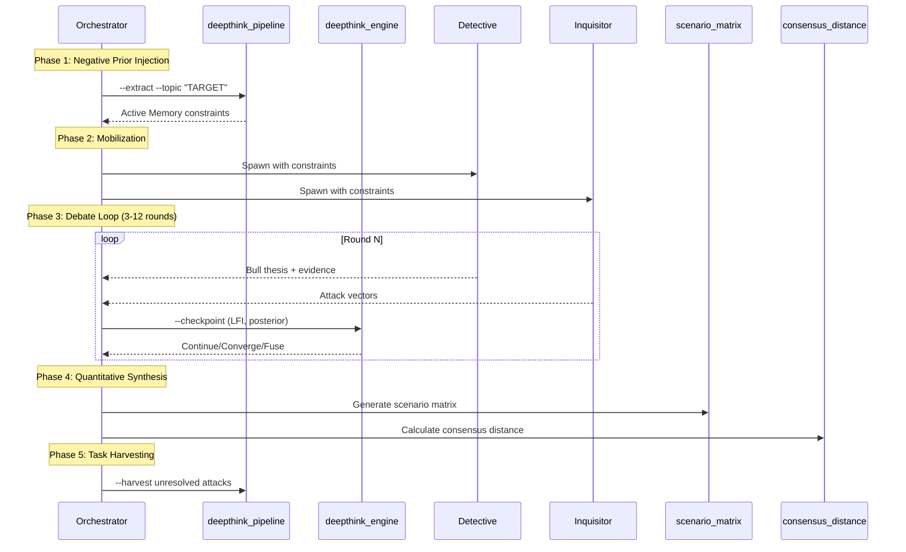

# Architecture — Trade Nothing v7.0

## System Overview

Trade Nothing is an **adversarial multi-agent investment research skill** that deploys physically isolated sub-agents in structured debate rounds, driven by Bayesian probability updates and convergence metrics.

## Core Architecture Diagram

```mermaid
graph TD
    subgraph Orchestrator Layer
        O[Orchestrator / Judge Agent]
        EM[Evolution.md<br/>Active Memory]
        SI[Research Index<br/>.json]
    end

    subgraph Sub-Agent Layer
        D[Detective 侦探<br/>agents/detective.md]
        I[Inquisitor 审问者<br/>agents/inquisitor.md]
    end

    subgraph Tool Layer
        DE[deepthink_engine.py<br/>State + Convergence]
        DP[deepthink_pipeline.py<br/>Memory + Harvest]
        SM[scenario_matrix.py<br/>4-Scenario Analysis]
        CD[consensus_distance.py<br/>Market Gap Calc]
        VF[verified_fetcher.py<br/>Macro Indicators]
        FA[fetch_akshare.py<br/>A-Share Data]
        CC[catalyst_calendar.py<br/>Event Calendar]
        EB[excel_model_builder.py<br/>DCF Model Builder]
        FP[fetch_polymarket.py<br/>Prediction Markets]
        LR[logic_radar_v2.py<br/>Hook Monitor]
    end

    subgraph Output Layer
        SR[Stock Report<br/>stock-report.md]
        IS[Issue Files<br/>.scratch/issues]
        XL[Excel DCF<br/>.xlsx Model]
    end

    O -->|1. Extract priors| DP
    DP -->|Read| EM
    O -->|2. Spawn| D
    O -->|2. Spawn| I
    D -->|Data gathering| FA
    D -->|Data gathering| VF
    I -->|Logic audit| LR
    D -->|Round output| O
    I -->|Attack vectors| O
    O -->|3. Checkpoint| DE
    DE -->|Converged?| O
    O -->|4. Synthesize| SM
    O -->|4. Synthesize| CD
    O -->|4. Synthesize| EB
    O -->|5. Generate| SR
    O -->|5. Generate| XL
    O -->|6. Harvest| IS
    DP -->|Update| SI
```



## Data Flow

### DeepThink Pipeline (5 Phases)



## File Structure

```
trade-nothing/
├── SKILL.md                 # Core skill definition (agent reads this)
├── agents/
│   ├── detective.md         # Bull-case agent persona
│   └── inquisitor.md        # Bear-case agent persona
├── scripts/
│   ├── utils.py             # Shared utilities (paths, slugs, JSON I/O)
│   ├── deepthink_engine.py  # State machine + convergence logic
│   ├── deepthink_pipeline.py # Memory extraction + task harvesting
│   ├── scenario_matrix.py   # 4-scenario probability matrix
│   ├── consensus_distance.py # Market consensus gap calculator
│   ├── catalyst_calendar.py # Event calendar (macro + sector)
│   ├── excel_model_builder.py # DCF model Excel generator
│   ├── fetch_akshare.py     # A-share stock data fetcher
│   ├── verified_fetcher.py  # Macro indicator fetcher with fallbacks
│   ├── fetch_polymarket.py  # Prediction market data
│   ├── logic_radar_v2.py    # Assertion calibrator
│   ├── logic_radar_daemon.py # Background monitoring daemon
│   └── deepthink_timer.py   # Interactive countdown timer
├── assets/
│   ├── templates/stock-report.md  # Report output template
│   └── prompts/deep-think.md      # (Consolidated into SKILL.md)
├── references/
│   ├── data-sources.md      # Data acquisition protocol
│   └── vault-rules.md       # Storage conventions
├── examples/
│   ├── demo_scenarios.json  # Sample scenario input
│   └── demo_deepthink_state.json # Sample state file
└── docs/
    └── architecture.md      # This file
```

## Key Design Decisions

### Physical Isolation Over Role-Playing
Sub-agents (Detective & Inquisitor) must run in **separate contexts** with no shared intermediate reasoning. This prevents the common failure mode where a single model role-playing both sides converges too quickly to a comfortable middle ground.

### Bayesian Convergence with Hard Fuse
The debate loop uses the Logical Friction Index (LFI) for convergence detection, but enforces a hard fuse at 12 rounds to prevent infinite loops. Minimum 3 rounds ensures enough adversarial pressure.

### Agent-Agnostic Protocol
The skill does not bind to any specific agent framework. The `SKILL.md` describes the protocol in terms of structured JSON I/O, and each runtime (Claude Code, Gemini CLI, Antigravity, Hermes) maps this to its native sub-agent dispatch API.

### Portable Path Resolution
All file paths are resolved via:
1. Environment variables (highest priority)
2. `utils.py` helpers with OS-agnostic defaults
3. Relative paths from `SKILL.md` location

No hardcoded absolute paths exist in the codebase.
