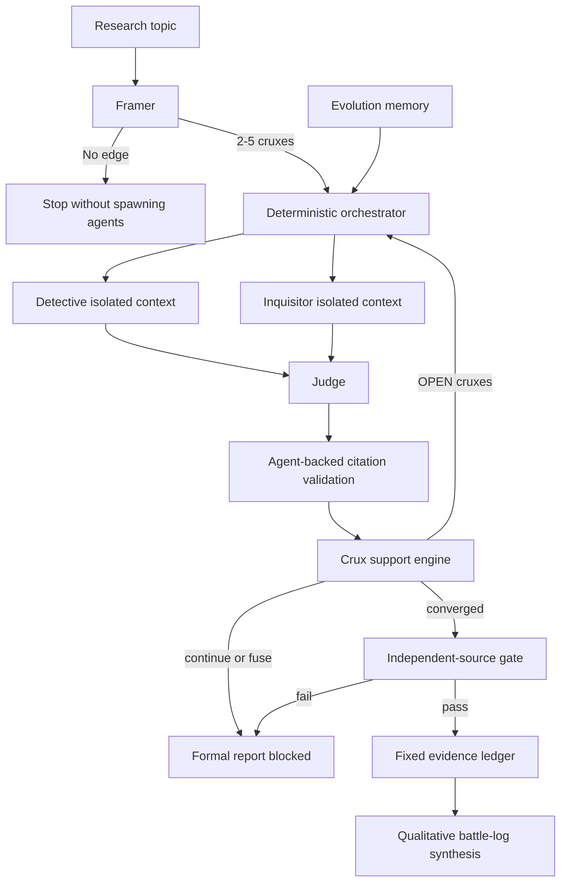

# Trade Nothing Architecture

## System boundary

Trade Nothing is a deterministic research workflow around LLM-produced evidence. The Python
code controls state, evidence gates, score updates, convergence, and report eligibility. LLMs
produce framing, evidence, attacks, Judge signals, and qualitative synthesis.

The host runtime—not the skill—owns agent isolation, model execution, web access, and user
authorization. A run may claim isolated multi-agent debate only when the host actually dispatched
Detective and Inquisitor into separate contexts.

## Recommended v2 flow

```mermaid
flowchart TD
    U[Research topic] --> F[Framer]
    F -->|No edge| X[Stop without spawning agents]
    F -->|2-5 cruxes| O[Deterministic orchestrator]
    M[Evolution memory] --> O
    O --> D[Detective isolated context]
    O --> I[Inquisitor isolated context]
    D --> J[Judge]
    I --> J
    J --> V[Agent-backed citation validation]
    V --> E[Crux support engine]
    E -->|OPEN cruxes| O
    E -->|continue or fuse| B[Formal report blocked]
    E -->|converged| G[Independent-source gate]
    G -->|fail| B
    G -->|pass| R[Fixed evidence ledger]
    R --> S[Qualitative battle-log synthesis]
```

## Responsibilities

### Host runtime

- Read `SKILL.md` and dispatch the requested workflow.
- Run Detective and Inquisitor in separate contexts when supported.
- Record isolation as `verified`, `unverified`, or `degraded`.
- Provide current web/data access and preserve source URLs.
- Never treat a report as authorization to trade.

### `deepthink_orchestrator_v2.py`

- Loads negative-prior memory through `TRADE_NOTHING_EVOLUTION_PATH`.
- Stores state under `TRADE_NOTHING_SCRATCH_DIR/v2-state`.
- Uses readable topic slugs plus a hash suffix to prevent collisions.
- Dispatches only OPEN cruxes after each round.
- Rejects Judge citations that cannot be matched to agent JSON.
- Enforces configured maximum rounds and blocks reports after a fuse.
- Uses locked, atomic JSON writes and supports read-only migration from legacy state paths.

### Detective and Inquisitor

- Return per-crux structured evidence in `crux_evidence` and `crux_attacks`.
- Attach claim, number or null, source, concrete URL, date, and source tier.
- State uncertainty explicitly; an unsourced number is omitted or null.
- May not present rhetorical repetition as new evidence.

### Judge

- Scores only evidence already present in the two agent payloads.
- Does not search, invent citations, generate probabilities, or make a trade decision.
- Emits one bounded signal per crux plus verbatim citation objects.

### `crux_engine.py`

- Rejects invalid and bare-domain citations.
- De-duplicates evidence by normalized URL + claim + number per crux.
- Requires source diversity before a crux can retire.
- Applies a bounded, deterministic debate-support update.
- Returns `continue`, `converge`, or `fuse_break`.

The support value is an uncalibrated workflow heuristic. Constants such as gain, decay, and
clamps are control parameters, not estimates learned from market outcomes.

### `report_v2.py`

- Renders the fixed evidence ledger and source registry from engine state.
- Labels support values as non-probabilistic.
- Generates no target price, expected return, scenario probability, Kelly allocation, or size.
- Gives the synthesis model a citation whitelist for the qualitative layer.

## Formal report gates

A formal v2 report is allowed only when all are true:

1. Every crux is resolved or monitorable.
2. The research status is stable and no new crux has appeared for the dry-round window.
3. The engine returned `converge`, not `continue` or `fuse_break`.
4. Every crux has at least two distinct, concrete, valid source URLs.

The report remains a research artifact requiring human judgment.

## State and side effects

- Runtime state: `TRADE_NOTHING_SCRATCH_DIR/v2-state`.
- Generated artifacts: `TRADE_NOTHING_OUTPUT_DIR`.
- Research vault: `TRADE_NOTHING_VAULT_DIR`.
- Evolution memory: `TRADE_NOTHING_EVOLUTION_PATH`.
- Local issue harvesting is allowed by `--harvest`.
- OS reminders require `--notify`; webhooks require `--webhook`.

Source installation never deletes runtime JSON, scratch files, or personal research artifacts.

## Legacy v1

`deepthink_engine.py` and `deepthink_orchestrator.py` remain for compatibility. Their LFI,
Bayesian posterior, and sizing-related utilities are uncalibrated legacy heuristics. They are not
the recommended workflow and must not be represented as real market probabilities or safe sizing.
