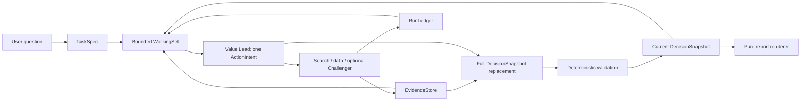

# Trade Nothing v0.18 Architecture

Trade Nothing is a bounded investment-research harness. Its job is not to make a model look busy;
its job is to make the final answer more current, more decision-useful and more auditable than the
same model working without the Skill.

## 1. Design thesis

The previous architecture accumulated useful controls but distributed meaning across Research
Agenda, material-change state, cruxes, CandidateMap, role payloads, report synthesis and runtime
envelopes. Each local component could be valid while the final report still missed a decisive fact
or contradicted itself.

v0.18 keeps the single-writer choice and adds one execution boundary:

> Evidence may be appended by many mechanisms; decision meaning has exactly one writer and one
> persistent representation.

> The host owns identity, tools, isolation, waiting and cancellation. The portable kernel owns only
> research semantics, evidence lineage, budgets, transitions and rendering truth.

The framework therefore persists four objects only:

| Object | Owns | Must not own |
|---|---|---|
| `TaskSpec` | question, as-of, budget, entities, mandatory fact surfaces, answerable questions | conclusions |
| `EvidenceStore` | canonical EvidenceItems and auditable SourceChecks | ranking or recommendation |
| `DecisionSnapshot` | all user-facing judgment and uncertainty | runtime truth |
| `RunLedger` | dispatches, hashes, calls, failures, budget and execution labels | research conclusions |

Historical engines remain available in the v0.16 baseline commit and selected source archaeology,
but an explicit allowlist excludes them from the active method identity and installed Skill.

## 2. Semantic ownership


```mermaid
flowchart LR
    U["User question"] --> T["TaskSpec"]
    T --> W["Bounded WorkingSet"]
    E["EvidenceStore"] --> W
    D["Current DecisionSnapshot"] --> W
    L["RunLedger"] --> W
    W --> A["Value Lead: one ActionIntent"]
    A --> X["Search / data / optional Challenger"]
    X --> E
    X --> L
    E --> N["Full DecisionSnapshot replacement"]
    A --> N
    N --> V["Deterministic validation"]
    V --> D
    D --> R["Pure report renderer"]
```

The Value Lead is the only semantic writer. A Challenger can attack named claims but cannot write
the Snapshot. Code can reject invalid meaning but cannot manufacture meaning. The renderer cannot
upgrade, rank, infer or reconcile; it only formats a validated Snapshot.

This separation is the core invariant:

```text
model: meaning
code: contracts and lineage
host harness: tools, identity, isolation and lifecycle
renderer: presentation
```

## 3. Action-driven Agent Loop

There is no fixed Framer → Detective → Inquisitor → Judge procession. TaskSpec framing is an inline
compiler step. Each paid research loop is bound to one `ActionIntent`:

```text
target_snapshot_field
current_uncertainty
evidence_needed
expected_decision_delta
stop_condition
cost_bound
```

The host compiles a WorkingSet containing the exact current task, Snapshot hash, relevant evidence,
hard obligations, remaining budget and one next call. It deliberately omits raw role history and
parallel state objects.

Some model hosts do not expose the order of hidden tool calls, so the ledger does not pretend a
packet-time ActionIntent proves per-tool precommit. `target_snapshot_field` is a routing hint, not a
promise that one exact field must change. The enforceable invariant is outcome-based: a research
call must add a new canonical EvidenceItem or SourceCheck and produce a real semantic Snapshot
delta. Empty or no-delta calls are rejected without consuming budget.

Possible calls are:

- `LEAD_RESEARCH`: obtain evidence and atomically update the Snapshot;
- `CHALLENGER`: attack an already named load-bearing claim;
- `LEAD_RESOLUTION`: reconcile a real ChallengePacket without consuming another search loop;
- `LEAD_SYNTHESIS`: budget-zero synthesis from supplied evidence;
- `REPORT`: no model call; pure rendering only.

A loop is a ceiling, not a quota. The system stops when no currently executable action has enough
expected decision gain to justify its cost. Additional loops require explicit authorization and the
total can never exceed ten.

## 4. Current Reality as a recall problem

The repeated product failure was not weak prose; it was incomplete retrieval. A few semantically
plausible searches can miss a pledge, unlock, financing plan, control event, cancellation or other
fact that completely changes the recommendation.

For this reason, `TaskSpec` adds non-removable fact surfaces by entity type. A listed company must
first enumerate the official disclosure index over a bounded window, inspect the complete title
set, and open every potentially HIGH item across financials, operations, ownership/control, capital
actions and legal/regulatory risk. Theme keywords are a second pass, never a substitute.

`SourceCheck` is an auditable retrieval result, not “the model says it searched.” It records:

- actual queries;
- source/index URL;
- concrete checked document URLs;
- date window;
- fact surface;
- `FOUND`, bounded `NO_RESULT`, or honest `INSUFFICIENT`;
- whether required index enumeration completed;
- the full title/URL/date/disposition/reason manifest, whose length must equal the recorded count;
- runtime-assigned acquisition origin and any adapter receipt IDs.

A complete official index cannot be created by an ordinary Lead or optional CLI packet. It must come
from an explicit host input or a controlled fixture. A caller-reported process result may first be
reconciled by the host, but the process label alone grants no acquisition authority.
Every relevant title must be opened and evidence-bound; title-level dismissals retain a reason.

The manifest remains in EvidenceStore for audit and regression. Context compilation replaces it
with a count and SHA-256 on later calls, so stronger retrieval proof does not become permanent
prompt bloat.

Every HIGH EvidenceItem creates a deterministic obligation. It must be visible as a material
change, remain an explicit gap, or receive a structured non-material disposition. For a
material-title document, the EvidenceItem first needs at least two host-extracted body facts with
typed fact kind, locator, excerpt, controlled event type/anchor and a document SHA-256 registered on
the binding SourceCheck. The Lead then selects exactly one of material change, open gap or
non-material disposition. The kernel deterministically derives the event family from subject, type
and anchor; the model never submits that internal ID. It cannot merge unrelated events, and one family can occupy only one aggregate material
change or open-gap entry. A forgotten, duplicated or shallowly dismissed item makes
`DECISION_READY` impossible.

Enumeration count is not materiality recall. A completed manifest may not title-dismiss losses,
impairments, related-party borrowing, incentives, pledges, unlocks, guarantees, financing,
contracts, litigation or control changes with a generic reason. Those titles require
`OPENED_RELEVANT` plus a bound EvidenceItem. This turns the real missed-fact failure into a regression gate
instead of rewarding a superficially complete 80/80 index.

## 5. Atomic semantic transactions

A LeadPacket proposes new evidence/checks and one complete Snapshot replacement. Acceptance is
transactional:

1. validate the call-scoped ActionIntent and host receipt lineage;
2. normalize and deduplicate new evidence;
3. validate SourceChecks against TaskSpec and the combined evidence store;
4. validate Snapshot version, base hash, as-of, schema and evidence references;
5. recompute hard obligations and visible evidence union;
6. derive candidate-security reality obligations and validate challenge provenance;
7. require an observation delta plus a real semantic Snapshot change;
8. append the call receipt and commit all four objects together.

Any failure commits nothing. There is no partial “evidence accepted but conclusion rejected” state
and no patch whose omitted fields accidentally erase prior meaning.

`consumed_evidence_ids` equals the exact union of evidence referenced anywhere in the Snapshot. It
is a checksum-like semantic invariant, not a manually curated bibliography.

The kernel explicitly has two clocks:

- **committed clock**: a Snapshot is replayed and validated against the exact evidence/check/
  challenge frontier recorded on its accepting Lead action;
- **pending clock**: host inputs and Challenger packets appended after that frontier create
  obligations for the next Lead.

Without this split, new evidence retroactively makes a historical Snapshot invalid and tempts host
repair scripts to edit conclusions or delete evidence. v0.18 forbids both: EvidenceStore and
RunLedger histories are append-only, while a Snapshot replacement requires exactly one accepted
Lead action and receipt.

## 6. Harness-first challenge without theatre

A Challenger is useful only when disagreement can change a load-bearing conclusion. It receives
exact target claim IDs and relevant evidence, not the entire topic. In Codex, one native child agent
is the default Challenger. The host orchestrates a separate context and reports identity; the
semantic kernel binds the exact prompt, payload, target claims and base Snapshot without treating
the caller's report as application-side attestation.

Execution truth has three explicit levels:

- `HARNESS_SUBAGENT / HARNESS_REPORTED / SEPARATE_CONTEXT_REPORTED`: the latest accepted Lead reports a distinct child identity
  and separate Codex context. This does not prove a different model or cryptographic process
  boundary;
- `HOST_PROCESS / PROCESS_REPORTED / PROCESS_CONTEXT_REPORTED`: an optional external adapter records
  what its caller observed:

  - a different agent/process identity from the latest Lead;
  - a reported process ID and host runtime;
  - exact prompt SHA-256 and payload SHA-256;
  - the expected call mode, target challenge and base Snapshot hash;
- `SELF_DECLARED / UNVERIFIED`: a manual parent receipt proves only content lineage and can never
  satisfy a Challenger dispatch.

An arbitrary `VERIFIED` string has no authority. The requested orchestration mode is always reported
separately from achieved provenance. There is no Judge role in the active loop. The Lead must
explicitly accept, partially accept, reject or leave unresolved each bounded attack. Harness and
external-process records are both honest weak provenance until an application host supplies an
unforgeable attestation callback.

The cross-environment rule is deliberately asymmetric: native harness capabilities are preferred
inside each host; the portable contract does not emulate spawning, permissions, waits or process
management. External Claude Code or Antigravity CLIs remain explicit adapters and their failure
cannot block the native Codex path.

The repository exposes no `attest_host_record(dict)`-style stamping API. A future strong process
proof must be returned by an application-side host that itself owns child creation, communication,
termination and result capture; repository code cannot create trust by signing caller-provided
fields. Until then the optional adapter is deliberately `PROCESS_REPORTED`.

## 7. Industry-to-market bridge

The Snapshot keeps two causal paths distinct:

```text
technical/policy fact -> constraint change -> profit-pool shift -> company economic exposure
event/narrative -> marginal capital -> trading carrier -> crowding/verification/divergence
```

The first explains who may earn money. The second explains what the market may trade now. They may
point to different securities and change at different speeds, so the Snapshot writes separate views
for event days, tactical weeks, earnings quarters and structural years.

A market carrier is not a recommendation. `market_carriers_by_horizon` records what marginal
capital is trading, why it is traded, the closest alternative and switch condition even when no
candidate qualifies. `candidates_by_horizon` separately records research stance.

An alternative is not a prose comparison. It is `UNKNOWN` or one canonical `ticker@MIC` backed by
market evidence bound exclusively to that security. This makes “why this carrier rather than the
closest substitute” part of the same auditable market map.

A conditional priority is not produced by a score. It requires a complete comparative argument:
identity, horizon, economic exposure, market role, why now, closest alternative, switch condition,
trigger, invalidation, price/crowding boundary and evidence. Completeness allows discussion; it does
not prove alpha.

The connection is executable, not merely two non-empty fields. Evidence carries a canonical
`ticker@MIC` binding and one or more semantic roles such as `ECONOMIC_EXPOSURE`, `MARKET_STATE` or
`CURRENT_REALITY`. One observation may honestly serve several roles; duplicating it merely to make
two sets disjoint is forbidden. Candidate exposure references must intersect a selected value path,
and market references must intersect the same-horizon market view. The active host bundle
retains the bounded Tushare/BaoStock/AKShare/CSV observation and market-snapshot adapters, while
provider success remains `SINGLE_SOURCE` market context rather than economic exposure.

Structured numbers are typed measures, never opaque `number` strings. A controlled metric registry
owns definition and allowed units; a controlled basis ID replaces prose identity; each measure has
an explicit subject, and each EvidenceItem binds at most one security. Metric, raw value, unit,
subject, as-of, period and basis are bound into evidence and host-input hashes; one formatter owns
display scale. Model-authored unit-bearing numeric prose is rejected after Unicode/Markdown
canonicalization; a typed measure is the only numeric source rendered to the report. This closes
unit-conversion error, metric/value borrowing, prose-basis conflict evasion, cross-security leakage
and report-side value drift.

When a priority security is discovered under an industry/event TaskSpec, the core derives the full
listed-company fact-surface obligations for that security. It does not mutate TaskSpec or introduce
a candidate lifecycle. Receipt-bound market snapshots can be converted into canonical host input
and appended between Lead calls; that append writes EvidenceStore/RunLedger only and recompiles an
unspent dispatch.

## 8. Execution and recovery

`RunLedger` binds every accepted packet to a pending dispatch. A repeated dispatch with the same
state is idempotent. A mismatched payload, prompt or base hash is rejected without mutation.

Timeout, invalid JSON, permission denial, authentication failure and quota exhaustion are recorded
once. The harness never auto-retries because a technically identical repeat can duplicate cost,
hide an unknown outcome or create an untraceable semantic fork. A run with a prior Lead Snapshot can
still deliver a visibly degraded report.

A model call whose hash-bound JSON violates the packet contract is real cost but not semantic
progress. RunLedger records it as a rejection, commits no evidence or Snapshot, and gives the exact
errors to the next WorkingSet. The user must explicitly resume; the harness neither forgets the
cost nor repeats a context-free repair automatically.

Registered state is written under the scratch directory and keyed by immutable `run_id`. Resume
requires the pinned active method identity to match; an old run is historical input, not current
truth under a new method.

Report delivery is also one truth. Content-addressed `report-user-<hash>.md` and
`report-audit-<hash>.md` artifacts are pure views of the same validated run; a content-addressed
report-bundle manifest binds their hashes to the complete run and RunLedger, TaskSpec, EvidenceStore,
DecisionSnapshot, method identity and exact renderer source. A verifier recomputes both artifacts
before delivery and on demand. The delivery instruction forbids manual prepends, copied
unit fixes or a second synthesized conclusion.

## 9. Active and legacy boundaries

The v0.16 baseline commit preserves the complete pre-v0.17 system; selected old engines and tests
also remain as source archaeology. They are not part of the active method identity and are
quarantined from installed Skill copies.
In particular, new runs must not load or dispatch:

- crux convergence and Judge;
- parallel Research Agenda or CandidateMap state;
- opportunity/thesis lifecycle;
- report-side semantic synthesis;
- portfolio, order, publication or handoff objects.

The active installed bundle is an explicit allowlist. Adding a file to the repository does not give
it semantic authority.

## 10. What engineering proof means

Deterministic tests establish atomicity, lineage, evidence visibility, budget bounds, report purity,
failure behavior and installation isolation. They do not establish investment value.

Method improvement requires blind forward comparison against the same model, as-of and comparable
budget. The current release remains `UNBENCHMARKED_METHOD_CHANGE` until diverse cases show:

- zero frozen P0 current-fact omissions;
- no false challenge provenance;
- no contradiction between core judgment, material facts and recommendation;
- greater decision usefulness on at least four of five cases;
- total cost no greater than 1.5 times the baseline.

That distinction keeps a clean kernel from becoming another beautifully tested vehicle nobody can
drive.
