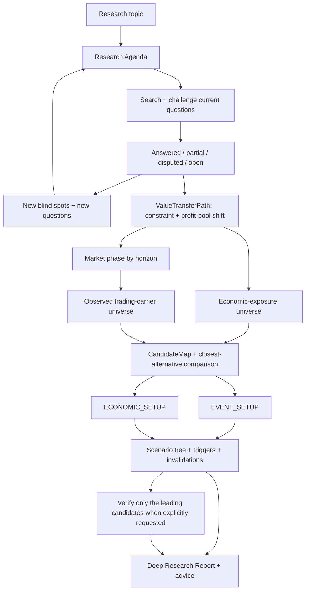

# Trade Nothing Architecture

> Product target: `docs/topic-led-research-product.md`. The default product ends at a Deep Research
> Report with conditional recommendations. Components that create or promote Thesis, Decision,
> order, position, portfolio,
> publication, or cross-product handoff are legacy compatibility surfaces, not part of the target
> architecture.

## System boundary

Trade Nothing is a topic-led iterative research workflow around public evidence and market
mechanisms. LLMs answer Research Agenda questions, produce challenges, blind spots, optional
hypotheses, concrete candidate maps and synthesis. Deterministic
code protects citation integrity and bounded execution; it must not make control-state completion
the definition of opportunity quality.

`research_kernel.py` is the only shared deterministic semantic core. It validates evidence,
reconciles answer/direction variants, normalizes listed-instrument identity and evaluates setup
readiness. It owns no workflow state, scheduling, authorization or lifecycle.

Every LLM call is also an explicit semantic interface. The prompt physically embeds a `WORK WINDOW`
and the exact role/protocol contract; a filename such as `detective.md` is never treated as though an
isolated process can magically read it. Each window names the stage, role, objective, authoritative
inputs, output product, forbidden work, completion test and next consumer. The stored prompt hash
therefore binds the instructions actually seen by the model, not merely a pointer to them.

The host runtime—not the skill—owns agent isolation, model execution, web access, and user
authorization. A run may claim isolated multi-agent debate only when the host actually dispatched
Detective, Inquisitor and Judge into three distinct contexts and bound all prompts and payloads.

`execution_integrity.py` is an orthogonal execution-truth kernel. It does not interpret evidence or
own a workflow state. It classifies a report as current verified orchestration, unverified state-only
work, historical replay, or inline degraded research from method identity, registered state and
hash-bound host receipts. This keeps two independent truths separate:

```text
Research Agenda + evidence + CandidateMap -> what the report may conclude
Run manifest + exact prompts + payloads + host receipts -> what the report may claim was executed
```

Neither plane can manufacture facts for the other. A failed run remains failed even if a parent
later writes good analysis, and good analysis is not discarded merely because its execution mode is
degraded; it is labelled accurately.

## Default topic-led flow


```mermaid
flowchart TD
    U["Research topic"] --> A["Research Agenda"]
    A --> R["Search + challenge current questions"]
    R --> Q["Answered / partial / disputed / open"]
    Q --> X["New blind spots + new questions"]
    X --> A
    Q --> P["ValueTransferPath: constraint + profit-pool shift"]
    P --> M["Market phase by horizon"]
    P --> E1["Economic-exposure universe"]
    M --> E2["Observed trading-carrier universe"]
    E1 --> C["CandidateMap + closest-alternative comparison"]
    E2 --> C
    C --> E["EVENT_SETUP"]
    C --> N["ECONOMIC_SETUP"]
    E --> S["Scenario tree + triggers + invalidations"]
    N --> S
    S --> V["Verify only the leading candidates when explicitly requested"]
    S --> B["Deep Research Report + advice"]
    V --> B
```

## Responsibilities

### Host runtime

- Read `SKILL.md` and dispatch the requested workflow.
- Run Detective and Inquisitor in separate contexts when supported.
- Record isolation as `verified`, `unverified`, or `degraded`.
- Provide current web/data access and preserve source URLs.
- Deliver the complete embedded work window to each isolated process and bind it in the runtime
  receipt; an empty work directory plus a filename reference is not a valid role contract.
- Never treat a report as authorization to trade.

### `execution_integrity.py` and the execution gateway

- Require explicit process-runtime configuration; never infer Claude or Antigravity from an
  installed binary alone.
- Run capability preflight before creating or mutating a registered run.
- Bind each claimable round to three distinct host identities, exact prompt hashes and exact payload
  hashes; preserve the Judge host payload separately from the engine-enriched Judge record.
- Derive report execution markers and round wording from current state and method identity.
- Give inline research no run ID, numbered-round claim, named-role theatre or isolation claim.
- Mirror each persisted stage-envelope status into the run manifest so paused work cannot remain
  nominally `active`.

### `deepthink_orchestrator_v2.py`

- Loads negative-prior memory through `TRADE_NOTHING_EVOLUTION_PATH`.
- Stores state under `TRADE_NOTHING_SCRATCH_DIR/v2-state`.
- Uses readable topic slugs plus a hash suffix to prevent collisions.
- Dispatches unresolved Agenda questions and their relevant research directions after each round.
- Emits closed semantic work windows and embeds the exact Framer, research-role, Judge,
  CandidateScreen and Claim Verifier contracts in their prompts.
- Initializes a Research Agenda and harvests answer updates, conflicts, blind spots and new questions.
- Reprioritizes unresolved Agenda questions in each compact dispatch prompt.
- Harvests Market Bridge after Agenda evidence and before CandidateMap so same-round candidates can
  bind typed value paths, market-phase readings and canonical evidence IDs.
- Harvests CandidateMap as a discovery projection while applying the shared evidence and setup
  invariants; this does not promote a candidate.
- Returns `ready_for_report` directly after convergence; it never starts CandidateScreen or gap
  work from the default path.
- Rejects Judge citations that cannot be matched to agent JSON.
- Enforces configured maximum rounds and blocks only the FORMAL grade after a fuse; an exploratory
  report remains available.
- Uses locked, atomic JSON writes. Legacy state is never auto-loaded; adoption requires an exact
  explicit state path.

### Detective and Inquisitor

- Return `question_updates`, plus at most one lineage-bound new blind spot and one lineage-bound new
  question per role when they can name the exact decision change.
- Return per-crux structured evidence in `crux_evidence` and `crux_attacks`.
- Attach claim, number or null, source, concrete URL, date, and source tier.
- State uncertainty explicitly; an unsourced number is omitted or null.
- May not present rhetorical repetition as new evidence.
- Map up to six concrete carriers per role in the first round. Later rounds complete the supplied
  focus queue and may add at most one genuinely different carrier per role. An uncited lead stays
  EXPLORE.
- Express load-bearing industry conclusions as shortest value-transfer paths, distinguish the
  economic-exposure universe from observed trading carriers, and compare each preferred candidate
  with one mapped alternative at an explicit horizon.

### `market_snapshot_adapter.py`

- Accepts frozen, source-bound candidate and benchmark observations; it never fetches or guesses a
  market calendar.
- Computes reproducible 5/20/60-day returns and excess returns, 60-day drawdown, 20-day volume ratio
  and current turnover when enough observations exist.
- Binds the exact packet, normalized snapshot payload, market session and sources in a
  content-addressed receipt, so post-adapter metric edits fail closed.
- Provides market facts to Market Bridge; it does not classify an industry, select a security or
  authorize a recommendation.

### `free_market_observations.py`

- Collects exactly one A-share candidate and one benchmark from one explicitly selected source:
  Tushare Pro, BaoStock, AKShare's bounded Tencent history endpoint, or a source-linked CSV export.
- Never scans the whole market, selects an automatic fallback, retries a failed source, bypasses the
  host proxy, or installs an optional dependency.
- Tushare equity prices are forward-adjusted and anchored to the latest observed session; the free
  providers retain their explicit adjustment policy. Every path freezes the as-of date, provider
  version, session, source URL and normalized series hashes in an acquisition receipt. A second
  source is a separately authorized observation.
- Feeds `market_snapshot_adapter.py`; it does not admit evidence, reconcile issuer facts, discover a
  concept universe or recommend a security.

### `market_bridge_engine.py`

- Normalizes question-linked `ValueTransferPath` records and preserves evidence boundaries.
- Preserves competing market-phase readings by horizon instead of advancing a fixed phase state;
  one role is `SINGLE_VIEW`, and only two-role agreement is `CONSENSUS`. Recommendation authority
  additionally requires a verified distinct-role execution receipt plus current, non-hypothesis
  phase evidence from both roles; duplicated unverified payload slots are `UNVERIFIED_CONSENSUS`.
- Owns an append-only host market-snapshot projection. Explicit ingestion validates adapter and
  normalized-snapshot hashes, the complete upstream acquisition-receipt envelope, and the candidate
  identity hash; it also validates canonical price/activity evidence, current dates, relative
  strength and market activity before a snapshot can ground market recognition. Model-authored
  snapshots cannot write this plane.
- Grounds economic strength in candidate-specific economic evidence and a non-hypothesis
  value-transfer path.
- Projects candidates into confirmed leader, latent economic, event beta, low priority or unresolved
  lanes without a composite score or expected-return claim.
- Grants report-level conditional-priority authority only when a mapped alternative, current reason,
  switch condition, evidence-grounded value path, two-role phase consensus, complete dual universe,
  trusted market snapshot and time horizon are all visible. `WATCH_ONLY` and `FAILURE_HEDGE` never
  receive recommendation authority.

### Runtime contracts

- Human-facing role manuals remain under `agents/*.md` for design history and review.
- Actual Detective/Inquisitor calls embed the compact shared contract in
  `agents/runtime/research-round.md` plus one role overlay. Every work window therefore carries its
  mission, authoritative inputs, output product, forbidden actions and exact core schemas without
  injecting the 30KB legacy manuals.

### `market_map_engine.py`

- Requires ticker for listed equities and rejects abstract prose as a listed candidate.
- Uses exchange-qualified identity and rejects placeholder tickers.
- Merges the same concrete instrument without pooling it into a confidence or return score.
- Treats `REFINE` and `REPLACE` as snapshot deltas, not conflicts. Only an explicit `CHALLENGE`
  between mutually exclusive field claims can block setup readiness.
- Requires field-bound evidence, a valid catalyst window and no unresolved critical-field conflict
  before a setup becomes ready.
- Separates event beta from economic capture and preserves substitute/failure paths.
- Emits `EXPLORE`, `SETUP_READY`, or bounded `NO_USABLE_SETUP`; these are report result types, not
  lifecycle states.
- Treats those result types as completeness signals only. Market Bridge, not setup completeness,
  determines whether the report may express a cross-sectional conditional priority.

### Judge

- Scores only evidence already present in the two agent payloads.
- Does not search, invent citations, generate probabilities, or make a trade decision.
- Emits one bounded signal per crux plus verbatim citation objects.
- Ignores Agenda answers and blind spots for scoring so prose cannot launder evidence.

### `research_agenda_engine.py`

- Makes the topic workplan the primary research ledger.
- Preserves answer variants and evidence boundaries rather than overwriting disagreement.
- Accepts formal `evidence_items` only inside the as-of boundary, canonicalizes duplicates, and
  binds IDs only to declared questions/directions. Legacy crux evidence remains compatible.
- Allows blind spots to reprioritize research but not alter crux signals, candidate promotion, or execution.
- Admits at most two new questions and two new blind spots per round. New questions require a parent,
  a bounded success test and a named decision change; a promoted blind spot is not counted again as
  separate research debt.
- Recommends another round only for a fresh, low-cost test with material decision value. Repeating
  the same answer status/evidence boundary across two attempted rounds is diminishing-return debt,
  not an automatic continuation reason.

### `research_kernel.py`

- Rejects invalid/future-dated evidence and derives publisher identity from URLs.
- Reconciles all answer and direction variants deterministically across roles and rounds. `DISPUTED`
  describes epistemic uncertainty; it does not by itself mean the roles contradict each other.
- Prevents weak unsupported dissent from erasing stronger evidence while preserving the challenge.
- Normalizes listed-instrument identity and evaluates field-level conditional setup readiness.
- Defines no statuses beyond interpreting caller records and emits no lifecycle transition.

### `crux_engine.py`

- Rejects invalid and bare-domain citations.
- De-duplicates evidence by normalized URL + claim + number per crux.
- Requires source diversity before a crux can retire.
- Applies a bounded, deterministic debate-support update.
- Returns `continue`, `converge`, or `fuse_break`.

The support value is an uncalibrated workflow heuristic. Constants such as gain, decay, and
clamps are control parameters, not estimates learned from market outcomes.

### `report_v2.py`

- Renders Deep Research Report by default: Agenda answers, challenges, blind spots, value transfer,
  market phases, concrete map, closest-alternative comparisons, conditional advice, event/economic setups, scenarios, triggers, invalidations,
  evidence labels and next tests.
- Keeps Decision Brief, Candidate Cards and the full evidence ledger as explicit compatibility
  views only.
- Generates no target price, expected return, scenario probability, Kelly allocation, or size.
- Uses a deterministic renderer by default. Only an explicitly requested compatibility synthesis
  packet names a model and carries a citation whitelist.
- Separates complete answers from evidence-bounded partial/disputed progress, and keeps exhaustive
  question, direction, blind-spot and candidate histories in the audit view instead of flooding the
  default report.
- Groups conditional priorities by event, tactical, earnings and structural horizons; it does not
  reuse one global candidate order across incompatible clocks.

## Formal-grade gates

A report is always deliverable. It receives the compatibility `FORMAL` research grade only when
all are true:

1. Every crux is resolved or monitorable.
2. The research status is stable and no new crux has appeared for the dry-round window.
3. The engine returned `converge`, not `continue` or `fuse_break`.
4. Every crux has at least two distinct, concrete, valid source URLs.

The report remains a research artifact requiring human judgment. The grade creates no publication,
trade, position, or handoff permission.

## State and side effects

- Runtime state: `TRADE_NOTHING_SCRATCH_DIR/v2-state`.
- Generated artifacts: `TRADE_NOTHING_OUTPUT_DIR`.
- Research vault: `TRADE_NOTHING_VAULT_DIR`.
- Evolution memory: `TRADE_NOTHING_EVOLUTION_PATH`.
- Local issue harvesting is allowed by `--harvest`.
- The published skill exposes no notification, webhook, portfolio, or order-execution entry point.

Source installation never deletes runtime JSON, scratch files, or personal research artifacts.
It recoverably quarantines stale files on the managed code surface and treats installed
`Methodology_Evolution.md`, `scripts/.state`, and target `.git` as inert extras. Active memory
defaults to the external vault, and state defaults to scratch.

Runtime capability is stage-specific. Antigravity and Claude Code have bounded OS-process adapters;
Codex has manual collaboration receipt builders; Gemini, Hermes, and OpenHands are protocol-only in
this release. See `references/runtime-compatibility.md`.

## Retired v1

`deepthink_engine.py`, `deepthink_orchestrator.py`, and `dungs_argumentation.py` were removed in
v0.13.0. Their LFI, Bayesian posterior, and sizing utilities were uncalibrated heuristics, they
maintained a second state format under `scripts/.state/`, and their harvest path silently missed
`-deepthink2` state. `crux_engine.py` plus `deepthink_orchestrator_v2.py` are now the only research
pipeline. Historical v1 artifacts are readable through Git history and must not be presented as
real market probabilities or safe sizing.

Older portfolio, target-price, scenario-sizing, spreadsheet-model, and unbounded notification-daemon
implementations live only under `legacy/`. The installer treats any copy of those files on a managed
skill surface as stale code and moves it to the recoverable quarantine.
