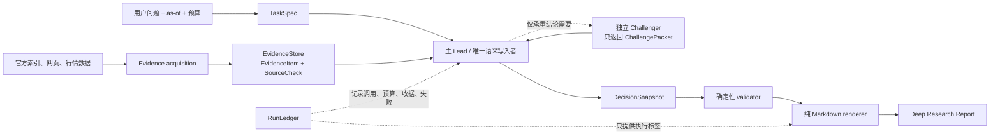

# Trade Nothing v0.17 优化方案：单一语义内核

状态：`IMPLEMENTED / FORWARD_EVALUATION_PENDING`

基线：v0.16 及最近同模型、有/无 Skill 对照结果。四对象内核与 Agent Loop 已实现；本文同时
保留原始设计依据和验收方式，但不代表方法已经通过产品有效性验证。

## 1. 结论先行

下一轮不应继续增加角色、阶段或状态，而应删除多重语义控制面，把系统收敛为四个持久对象：

1. `TaskSpec`：这次研究究竟要回答什么；
2. `EvidenceStore`：实际查到了什么，以及哪些官方事实面确实检查过；
3. `DecisionSnapshot`：截至当前，用户可以依赖的唯一研究结论；
4. `RunLedger`：模型调用、预算、收据、失败和执行真实性。

核心纪律：

> EvidenceStore 是来源真相，DecisionSnapshot 是决策真相，RunLedger 是执行真相；
> 报告只是渲染，角色只是贡献者，都不得再拥有一份平行真相。

当前最深的缺陷不是“步骤少”，而是 `material_change`、Research Agenda、Market Bridge、
CandidateMap、crux、hypothesis、opportunity、tracking 和 report view 都能生产或改写用户结论。
最终 renderer 还会根据 blocker、候选数量和字段完整度再推导一次结论。事实可能已经进入状态，
却没有进入报告；Lead 的自我反例也可能被拼接成独立质证。这类问题不能靠再加 gate 解决。

## 2. 产品价值函数

任何模块只有在下式中产生可观测增益才应保留：

```text
研究价值
  = 重大事实召回
  + 因果与产业—市场映射
  + 决策压缩
  + 认识边界可信度
  - 时间、token 与操作成本
```

工程状态完整、角色数量、轮数、URL 数量、报告长度和收据完整均不是独立产品价值。

v0.17 的目标不是让流程看起来更严谨，而是同时解决四个真实失败：

- 会改写结论的公司事实被漏掉，或虽进入内部状态却没有进入报告；
- 没有独立 Challenger 时，报告仍可能展示类似“最强质证”的语义；
- 核心判断、事实门、候选和 setup 由不同模块推导，产生前后矛盾；
- 相比同模型裸研究，耗时和上下文成本过高，但决策价值没有相应提高。

## 3. 目标架构



### 3.1 单一写入者

主 Lead 是唯一能写 `DecisionSnapshot` 的语义主体。它可以是 Codex 当前父任务，也可以是 Web
运行时中的中心 LLM loop。研究者、数据适配器和 Challenger 只能提交证据或挑战提案，不能直接
晋级候选、改写推荐状态或生成另一份“最终判断”。

Challenger 返回后，由同一个 Lead 明确选择：`ACCEPTED / PARTIAL / REJECTED / UNRESOLVED`，
并更新 Snapshot。确定性代码可以拒绝不合法的 Snapshot，但不得替模型做投资判断。

### 3.2 四个持久对象

#### `TaskSpec`

最小字段：

- `question`、`as_of`、`horizons`、`budget`；
- `primary_entities`；
- 每类实体必须完成的 `fact_surfaces`；
- 用户要求的报告产物和明确非目标。

问题清楚时由主 Lead 在首轮内联生成，不再默认单独调用 Framer。只有歧义会实质改变研究路线时
才向用户澄清或使用单独 framing 调用。

#### `EvidenceStore`

只允许追加或以 lineage 明确替代，包含两类记录：

- `EvidenceItem`：claim、数字、日期、发布者、具体 URL、来源等级、证据标签、实体和 as-of；
- `SourceCheck`：实体、事实面、检索窗口、实际 query/官方索引 URL、检查过的文档、结果、
  提取出的 Evidence IDs 和负结果边界。

`FOUND / NO_RESULT` 不再是模型一句自报状态。它必须有可审计的 SourceCheck；否则只能是
`INSUFFICIENT`。

#### `DecisionSnapshot`

这是唯一用户语义对象，建议至少包含：

```text
identity + version + as_of
decision_status + core_judgment + boundary
material_changes + open_material_gaps
agenda_answers
value_transfer_paths
market_by_horizon
candidates_by_horizon
conditional_setups
challenge_provenance + challenge_resolutions
unresolved_questions + lowest_cost_next_validation
consumed_evidence_ids + explicitly_non_material_evidence_ids
```

每个候选必须在同一对象中携带 ticker、时间视野、经济暴露、市场载体身份、为何现在、最近替代
项、切换条件、触发、失效、价格/拥挤边界和 Evidence IDs。字段完整只证明可讨论，不自动生成
优先级。

#### `RunLedger`

只记录 method identity、模型调用、实际角色、prompt/payload hash、预算消耗、权限/超时错误和
执行标签。它不能影响事实等级和投资结论；Snapshot 也不能伪造某个角色实际运行过。

### 3.3 Agent Loop：薄控制循环，不是新状态机

四个对象回答“真相归谁”，Agent Loop 只回答三个运行问题：下一步做什么、为何值得做、何时
停止。它不拥有候选、结论或研究阶段，也不维护另一套业务生命周期。

#### 两层循环

需要区分两种尺度：

1. **Tool loop**：Lead 在一个工作窗口内搜索、打开来源、取行情或调用 Challenger；这是宿主的
   通用模型—工具循环，不持久化为业务状态；
2. **Research loop**：一次工作窗口结束后，把新增 Evidence、SourceCheck 和更新后的 Snapshot
   原子保存，再判断是否值得开始下一次窗口。

```text
compile WorkingSet
  -> Lead 判断下一项最高价值动作
  -> tool / data adapter / optional Challenger
  -> append EvidenceStore + RunLedger
  -> Lead 重写一个 DecisionSnapshot
  -> deterministic validation
  -> stop，或用压缩后的 WorkingSet 进入下一循环
```

主 Lead 可以跨窗口由不同物理模型调用承接，但必须使用相同 writer contract、读取前一版
Snapshot，并以版本号和 base hash 原子替换。所谓“单一写入者”指唯一语义角色和写入协议，
不是要求一个无限增长的聊天上下文。

#### 不设独立 Planner Agent

Lead 自己选择下一动作。为防止流程空转，每次工具或 Challenger 调用前只生成一个瞬时
`ActionIntent`：

```text
target_snapshot_field
current_uncertainty
evidence_needed
expected_decision_delta
stop_condition
cost_bound
```

`ActionIntent` 不进入业务状态，只随 RunLedger 留作成本审计。若 Lead 不能说明该动作可能改变
`core_judgment`、`material_changes`、某个 horizon 的市场判断、candidate stance、
`decision_status` 或最低成本下一验证中的至少一项，宿主拒绝该动作。

确定性代码只产生硬义务，例如事实面未检查、HIGH evidence 未消费、来源越过 as-of、挑战缺少
provenance。产业因果、哪条线索更重要、哪个候选值得比较仍由 Lead 判断；不引入规则式投资
Planner。

#### Lead 每次只有三种行为

- **调用工具**：搜索、读取、行情或数据适配器；一次语义动作可以包含若干紧密相关的底层请求；
- **调用 Challenger**：只提交 claim packet，由隔离上下文返回 ChallengePacket；
- **封存 Snapshot**：当前可交付，或虽有缺口但继续研究的边际价值不足。

Challenger 可以作为宿主提供给 Lead 的一个特殊 tool。它没有自己的循环权限，不能继续派生
角色，也不能直接修改 Snapshot。返回后 Lead 必须在同一研究循环内给出 resolution；预算无法
覆盖处理动作时，不应启动挑战。

#### 下一动作的选择顺序

不用伪精确分数，采用可解释的词典序：

1. 先处理会阻断当期判断的硬义务：未完成官方事实面、开放 HIGH lead、孤立 HIGH evidence；
2. 再处理当前可检索、且会改变核心判断或候选相对排序的承重缺口；
3. 再补用户明确需要的市场时点、价格/拥挤和最近替代项；
4. 仅当承重 claim 已有单侧证据且质证可能改变结论时调用 Challenger；
5. 其余问题进入 unresolved/next validation，不为了“完整”继续搜索。

`NO_RESULT` 可以是有效产物，但必须来自真实 SourceCheck。权限错误、429、超时或无效 JSON
只进入 RunLedger，不算研究增量，也不触发无界自动重试。

#### 0–10 轮预算如何映射

用户预算是最大 Research Loop 次数，不是必须跑满的阶段数，也不是固定角色数量：

- `0`：不获取新外部证据，只在现有输入边界内生成 Snapshot；
- `1`：完成 Current Reality Scan 和首个 Snapshot；
- `2–10`：只给仍可改变判断的 ActionIntent 使用；
- 独立 Challenger 占用一轮预算；普通工具调用不按 URL 数重复计轮；
- 每轮必须产生新 Evidence/SourceCheck、challenge resolution 或实质 Snapshot delta；否则停止。

最终验证和确定性 Markdown 渲染不额外消耗研究轮次。预算是上限，满足停止条件时必须提前结束。

#### 停止条件

正向停止要求：

- 必要事实面均有 SourceCheck；
- 所有 HIGH evidence 已消费或显式解释；
- 承重 claim 有足够边界，独立挑战已处理或确实不需要；
- 产业—市场路径和用户要求的候选比较已完成，或形成有边界的无可用载体结论；
- 没有当前可执行、且可能改变判断的高影响动作。

降级停止包括：预算耗尽、只剩 `WAIT_FOR_DATE / WAIT_FOR_EVENT / NEEDS_USER_DATA`、权限或运行
故障、官方事实面无法完成。降级仍可交付报告，但 Snapshot 的 decision status 必须反映缺口。

#### 每轮上下文

Context Compiler 不回放全部聊天和历史 payload，而生成一个 `WorkingSet`：TaskSpec、当前
Snapshot、确定性硬义务、与 ActionIntent 相关的 Evidence 切片、剩余预算和精确输出 contract。
原始网页与历史版本留在外部存储，需要时按 Evidence ID 重开。

因此 Agent Loop 可以中断、恢复或迁移到 Web API：只要四个持久对象和 method identity 一致，
就能重建下一工作窗口；不依赖某个无限聊天线程保存隐含语义。

#### Agent Loop 验收

- 每个研究工作窗口都绑定一个 ActionIntent 和目标 Snapshot 字段；工具不透明的宿主不虚构
  逐工具前置证明，而以新增 Evidence/SourceCheck 和目标字段真实变化作为强制结果门；
- 不存在“因为进入第 N 轮所以调用某角色”的动作；
- 同一失败请求不自动重复，alternate route 必须有新的 intent；
- 恢复运行只读四个持久对象即可得到相同硬义务和交付边界；
- 盲评 trace 中，既没有新 Evidence/SourceCheck、也没有 challenge resolution 或 Snapshot delta
  的空调用占比目标为 0；
- 把最大预算从 3 提到 5 时，若没有新高价值义务，实际轮数不得自动增加。

## 4. P0：先修正确性，不重做流程

### P0-1 重大事实不能“发现后丢失”

建立确定性的 `material-evidence accounting`：

- 每条已核实 HIGH material evidence 必须被 Snapshot 的 `material_changes` 消费；
- 或由 Lead 显式标记为 `NON_MATERIAL_TO_DECISION` 并说明理由；
- 任何未处理 HIGH evidence 都令 `decision_status = MATERIAL_FACT_GAP`；
- renderer 必须逐项展示已消费的重大变化和开放缺口，不得自行筛掉。

这直接修复“事实已在内部状态，但最终报告看不见”的问题。

### P0-2 从“关键词搜几条”改为“官方索引先枚举”

对上市公司，Current Reality Scan 的第一条路径应是：

```text
官方披露索引
  -> 固定时间窗口内公告标题全集
  -> 资本、控制权、经营、风险事件分类
  -> 打开全部 HIGH 标题
  -> EvidenceItem / SourceCheck
```

默认窗口可取“最新定期报告以来”与最近 120 天中的较长者，并由 as-of 截断。最低事实面为：

- 业绩、审计、现金流和持续经营；
- 合同、订单、客户、产销和项目里程碑；
- 控制权、质押、冻结、司法处置和关联方；
- 解禁、增减持、回购、股权激励、定增和其他融资；
- 投资、出售、重大诉讼、监管、风险警示和退市风险。

这样不是为某几个漏项打补丁，而是用一次可枚举的官方公告面覆盖资本结构事件。主题、项目和
事件研究使用同一 SourceCheck 协议，但换成相应官方时间线或权威索引。

### P0-3 质证必须有真实来源身份

废止把所有角色的 `strongest_challenge` 字符串直接拼接。Snapshot 中严格区分：

- `SELF_COUNTERCASE`：Lead 自己提出的反例；
- `INDEPENDENT_CHALLENGE`：独立 Challenger 针对具体 claim ID 返回的攻击；
- `UNRESOLVED_CHALLENGE`：挑战尚未被 Lead 处理，必须降低交付等级。

只有 RunLedger 中存在真实 Challenger receipt，且 ChallengePacket 绑定 target claim IDs、
Evidence IDs 和 Lead resolution，报告才能写“独立质证”。角色被省略时不再提交巨大的 typed
empty payload；RunLedger 只记录该角色未调用。

### P0-4 renderer 不得再思考

新 renderer 只允许：

```text
DecisionSnapshot + EvidenceStore citations + RunLedger label -> Markdown
```

它不能根据 blocker 数量、候选数量、setup 完整度或旧 verdict 再生成一个结论。以下 invariant
在渲染前 fail closed：

- `decision_status != DECISION_READY` 时不存在条件性优先项；
- 没有真实挑战 provenance 时不存在“独立质证”表述；
- 没有 Evidence IDs 的事实不能进入核心判断；
- 没有 horizon、替代项、为何现在、触发、失效和价格/拥挤边界的证券不能进入优先项；
- 任何来源日期晚于 as-of 时阻断；
- 所有 HIGH evidence 已被消费或显式解释。

### P0 验收

P0 不是以单元测试通过为完成，而是同时满足：

- 最近对照中已知漏掉的资本结构事实全部进入重大变化区并影响结论；
- 独立 Challenger 未运行时，报告只写自我反例，不声称独立质证；
- 人工构造相互矛盾的旧模块状态时，renderer 仍只展示一个 Snapshot 结论；
- 任何孤立 HIGH evidence、as-of 越界或无证据优先项都被 validator 拒绝；
- 现有报告仍可在降级状态下交付，但边界不被洗白。

## 5. P1：删除重复工作，降低成本

P1 不改变研究思想，只删除重复语义生产者。

### P1-1 默认路径只保留一个研究控制面

现有模块的目标归并如下：

| 当前概念 | v0.17 去向 |
|---|---|
| Material Change register | EvidenceStore 的 SourceCheck + Snapshot material changes |
| Research Agenda | TaskSpec 初始问题 + Snapshot 当前答案/缺口 |
| Market Bridge | Snapshot 的 value paths 与 market-by-horizon |
| CandidateMap | Snapshot 的 candidates-by-horizon |
| crux / landscape / hypothesis | Lead 临时推理；只有被采用的内容进入 Snapshot |
| opportunity / tracking / formal action | 移出默认产品，保留只读 legacy audit |
| report view model | 删除；由 Snapshot 直接渲染 |

Agenda-native 提交不再每轮同时更新 crux、opportunity、tracking、hypothesis、landscape、market
map 等旧引擎。Legacy 数据只能通过显式 `--legacy-audit` 读取，禁止新旧双写。

### P1-2 收敛为一个主循环

```text
TaskSpec
  -> Lead 枚举当前事实并写 Snapshot draft
  -> 若存在承重且未被反证的 claim，调用一个 Targeted Challenger
  -> 同一 Lead 处理 challenge 并封存 Snapshot
  -> validate
  -> render
```

正常问题只需要主 Lead。Challenger 只收到目标 claim、相关证据和明确产物，不重做全题。Judge
退出默认路径。预算不足以处理挑战时，不启动 Challenger；若挑战已启动但未处理，则诚实交付
`UNRESOLVED_CHALLENGE`。

### P1-3 Context Compiler，而不是全量状态倾倒

每次模型调用只接收：

1. 短版 Product Constitution；
2. TaskSpec；
3. 与本轮实体、问题、候选和时间视野相关的 EvidenceStore 切片；
4. 当前 Snapshot 与未闭合缺口；
5. 一个角色的精确输出 contract。

运行命令、兼容说明、数据源替换和审计协议移入 references。`SKILL.md` 只保留产品边界、核心
循环、证据纪律、报告契约和资源路由，目标控制在约 120–180 行。脚本只承接易错且可确定验证
的工作，不用 Python 模拟研究判断。

### P1 验收

- 默认路径实际模型角色为 1 个，必要时最多增加 1 个 Targeted Challenger；
- 省略角色没有 payload，也不会进入语义状态；
- 默认提交路径不再调用 legacy 语义引擎；
- prompt 不包含无关候选、旧 crux、空 hypothesis 或整份历史状态；
- 对照总成本先达到不高于 baseline `1.5x` 的发布门槛，目标降至 `1.25x`；
- 总耗时不高于 baseline `1.3x`，且不存在大于 60 秒但没有可观测进展的内部空转。

## 6. 实施切片

### Slice 0：冻结失败样本与契约

- 冻结最近两次同模型对照的输入、as-of、预算、报告和耗时；
- 为漏事实、假挑战、结论冲突、事实未提升到报告分别建立回归 fixture；
- 定义并审查 `TaskSpec`、`EvidenceItem`、`SourceCheck`、`DecisionSnapshot` schema；
- 此阶段不改变现有运行行为。

完成标志：任何人都能仅凭 fixture 复现四类失败，且 schema 不含 Thesis、Decision、订单、仓位
或发布状态。

### Slice 1：P0 单一语义真相

- 新增 Snapshot validator 和 material-evidence accounting；
- 让主 Lead 输出 DecisionSnapshot；
- 实现纯 renderer；
- 修正 challenge provenance；
- 用公司官方索引枚举替代宽泛 coverage 自报。

完成标志：P0 验收全部通过，旧 report view 不再参与候选结论或首屏判断。

### Slice 2：P1 清理默认路径

- 从 Agenda-native submit 移除 legacy 多引擎更新；
- 删除 typed empty payload 和默认 Judge 兼容负担；
- 将 Framer 合并进主 Lead，增加最小 Context Compiler；
- 缩短 SKILL.md，把运行细节移入 references；
- 只保留一个只读旧状态导入器，用于 `HISTORICAL_REPLAY`。

完成标志：新运行只持久化四个核心对象；没有双写，没有第二套候选或结论状态。

### Slice 3：盲评后才发布

- 至少 5 个不同类型真实课题：公司事件、行业瓶颈、商业航天、AI 产业链、光伏；
- 同模型、同 as-of、相同工具权限和可比总预算；
- 评分者在看报告前拿到冻结的重大事实 key，不向运行模型泄露；
- 比较重大事实召回、因果质量、产业—市场映射、具体标的可用性、边界可信度、耗时和成本。

发布门槛：

- 每个课题在预先冻结的 P0 重大事实 key 中遗漏为 0；
- 重大事实加权召回不低于裸模型 baseline；
- 5 个课题中至少 4 个决策可用性严格优于 baseline；其余课题不得出现 P0 负回归；
- 结论矛盾和虚假独立质证均为 0；
- 总成本不超过 baseline `1.5x`；
- 未通过时删除无增益模块，不增加轮次来掩盖失败。

只有通过后才更新版本、安装到 Codex/Claude/Gemini、提交和推送；这些均是独立授权动作。

## 7. 迁移与风险控制

- 不在当前 v0.16 状态上原地混写；新 run 使用新 schema 和独立状态目录；
- 旧 state 只读导入，只有 lineage 完整的 EvidenceItem 可被重新验证后采用；
- 禁止同时向旧 CandidateMap 和新 Snapshot 写入，以免形成永久双真相；
- v0.16 保留在 Git 基线中，新 schema 使用独立状态目录，当前工作树中的用户产物不被迁移器
  或测试覆盖；
- 旧 renderer 已退出 active allowlist；历史源码可审计，但新 run 不再双写旧路径。

## 8. 明确不做

- 不新增通用多 Agent 平台；
- 不新增 Thesis/Decision/交易/仓位状态；
- 不为每个行业写一套硬编码流程；
- 不用更多 Judge、committee 或固定三角色提升“严谨感”；
- 不把 Web 部署、自动发布或每日任务混入研究内核；
- 不把 validator 变成替模型判断产业价值和股票优先级的规则引擎。

## 9. 最终形态

理想的 Skill 应该像一个很薄的研究宪法和一个可靠的 harness：主 Lead 清楚问题、证据边界和最终
产物；工具负责检索与确定性校验；Challenger 只在真正承重处介入；所有用户可见语义最终收敛
到一份 DecisionSnapshot。

这不是“少做研究”，而是让每一次研究动作都直接服务于当前事实、产业—市场映射和最终判断，
不再把模型能力消耗在维护彼此重叠的内部仪式上。
