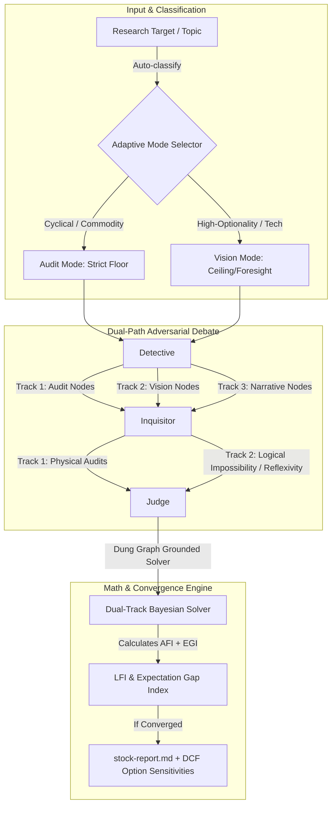

# Design Specification: Trade Nothing v0.9.1 — The Sovereign Investment Master

This specification outlines the architecture, prompts, and engine logic updates required to transition `trade-nothing` from a backward-looking "fundamental audit expert" into a forward-looking "sovereign investment master."

---

## 1. Core Architecture Upgrades

We introduce three symbiotic mechanisms to restore investment "spirituality and foresight" while keeping defensive rigor intact:



---

## 2. Three Pillars of the Master Persona

### Pillar A: Dual-Path Argumentation (双轨制研判)
Investment requires analyzing both the **downside safety margin (floor)** and the **upside optionality (ceiling)**.
1.  **Detective Claims** are now formalized into three distinct classes:
    *   `[Audit Node: <claim> | Proxy Data Anchor: <anchor>]`: Hard physical data points (customs logs, bids, weekly spot prices). Mandatory for establishing a price floor.
    *   `[Vision Node: <claim> | Catalyst/Optionality: <catalyst>]`: Speculative forward-looking structural changes. Must be logically plausible and tied to an upcoming event.
    *   `[Narrative Node: <claim> | Sentiment Source: <source>]`: Community consensus/sentiment nodes (Snowball, Futu, specialist talk) representing "decorated facts."
2.  **Inquisitor Attacks** are split accordingly:
    *   `[Audit Attack]`: Attacks physical facts (double-ordering, supply squeeze, margin pressure).
    *   `[Vision Audit]`: Focuses on physical impossibilities, technological scaling traps (thermodynamics, capex scaling), or reflexivity loops.
3.  **Bayesian Update & Weighting**:
    *   In the Judge's Solver, `[Audit Node]` failures directly penalize the **downside safety margin** (reducing Kelly position size floor).
    *   `[Vision Node]` successes (which withstand logical auditing) raise the **upside optionality multiplier** (increasing expected value ceiling).

### Pillar B: Expectation Gap Arbitrage (预期差与叙事套利)
We formalize Soros' reflexivity by tracking the delta between "narrative heat" and "physical facts":
1.  Introduce **Expectation Gap Index (EGI)**:
    $$EGI = \text{Narrative Sentiment Score} - \text{Physical Proxy Volatility Score}$$
2.  **Interpretation**:
    *   **Highly Positive EGI (Bubble Risk)**: Retail narratives are soaring, but physical shipments or tenders are flat. The Judge triggers a risk warning ("Crowded Cliché Zone") and penalizes sizing.
    *   **Highly Negative EGI (Non-consensus Goldmine)**: Retail sentiment is dead/despairing, but customs logs or raw material prices are silently showing structural improvements. The Judge triggers an **Asymmetric Edge Buy Signal**.

### Pillar C: Adaptive Severity Modes (根据标的属性动态切换严厉度)
The Orchestrator automatically classifies the topic into a mode:
*   **Audit-Hardened Mode (审计约束模态)**: Applied to asset-heavy, cyclical commodities (solar, lithium, steel). Requires high convergence standards (LFI < 0.15), 100% strict `[Proxy Data Anchor]` matching, and zero tolerance for speculative unanchored vision.
*   **Sovereign Vision Mode (主权远见模态)**: Applied to high-optionality, emerging growth sectors (AI infrastructure, innovate tech, biotech). Allows unanchored `[Vision Node]` weights of 0.5 (instead of 0), relaxes LFI convergence to 0.25, and evaluates qualitative narratives for early-stage optionality tracking.

---

## 3. Platform Portability: Cross-Platform File Locking

To fix the Windows compatibility issue, we replace `import fcntl` with a unified, cross-platform file locking utility class in `scripts/utils.py`.

```python
# scripts/utils.py cross-platform file locking snippet
import sys
import os

class CrossPlatformFileLock:
    def __init__(self, file_path: str):
        self.file_path = file_path
        self.lock_file = file_path + ".lock"
        self.handle = None

    def acquire_exclusive(self):
        """Acquire an exclusive lock (write lock)"""
        if sys.platform == "win32":
            import msvcrt
            self.handle = open(self.lock_file, "w")
            try:
                msvcrt.locking(self.handle.fileno(), msvcrt.LK_NBLCK, 1)
            except OSError:
                # If locking fails, retry with a block or raise
                raise OSError("Could not acquire exclusive lock on Windows")
        else:
            import fcntl
            self.handle = open(self.lock_file, "w")
            fcntl.flock(self.handle.fileno(), fcntl.LOCK_EX | fcntl.LOCK_NB)

    def acquire_shared(self):
        """Acquire a shared lock (read lock)"""
        if sys.platform == "win32":
            # Windows locking is always exclusive via msvcrt.locking, so we mock shared or fall back
            self.acquire_exclusive()
        else:
            import fcntl
            self.handle = open(self.lock_file, "r")
            fcntl.flock(self.handle.fileno(), fcntl.LOCK_SH | fcntl.LOCK_NB)

    def release(self):
        """Release the acquired lock"""
        if self.handle:
            try:
                if sys.platform == "win32":
                    import msvcrt
                    self.handle.seek(0)
                    msvcrt.locking(self.handle.fileno(), msvcrt.LK_UNLCK, 1)
                else:
                    import fcntl
                    fcntl.flock(self.handle.fileno(), fcntl.LOCK_UN)
            except Exception:
                pass
            finally:
                self.handle.close()
                self.handle = None
```

This class guarantees thread and process safety across Windows, macOS, and Linux without external dependencies.

---

## 4. Verification Plan

### Automated Tests
1. Run `python scripts/deepthink_engine.py --help` on Windows to verify the `fcntl` import error is completely resolved.
2. Execute the mock server session locally using `python scripts/trade_nothing_skill.py --code 300118 --target 25.0` to verify mathematical convergence logic.

### Manual Verification
1. Spawn a `-deepthink "300118 HJT"` cycle (Solar) to verify it triggers **Audit-Hardened Mode** and aggressively demands physical anchors.
2. Spawn a `-deepthink "AI Computing Liquid Cooling"` cycle to verify it triggers **Sovereign Vision Mode**, allowing speculative visionary catalysts and optionality multipliers.
