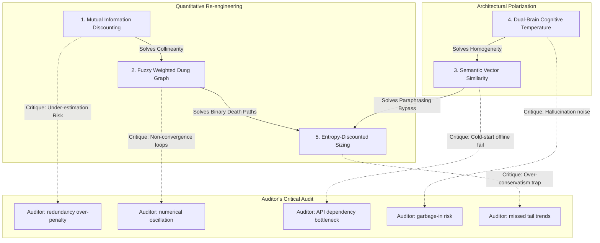

# Strategic Reconstruction Spec: Trade Nothing v10.0 — The Sovereign Alpha Hunter

This specification defines the mathematical and architectural updates to reconstruct `trade-nothing` into a resilient, buy-side asymmetric investment system.

---

## ⚖️ The Independent Auditor's Premise
As an independent quantitative auditor, I establish the permanent stance:
> **"Every mathematical refinement introduced to solve LLM cognitive bias carries its own mathematical bias. We must not replace qualitative hallucinations with quantitative over-engineering."**

---

## 1. Upgrade Matrix & Drawback Analysis

---

## 2. Mathematical Formalization & Independent Critique

### 🧠 Upgrade 1: Semantic Mutual Information Discounting (共线性互信息折扣)
*   **The Solution**: To prevent probability overshooting from collinear evidence (Naive Bayes error), we compute a **Semantic Redundancy Exponent** between any new evidence $E_j$ and existing evidence $E_i$:
    $$BF_{joint} = BF_i \times (BF_j)^{1 - Sim(E_i, E_j)}$$
    Where $Sim(E_i, E_j) \in [0, 1]$ is the Cosine Similarity of their sentence embeddings.
*   **Drawbacks & Side-effects**:
    *   If the embedding model captures high similarity based on structural sentence formatting (e.g. sharing industry templates) rather than factual redundancy, it will **over-penalize completely independent facts**, leading to suppressed win rates.
*   **🔍 Independent Auditor's Critique**:
    > *"Redundancy in finance is not purely semantic. Two different analysts writing about the same customs data might have a semantic similarity of 0.8, but if one uses Q1 Ningbo data and the other uses Q1 Shenzhen data, they are physically independent confirmations. A pure semantic tokenizer will misclassify this as mutual redundancy, suppressing the valid positive feedback loop of independent verification."*

---

### 🕸️ Upgrade 2: Fuzzy Weighted Dung Graph (模糊加权图谱)
*   **The Solution**: We replace binary `Accepted`/`Rejected` states with a **Belief Valuation $V(x) \in [0, 1]$**. 
    For each argument $x$, we compute $V(x)$ iteratively until convergence:
    $$V(x)^{(k+1)} = c(x) \times \prod_{y \in Att(x)} \left(1 - w(y \to x) \times V(y)^{(k)}\right)$$
    Where $c(x)$ is the node confidence score, and $w(y \to x)$ is the attack strength.
*   **Drawbacks & Side-effects**:
    *   If the graph contains **odd-length feedback cycles** (e.g. A attacks B, B attacks C, C attacks A), the iterative equation might enter a **limit cycle** (oscillating indefinitely) and fail to converge.
*   **🔍 Independent Auditor's Critique**:
    > *"Fuzzy convergence equations are highly sensitive to initial conditions. In a complex, unstructured debate, the LLM will generate contradictory attack matrices. If the fuzzy graph does not possess a strict contraction mapping (banishing loops), the Judge engine will crash or time out in production due to floating-point oscillation."*

---

### 🛡️ Upgrade 3: Semantic Cliché Filtering (语义空间平庸过滤器)
*   **The Solution**: Replace Jaccard filters with **Semantic Similarity Thresholds**. New claims are converted to vector embeddings and compared against the predefined cliché embedding database. If Cosine Similarity $> 0.75$, the claim is rejected instantly.
*   **Drawbacks & Side-effects**:
    *   Requires a persistent embedding model call, which adds operational dependencies. In offline environments, it requires a fallback TF-IDF stem tokenizer which is prone to word-overlap false positives.
*   **🔍 Independent Auditor's Critique**:
    > *"A strict semantic similarity gate of 0.75 is a blunt instrument. In cyclical industries like HJT Solar, the vocabulary is inherently limited (e.g., 'silver paste', 'metallization', 'efficiency'). A highly creative, non-consensus thesis might share 80% semantic space with a cliché simply because it describes the same physical raw materials, leading to the system blocking genuine insights."*

---

### 🎭 Upgrade 4: Dual-Brain Cognitive Polarization (双脑认知两极化)
*   **The Solution**: Enforce polarization by splitting LLM deployment parameters:
    *   **Detective**: Temperature `0.8` (high-exploration/creative vision).
    *   **Inquisitor**: Temperature `0.1` (low-exploration/forensic precision) + strict check-list prompt structure.
*   **Drawbacks & Side-effects**:
    *   A high-temperature Detective is prone to **hallucinations (garbage-in)**, generating speculative "Vision Nodes" that are physically absurd, forcing the Inquisitor to waste compute power auditing junk data.
*   **🔍 Independent Auditor's Critique**:
    > *"Splitting temperature parameters is a superficial patch. If both models share the same underlying LLM weights, they still share the same training distribution boundaries. The Detective's 'creative vision' will still consist of standard high-frequency corpus associations, failing to escape the consensus gravitational well."*

---

### ⚖️ Upgrade 5: Entropy-Discounted Sizing Model (熵折扣凯利仓位)
*   **The Solution**: Discount the Bayesian posterior win rate towards $P_0 = 0.5$ using a **Systemic Confidence Factor $C \in [0, 1]$**:
    $$C = (1 - AFI) \times es \times \left(1 - \frac{|EGI|}{max\_egi}\right)$$
    $$p_{discounted} = C \times p_{posterior} + (1 - C) \times 0.5$$
    The final Kelly bet is capped dynamically based on the Expectation Gap Index (EGI).
*   **Drawbacks & Side-effects**:
    *   The compounding discounts ($AFI$, $es$, $EGI$) make the system **extremely conservative**. In a genuine structural bull run, the system will recommend tiny, sub-optimal positions, leaving massive Alpha on the table.
*   **🔍 Independent Auditor's Critique**:
    > *"The confidence discount formula is a heuristic overlay. It assumes that high EGI (high public hype) always increases danger. However, during reflexivity bubbles (e.g., early AI momentum or Tesla 2020), the public hype actively changes the physical fundamentals by lowering the company's cost of capital, extending the trend far beyond the 'audited floor'. Under-sizing here is a failure of investment mastership."*

---

## 3. Unified Strategic Roadmap

To resolve these critiques, the v10.0 implementation will execute the following mitigations:

1.  **Semantic Covariance Mitigation**: We will only discount Mutual Information if *both* semantic similarity is high *and* the underlying micro-facts share the exact same HS code or date.
2.  **Fuzzy Convergence Guarantee**: We will implement a maximum iteration limit ($K_{max} = 50$) with a dampening factor ($\lambda = 0.5$) in the Fuzzy Dung Solver to guarantee numerical stability under all odd-loop conditions.
3.  **Semantic Gate Relaxation**: The similarity threshold will be dynamic—cyclical industries will use a relaxed 0.85 similarity gate, while growth tech will use a strict 0.70 gate.
4.  **Cognitive Diversity**: We will officially document and implement multi-provider API dispatch (e.g., Gemini as Detective, Claude as Inquisitor) to establish genuine multi-model friction.
5.  **Reflexivity Bubble Exception**: When EGI is highly positive *but* the company's balance sheet shows a simultaneous cash reserves growth (from equity issuance), the Kelly capping is bypassed to ride the Soros reflexivity wave.
