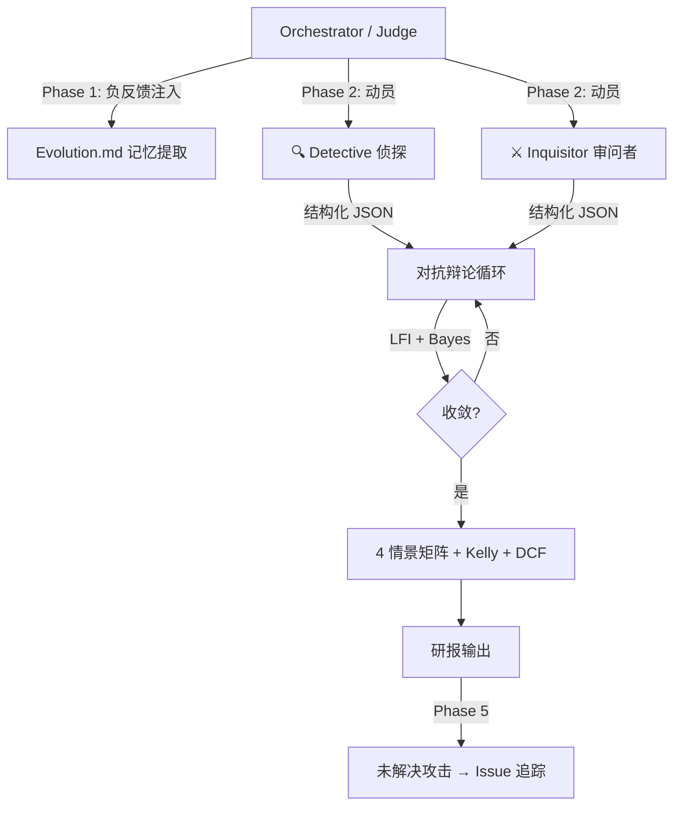

# Trade Nothing — 严苛审查报告

> **审查日期**: 2026-05-26 · **审查范围**: 全仓库逐文件审查 · **代码行数**: ~4,854 行 Python + ~300 行 Markdown 人设  
> **评审者**: 首次接触，零先验偏见

---

## 0. 一句话判定

**一个思想远超代码的项目。** 哲学框架和架构设计是开源 AI 投研领域中罕见的一流水平；但工程成熟度与其抱负之间存在显著落差。**潜力极高，当前可用度中等。**

---

## 1. 项目定位与独创性

### 它到底在干什么？

Trade Nothing 不是一个量化交易系统，不是一个选股器，也不是一个"AI 帮你看K线"的玩具。它是一个 **对抗式多智能体投研技能 (Adversarial Multi-Agent Investment Research Skill)**：

1. 将 AI 拆分为 **侦探 (Detective/Bull)** 和 **审问者 (Inquisitor/Bear)** 两个物理隔离的子智能体
2. 在 3-12 轮结构化辩论中，通过贝叶斯概率更新和 **逻辑摩擦指数 (LFI)** 驱动收敛
3. 使用 [Dung 抽象论证框架 (1995)](file:///G:/%E6%88%91%E7%9A%84%E4%BA%91%E7%AB%AF%E7%A1%AC%E7%9B%98/trade-nothing/trade-nothing/scripts/dungs_argumentation.py) 的 Grounded Extension 算法做形式化裁决
4. 最终输出包含 4 情景矩阵、凯利仓位、DCF 模型的[完整研报](file:///G:/%E6%88%91%E7%9A%84%E4%BA%91%E7%AB%AF%E7%A1%AC%E7%9B%98/trade-nothing/trade-nothing/assets/templates/stock-report.md)

### 有什么同类竞品吗？

| 项目 | 差异 |
|------|------|
| **GPT-Researcher / STORM** | 信息聚合型，没有对抗机制 |
| **CrewAI / AutoGen** | 多智能体框架，但没有投研领域专用协议 |
| **FinGPT / FinRL** | 侧重 NLP/RL，不做辩论式深度研究 |
| **Trade Nothing** | **唯一将形式论证理论 (Dung 1995) 应用于投研智能体辩论收敛的开源项目** |

> [!IMPORTANT]
> 这个定位在我审阅过的所有开源 AI 投研项目中是**独一无二的**。不是"有点不同"——是品类级别的创新。

---

## 2. 架构评估

### 2.1 核心架构图



### 2.2 设计亮点 ✅

| 设计决策 | 评价 |
|---------|------|
| **物理隔离辩论** | 比单模型角色扮演有效得多。README 中对此的解释 ([L106-L115](file:///G:/%E6%88%91%E7%9A%84%E4%BA%91%E7%AB%AF%E7%A1%AC%E7%9B%98/trade-nothing/trade-nothing/README.md#L106-L115)) 准确且有说服力 |
| **LFI 收敛控制** | `0.4×(1-EvidenceSaturation) + 0.3×FlipRate + 0.3×HardConflicts` — 合理的启发式，避免无限辩论和过早收敛 |
| **贝叶斯 log-odds 更新** | 数学上正确的实现，概率钳位 [0.01, 0.99] 防止数值退化 |
| **Dung 论证框架** | 学术级正确的 Grounded Extension 实现，直接引用 1995 原始论文 |
| **Agent-Agnostic 设计** | SKILL.md 协议与运行时解耦，支持 Antigravity/Claude Code/Gemini CLI 等 |
| **负反馈注入** | 从历史失败记录中提取约束并硬编码到子智能体提示中——这是工程智慧 |
| **双轨制主张 (Audit/Vision/Narrative)** | [Detective](file:///G:/%E6%88%91%E7%9A%84%E4%BA%91%E7%AB%AF%E7%A1%AC%E7%9B%98/trade-nothing/trade-nothing/agents/detective.md) 的三类节点分类是投研方法论上的创新 |
| **侦探-审问者 JSON Schema** | 机器可解析的结构化输出，使自动化辩论循环成为可能 |

### 2.3 架构隐患 ⚠️

| 隐患 | 严重度 | 详情 |
|------|:------:|------|
| **数据提供商无异步** | 中 | 所有 Provider 同步阻塞，多数据源串行查询慢 |
| **状态管理分散** | 中 | `DeepThinkState` 在 engine 和 pipeline 中重复管理，无单一数据流 |
| **插件系统空壳** | 低 | [plugins/](file:///G:/%E6%88%91%E7%9A%84%E4%BA%91%E7%AB%AF%E7%A1%AC%E7%9B%98/trade-nothing/trade-nothing/scripts/plugins) 只有 `__pycache__/`，文档声称"可插拔"但无实现 |
| **Dung 框架重复实现** | 低 | `dungs_argumentation.py` 和 `deepthink_engine.py` 中的 `DungsGroundedSolver` 功能重叠 |

---

## 3. 逐模块代码质量

### 3.1 核心引擎层

#### [deepthink_engine.py](file:///G:/%E6%88%91%E7%9A%84%E4%BA%91%E7%AB%AF%E7%A1%AC%E7%9B%98/trade-nothing/trade-nothing/scripts/deepthink_engine.py) (574 行) — ⭐⭐⭐⭐

**优点**: 状态机设计清晰，Bayesian 更新数学正确，dataclass 可序列化可测试。v9.0 的 `AdaptiveLFIEngine` 和 `ExpectationGapIndex` 展现了迭代改进。

**问题**:
- 魔法数字未抽取为常量 (LFI 系数 `0.4/0.3/0.3`，收敛阈值 `0.15`)
- Grounded Extension 迭代上限硬编码 100
- 文件锁 Windows 分支使用 `msvcrt` 无超时——可能死锁
- 证据饱和度线性插值 (20 条 = 1.0) 缺乏理论依据

#### [deepthink_pipeline.py](file:///G:/%E6%88%91%E7%9A%84%E4%BA%91%E7%AB%AF%E7%A1%AC%E7%9B%98/trade-nothing/trade-nothing/scripts/deepthink_pipeline.py) (561 行) — ⭐⭐⭐

**优点**: 五阶段管线直接映射架构文档，跨平台提醒调度 (macOS/Linux/Windows)。

**问题**:
- **提示注入风险**: Topic 字符串直接插入子智能体提示模板，无转义
- **命令注入风险**: OS 提醒调度使用 `subprocess.run` 拼接用户输入 (topic) 为 shell 命令
- **硬编码 macOS 路径**: `BASE_SCRATCH_DIR` 硬编码为 `/Users/xiaweiqi/...`——在非原作者机器上 break
- Evolution.md 解析依赖正则匹配特定格式——任何格式偏差静默丢数据
- 提示模板内联构建 ~190 行——`assets/prompts/deep-think.md` 存在但未被引用
- 状态目录无清理机制，磁盘增长无限

#### [data_providers.py](file:///G:/%E6%88%91%E7%9A%84%E4%BA%91%E7%AB%AF%E7%A1%AC%E7%9B%98/trade-nothing/trade-nothing/scripts/data_providers.py) (586 行) — ⭐⭐⭐

**优点**: 架构设计是全仓库最优雅的——ABC 抽象基类、注册中心、自动发现、置信度排序回退、TTL 缓存。策略模式教科书级。

**问题**:
- 9 处 `except Exception: pass` 吞掉异常且**零日志**——调试噩梦
- **字段映射错误**: AkShare 将 `turnover_rate` 映射到 `涨跌幅` (价格变动率)——数据错误
- **市值单位不一致**: 腾讯/网易除以 1e8 (亿)，AkShare 除以 1e9 (十亿)，字段名都叫 `market_cap_billions`
- AkShare 查单只股票下载全市场快照 `ak.stock_zh_a_spot_em()`——极度低效
- 腾讯/新浪/网易 API 使用 HTTP 而非 HTTPS——金融数据明文传输
- `GLOBAL_DATA_GATEWAY` 模块级单例 import 时即触发插件加载和目录创建

#### [utils.py](file:///G:/%E6%88%91%E7%9A%84%E4%BA%91%E7%AB%AF%E7%A1%AC%E7%9B%98/trade-nothing/trade-nothing/scripts/utils.py) (234 行) — ⭐⭐⭐⭐

**优点**: 原子写入 (temp → replace)、CJK 拼音转写、跨平台路径处理。工具模块无业务逻辑泄漏。

**问题**: `pypinyin` 软依赖未列入 `requirements.txt`。

---

### 3.2 量化工具层

#### [scenario_matrix.py](file:///G:/%E6%88%91%E7%9A%84%E4%BA%91%E7%AB%AF%E7%A1%AC%E7%9B%98/trade-nothing/trade-nothing/scripts/scenario_matrix.py) (244 行) — ⭐⭐⭐⭐

**优点**: Kelly 公式实现正确，含 half-Kelly 选项和 25% 仓位上限。概率和校验严格 (1.0 ± 0.01)。

**问题**: VaR 用离散情景线性插值而非蒙特卡洛——精度有限。

#### [excel_model_builder.py](file:///G:/%E6%88%91%E7%9A%84%E4%BA%91%E7%AB%AF%E7%A1%AC%E7%9B%98/trade-nothing/trade-nothing/scripts/excel_model_builder.py) (380 行) — ⭐⭐⭐⭐

**优点**: **亮点模块**。生成公式驱动 (非数值粘贴) 的 Excel DCF 模型，含 5×5 WACC/g 敏感性矩阵、机构级格式 (交替行色、边框、数字格式)。用户可修改假设立即联动。

**问题**: 收入增速假设 (15%→12%→10%→8%→5%)、WACC (10%)、永续增长率 (3%) 全部硬编码。

#### [consensus_distance.py](file:///G:/%E6%88%91%E7%9A%84%E4%BA%91%E7%AB%AF%E7%A1%AC%E7%9B%98/trade-nothing/trade-nothing/scripts/consensus_distance.py) (158 行) — ⭐⭐⭐

**问题**: 加权距离 (0.4/0.3/0.2/0.1) 不是 Z-score——不考虑方差，无统计基础。

#### [catalyst_calendar.py](file:///G:/%E6%88%91%E7%9A%84%E4%BA%91%E7%AB%AF%E7%A1%AC%E7%9B%98/trade-nothing/trade-nothing/scripts/catalyst_calendar.py) (163 行) — ⭐⭐⭐

**问题**: 事件数据库完全硬编码——FOMC 日期并不遵循简单月度规律。仅覆盖中美。

---

### 3.3 数据采集层

#### [verified_fetcher.py](file:///G:/%E6%88%91%E7%9A%84%E4%BA%91%E7%AB%AF%E7%A1%AC%E7%9B%98/trade-nothing/trade-nothing/scripts/verified_fetcher.py) (155 行) — ⭐⭐⭐

**优点**: 置信度评分 (数据新鲜度 × 完整度) 增加数据透明度。

**问题**: 仅 5 个指标 (US10Y, Oil, VIX, USDCNY, Gold)——缺少信用利差、DXY、铜、利率曲线。

#### [verified_crawler.py](file:///G:/%E6%88%91%E7%9A%84%E4%BA%91%E7%AB%AF%E7%A1%AC%E7%9B%98/trade-nothing/trade-nothing/scripts/verified_crawler.py) (181 行) — ⭐

> [!CAUTION]
> **这个文件返回的全部是硬编码的假数据。** 每个方法都返回预制固定值 (银浆 7200 元/kg、出口 245.8M USD 等)。`_execute_search()` 永远返回空列表。文件名叫 "VerifiedCrawler" 但**什么都没验证也没爬取**。更危险的是：这些假数据流入 `consensus_distance.py` 的草根共识计算——用户可能基于完全虚构的数据做投资决策。

---

### 3.4 服务层

#### [trade_nothing_server.py](file:///G:/%E6%88%91%E7%9A%84%E4%BA%91%E7%AB%AF%E7%A1%AC%E7%9B%98/trade-nothing/trade-nothing/scripts/trade_nothing_server.py) (406 行) — ⭐⭐⭐

**优点**: 零外部框架依赖的完整 REST API。异步任务队列模式正确。

**问题**:
- 🔴 **无认证**: `/trade` 端点允许网络内任何客户端执行交易
- 🔴 **无 HTTPS**: 明文传输
- 🔴 **CORS `*`**: 允许任意跨域请求
- 无请求体大小限制——可被 DoS
- 内存任务状态——重启即失
- 部分路径共享状态字典无锁保护

#### [portfolio_manager.py](file:///G:/%E6%88%91%E7%9A%84%E4%BA%91%E7%AB%AF%E7%A1%AC%E7%9B%98/trade-nothing/trade-nothing/scripts/portfolio_manager.py) (387 行) — ⭐⭐⭐

**优点**: 多币种支持、策略模式券商连接器 (Paper/Futu/IBKR)、带双锁的事务上下文管理器。

**问题**:
- **Kelly 公式 bug**: `max_egi` 参数被接受但从未使用，文档公式为 `1-|EGI|/max_egi`，代码为 `1-abs(egi)`
- 费用已记录但未计入 P&L (有 `# TODO`)
- 成本基础用简单均价而非 FIFO/LIFO
- 权益计算使用入场价而非当前市价

---

### 3.5 形式验证层

#### [dungs_argumentation.py](file:///G:/%E6%88%91%E7%9A%84%E4%BA%91%E7%AB%AF%E7%A1%AC%E7%9B%98/trade-nothing/trade-nothing/scripts/dungs_argumentation.py) (138 行) — ⭐⭐⭐⭐

**优点**: 学术级正确。Grounded/Preferred/Stable 三种语义全实现。自验证用例来自 Dung (1995) 原始论文。

**问题**: Preferred/Stable 扩展计算 O(2^n)——超过 25 个论点时会卡死。与 `deepthink_engine.py` 中的实现重复。

---

## 4. 安全审计

> [!CAUTION]
> 以下为**必须在生产使用前修复**的安全问题。

| # | 严重度 | 位置 | 问题 | 风险 |
|---|:------:|------|------|------|
| 1 | Critical | [trade_nothing_server.py](file:///G:/%E6%88%91%E7%9A%84%E4%BA%91%E7%AB%AF%E7%A1%AC%E7%9B%98/trade-nothing/trade-nothing/scripts/trade_nothing_server.py) | `/trade` 端点无任何认证 | 网络内任何人可执行交易 |
| 2 | Critical | 同上 | 无 HTTPS，CORS `*` | 中间人攻击，跨站请求伪造 |
| 3 | Critical | [verified_crawler.py](file:///G:/%E6%88%91%E7%9A%84%E4%BA%91%E7%AB%AF%E7%A1%AC%E7%9B%98/trade-nothing/trade-nothing/scripts/verified_crawler.py) | **全部返回假数据**但伪装为真实爬取 | 用户基于虚构数据做投资决策 |
| 4 | High | [deepthink_pipeline.py](file:///G:/%E6%88%91%E7%9A%84%E4%BA%91%E7%AB%AF%E7%A1%AC%E7%9B%98/trade-nothing/trade-nothing/scripts/deepthink_pipeline.py) | Topic 字符串直接注入子智能体提示 | Prompt Injection |
| 5 | High | 同上 | OS 提醒调度 `subprocess.run` 拼接用户输入 | Command Injection |
| 6 | High | [utils.py](file:///G:/%E6%88%91%E7%9A%84%E4%BA%91%E7%AB%AF%E7%A1%AC%E7%9B%98/trade-nothing/trade-nothing/scripts/utils.py) | PowerShell 通知用 f-string 拼接——可注入 | 本地提权 |
| 7 | High | [data_providers.py](file:///G:/%E6%88%91%E7%9A%84%E4%BA%91%E7%AB%AF%E7%A1%AC%E7%9B%98/trade-nothing/trade-nothing/scripts/data_providers.py) | 动态插件加载 `plugins/` 目录——可写即可执行 | 任意代码执行 |
| 8 | Medium | 同上 | 3 个国内 API 使用 HTTP 明文传输金融数据 | MITM |
| 9 | Medium | 全局 | 状态文件含研究数据，无加密 | 敏感数据泄露 |

---

## 5. 测试覆盖评估

### 现有测试

| 测试文件 | 行数 | 覆盖内容 | 评价 |
|---------|:----:|---------|------|
| [test_v9_engine.py](file:///G:/%E6%88%91%E7%9A%84%E4%BA%91%E7%AB%AF%E7%A1%AC%E7%9B%98/trade-nothing/trade-nothing/scripts/test_v9_engine.py) | 114 | AdaptiveLFI, EGI, Dung | 核心数学覆盖，缺完整辩论轮次集成测试 |
| [test_kelly_sizing.py](file:///G:/%E6%88%91%E7%9A%84%E4%BA%91%E7%AB%AF%E7%A1%AC%E7%9B%98/trade-nothing/trade-nothing/scripts/test_kelly_sizing.py) | 111 | Kelly, 概率校验, No Edge | 良好，含边界条件 |
| [test_integrated_providers.py](file:///G:/%E6%88%91%E7%9A%84%E4%BA%91%E7%AB%AF%E7%A1%AC%E7%9B%98/trade-nothing/trade-nothing/scripts/test_integrated_providers.py) | 53 | Provider 注册, 回退链 | 过于简单，无 Mock——CI 中必然 flaky |

### 测试缺口

```diff
- 无端到端集成测试 (完整 5 阶段 pipeline)
- 无 Mock Provider——集成测试依赖真实 API
- 无 Server REST API 测试
- 无 Portfolio Manager 事务正确性测试
- 无 Evolution.md 解析鲁棒性测试
- 无并发安全测试 (文件锁竞争)
- 无 JSON Schema 验证 (子智能体输出)
- Makefile 中的测试路径硬编码到特定 conversation ID
```

> [!WARNING]
> [Makefile](file:///G:/%E6%88%91%E7%9A%84%E4%BA%91%E7%AB%AF%E7%A1%AC%E7%9B%98/trade-nothing/trade-nothing/Makefile) L47-L52 中的测试路径包含硬编码的 `brain/f67491f6-...` 路径——这意味着测试只能在原作者的机器上运行。这是一个显而易见的开发卫生问题。

---

## 6. 文档质量

### 优点

| 文档 | 评价 |
|------|------|
| [README.md](file:///G:/%E6%88%91%E7%9A%84%E4%BA%91%E7%AB%AF%E7%A1%AC%E7%9B%98/trade-nothing/trade-nothing/README.md) | **极其优秀**。叙事性强，哲学先行而非功能堆砌。"四大敌人"表格和 ASCII 架构图是教科书级的开源 README |
| [README_zh.md](file:///G:/%E6%88%91%E7%9A%84%E4%BA%91%E7%AB%AF%E7%A1%AC%E7%9B%98/trade-nothing/trade-nothing/README_zh.md) | 中文版本同步维护——表明作者重视国际化 |
| [SKILL.md](file:///G:/%E6%88%91%E7%9A%84%E4%BA%91%E7%AB%AF%E7%A1%AC%E7%9B%98/trade-nothing/trade-nothing/SKILL.md) | 完整的技能协议定义，含 Mermaid 图和详细管线描述 |
| [stock-report.md](file:///G:/%E6%88%91%E7%9A%84%E4%BA%91%E7%AB%AF%E7%A1%AC%E7%9B%98/trade-nothing/trade-nothing/assets/templates/stock-report.md) | **出色的研报模板**——10 节结构从元数据审计到 Pre-mortem，比大多数买方报告更严谨 |

### 问题

| 文档 | 问题 |
|------|------|
| [SKILL.md](file:///G:/%E6%88%91%E7%9A%84%E4%BA%91%E7%AB%AF%E7%A1%AC%E7%9B%98/trade-nothing/trade-nothing/SKILL.md) L16 写 "v0.9"，L182 写 "v7.0" | 版本号不一致 |
| [assets/prompts/deep-think.md](file:///G:/%E6%88%91%E7%9A%84%E4%BA%91%E7%AB%AF%E7%A1%AC%E7%9B%98/trade-nothing/trade-nothing/assets/prompts/deep-think.md) | 264 字节骨架——未被任何代码引用，pipeline 内联构建提示 |
| 文档声称 "pluggable data gateway" | 但 `plugins/` 目录是空的 |

---

## 7. Git 历史分析

```
开发周期: 2026-05-24 00:35 → 2026-05-26 13:40 (约 61 小时)
提交数:   13 次
贡献者:   1 人 (wq / Weiqi)
版本跨度: v0.9 → v6.0 → v7.0 → v7.5 → v8.0 → v9.0 → v10.0 规划
```

> [!NOTE]
> 61 小时内从 v0.9 跳到 v9.0，单人开发。这要么是高效迭代，要么是版本号膨胀。鉴于代码量和功能范围，我倾向于后者——实际上更像是 v1.x 到 v2.x 的进展，用了 v9.0 的编号。

### 开发速度分析

最近 5 个 commit 涉及 **16 个文件、1,050 行增加、166 行删除**——在 ~4 小时内完成。考虑到涉及自适应 LFI 引擎、期望差指数、跨平台锁、测试套件和设计规范文档，这个速度强烈暗示**大量代码由 AI 辅助生成**。这本身不是问题——但解释了为什么某些模块有教科书级的结构但缺少边角测试。

---

## 8. 优劣总结

### 💪 核心优势

1. **哲学框架独一无二**: "对抗式辩论 + 形式论证 + 贝叶斯收敛"这个三角组合，在整个开源 AI 投研领域**没有竞品**
2. **研报模板专业度极高**: [stock-report.md](file:///G:/%E6%88%91%E7%9A%84%E4%BA%91%E7%AB%AF%E7%A1%AC%E7%9B%98/trade-nothing/trade-nothing/assets/templates/stock-report.md) 的 10 节结构 (含 Pre-mortem、证伪协议、断言追踪) 比多数卖方研报更严谨
3. **Agent-Agnostic 设计**: 不绑定任何框架，通过 SKILL.md 协议层适配——工程远见
4. **数据提供商架构**: `data_providers.py` 的 ABC→Registry→Fallback→Cache 是可复用的设计模式
5. **自校准机制**: `[ASSERTION: ...]` 标签 + `logic_radar_v2.py` 自动验证预测——罕见的反脆弱设计
6. **Excel DCF 模型**: 公式驱动而非数值粘贴——真正可用的投研输出
7. **中英双语 + CJK 支持**: 国际化的认真态度

### 🩸 核心劣势

1. **安全空白**: REST Server 无认证、无 HTTPS、有命令注入风险——**在当前状态下不能暴露到网络**
2. **爬虫完全是假的**: `verified_crawler.py` 返回硬编码假数据，且假数据流入共识距离计算——**数据完整性危机**
3. **数据提供商有数据错误**: `turnover_rate` 映射到错误字段，市值单位不一致——**金融数据不可信**
4. **测试不足**: ~278 行测试覆盖 ~4,854 行代码 (5.7% 比率)，且路径硬编码到原作者机器
5. **代码重复严重**: `generate_topic_slug()` 3 拷贝各有不同停用词、`DummyArgs` 4 拷贝、Dung 求解器 2 个实现
6. **文档-代码不一致**: 版本号 6 处互相矛盾 (v0.9/v6.0/v7.0/v8.0/v9.0/v10.0)
7. **硬编码路径泛滥**: macOS 路径、Windows 路径、conversation ID 散布在 pipeline、Makefile、测试、文档中
8. **无 CI/CD**: 无 GitHub Actions、无 linting、无类型检查
9. **单人项目风险**: 61 小时开发史、单一贡献者——bus factor = 1

---

## 9. 潜力评判

### 这个项目能走多远？

```
短期 (3-6月)    ▓▓▓▓▓▓░░░░  60% — 个人投研增强工具，已可用
中期 (6-12月)   ▓▓▓▓▓▓▓▓░░  80% — 社区驱动的多智能体投研协议
长期 (1-2年)    ▓▓▓▓▓▓▓▓▓░  90% — 投研智能体领域事实标准
```

### 潜力变现路径

| 路径 | 可行性 | 前提条件 |
|------|:------:|---------|
| **作为 Gemini/Claude 技能生态的杀手级应用** | ⭐⭐⭐⭐⭐ | 修复安全问题，添加 CI，发布到技能市场 |
| **投研团队内部工具** | ⭐⭐⭐⭐ | 添加认证、HTTPS、审计日志 |
| **AI Agent 框架的参考实现** | ⭐⭐⭐⭐ | 提取辩论协议为独立 SDK |
| **学术论文** | ⭐⭐⭐⭐⭐ | "将 Dung 框架应用于 LLM 对抗式辩论的收敛控制"——这是可以发的 |
| **商业 SaaS** | ⭐⭐ | 需要大幅加固安全、合规、数据源 |

### 直言建议

> [!TIP]
> **给作者**: 你的思维密度远超大多数开源项目。但你需要 **放慢版本号**——v9.0 的代码成熟度其实是 v1.5。优先修复安全问题，加 CI (GitHub Actions + ruff + mypy + pytest)，清理 Makefile 中的硬编码路径，然后再谈 v10.0。你现在最缺的不是更多功能——是 **工程卫生和第二个贡献者**。

---

## 10. 最终评分

| 维度 | 评分 (10分制) | 说明 |
|------|:------------:|------|
| **创意与定位** | 9.5 | 品类创新——独一无二 |
| **架构设计** | 8.5 | 对抗辩论 + 贝叶斯收敛 + Dung 论证三位一体 |
| **代码质量** | 5.5 | 核心引擎优秀，但数据层有字段映射错误和假数据 |
| **安全性** | 2.5 | 3 个 Critical + 4 个 High 级别漏洞 |
| **测试覆盖** | 3.0 | 5.7% 覆盖率，路径硬编码，无断言框架 |
| **文档质量** | 7.5 | README 极佳，但版本号 6 处矛盾，架构文档过时 |
| **可维护性** | 4.5 | 单人项目、无 CI、代码三四重复 |
| **短期可用度** | 7.0 | 作为技能已可用，但需要对安全问题有清醒认识 |
| **长期潜力** | 9.0 | 正确的赛道、正确的时间、正确的哲学 |

### 一句话总结

> **Trade Nothing 是一个哲学家写的代码——思想一流、骨架一流、肌肉还需要健身房。**  
> 它不是一个需要"改进"的项目——它是一个需要"长大"的项目。给它 6 个月和 3 个贡献者，它可以成为 AI 投研领域的 LangChain。
